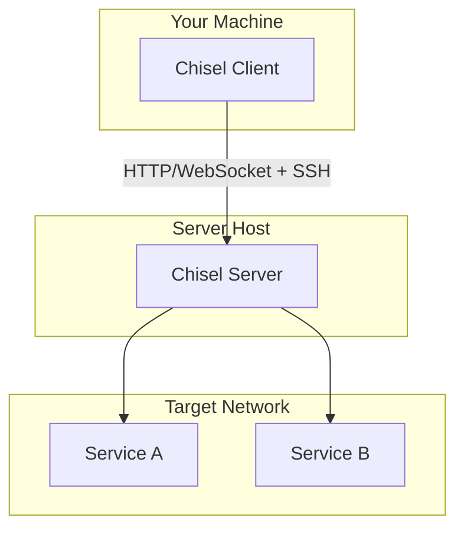
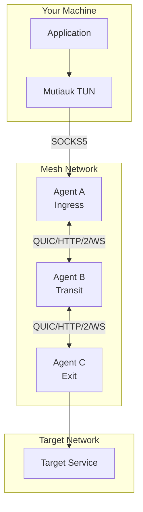
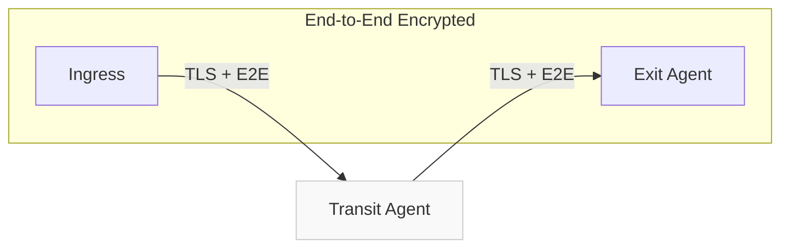

<div style={{textAlign: 'center', marginBottom: '2rem'}}>
  
</div>

# Chisel vs Muti Metroo

Both Chisel and Muti Metroo create encrypted tunnels for TCP and UDP traffic, but they take different architectural approaches. This comparison helps you choose the right tool for your use case.

## Quick Comparison

| Aspect | Chisel | Muti Metroo + Mutiauk |
|--------|--------|----------------------|
| **Architecture** | Client-Server | Mesh network (any topology) |
| **Transport** | HTTP/WebSocket | QUIC, HTTP/2, WebSocket |
| **Encryption** | SSH (crypto/ssh) | TLS 1.3 + E2E (ChaCha20-Poly1305) |
| **Multi-hop** | Manual chaining | Native flood-based routing |
| **SOCKS5 Proxy** | Yes | Yes |
| **UDP Support** | Yes (tunneled) | Yes (SOCKS5 UDP ASSOCIATE) |
| **Reverse Tunneling** | Yes (R: prefix) | Yes (port forwarding) |
| **Authentication** | Username/password file | TLS certificates + mTLS |
| **TUN Interface** | No | Yes (Mutiauk) |
| **Auto-reconnect** | Yes | Yes |
| **ICMP Support** | No | Yes |
| **File Transfer** | No | Yes (built-in) |
| **Remote Shell** | No | Yes (authenticated) |

## Architecture Comparison

### Chisel: Client-Server Model

Chisel uses a traditional **client-server model** where clients connect to a central server:



**How it works:**
1. Start Chisel server on a host with access to target services
2. Connect Chisel client specifying which ports to forward
3. Traffic flows: Client -> Server -> Target service
4. Single connection multiplexes all tunnels

### Muti Metroo: Mesh Network

Muti Metroo creates a **mesh network** where agents connect to each other and routes propagate automatically:



**How it works:**
1. Deploy agents on available hosts (form any topology)
2. Agents connect as peers (bidirectional)
3. Exit agents advertise routes automatically
4. Traffic finds optimal path through the mesh

## Tunneling Modes

### Chisel Tunneling

Chisel supports three tunneling modes with a concise syntax:

**Local Port Forward:**
```bash
# Forward local port 3000 to remote service
chisel client server:8080 3000:internal-host:80

# Access via localhost
curl http://localhost:3000
```

**Reverse Port Forward:**
```bash
# Expose local service through server
chisel client server:8080 R:8080:localhost:3000

# Service now accessible at server:8080
```

**SOCKS5 Proxy:**
```bash
# Server with SOCKS5 enabled
chisel server --socks5

# Client connects
chisel client server:8080 socks

# Use SOCKS proxy
curl --socks5 localhost:1080 http://internal-host/
```

### Muti Metroo Tunneling

Muti Metroo uses SOCKS5 as the primary ingress with declarative exit routing:

**SOCKS5 Proxy (default):**
```yaml
# Ingress agent config
socks5:
  enabled: true
  address: "127.0.0.1:1080"
```

```bash
# Access any destination via SOCKS5
curl --socks5 localhost:1080 http://internal-host/
```

**Transparent TUN (with Mutiauk):**
```bash
# Start Mutiauk for transparent routing
sudo mutiauk daemon start

# All traffic to configured routes flows through mesh
curl http://internal-host/
ping internal-host
```

**Port Forwarding (reverse tunnel):**
```yaml
# Endpoint agent - where service runs
forward:
  endpoints:
    - key: "my-service"
      target: "localhost:3000"

# Listener agent - where to expose
forward:
  listeners:
    - key: "my-service"
      address: ":8080"
```

## Encryption Comparison

### Chisel: SSH Encryption

Chisel uses Go's `crypto/ssh` library for encryption:

- ECDSA key pairs generated at startup
- SSH protocol encryption
- Optional fingerprint verification
- Persistent keys via `--keyfile`

```bash
# Server displays fingerprint at startup
chisel server --port 8080
# Fingerprint: ab:cd:ef:...

# Client validates fingerprint
chisel client --fingerprint ab:cd:ef:... server:8080 3000
```

### Muti Metroo: TLS + End-to-End

Muti Metroo provides two layers of encryption:

**Transport Layer (TLS 1.3):**
- Encrypts peer-to-peer connections
- Certificate-based authentication
- Optional mTLS for mutual authentication

**End-to-End Layer:**
- X25519 key exchange per stream
- ChaCha20-Poly1305 encryption
- Transit agents cannot decrypt traffic



The transit agent relays encrypted frames it cannot read - only ingress and exit can decrypt.

## Multi-hop Capabilities

### Chisel: Manual Chaining

To reach services through multiple hops, chain Chisel instances:

```bash
# Hop 1: Server on DMZ host
chisel server --port 8080

# Hop 2: Client on DMZ connects to internal server
chisel client dmz-server:8080 R:9090:internal-server:8080

# Hop 2: Server on internal host
chisel server --port 8080

# Your client connects through the chain
chisel client dmz-server:9090 3000:final-target:80
```

Each hop requires manual configuration and separate Chisel instances.

### Muti Metroo: Native Routing

Routes propagate automatically through flood-based routing:

```yaml
# Agent C (exit) - just advertise routes
exit:
  cidr_routes:
    - cidr: "10.0.0.0/8"
```

Agents discover paths automatically. No per-hop configuration needed:

```
[Client] --> Agent A --> Agent B --> Agent C --> Target
```

Add or remove agents - routes adjust automatically.

## Reverse Tunneling Comparison

### Chisel Reverse Tunnels

Use the `R:` prefix to expose local services through the server:

```bash
# Expose local web server
chisel client server:8080 R:8080:localhost:3000

# Expose local SSH
chisel client server:8080 R:2222:localhost:22

# Multiple reverse tunnels
chisel client server:8080 R:8080:localhost:3000 R:2222:localhost:22
```

The server must be reachable from your client.

### Muti Metroo Port Forwarding

Configure endpoints (where services run) and listeners (where to expose):

```yaml
# Agent on machine with the service
forward:
  endpoints:
    - key: "web-server"
      target: "localhost:3000"
    - key: "ssh-access"
      target: "localhost:22"
```

```yaml
# Agent where you want to access the service
forward:
  listeners:
    - key: "web-server"
      address: ":8080"
    - key: "ssh-access"
      address: ":2222"
```

Services are discovered via routing - works across multi-hop paths.

## Authentication

### Chisel Authentication

Optional username/password authentication via JSON file:

```json
// users.json
{
  "user1": "password1",
  "user2": "password2"
}
```

```bash
# Server with auth
chisel server --authfile users.json

# Client with credentials
chisel client --auth user1:password1 server:8080 3000
```

### Muti Metroo Authentication

TLS certificate-based authentication:

```yaml
tls:
  ca: "./certs/ca.crt"
  cert: "./certs/agent.crt"
  key: "./certs/agent.key"
  require_client_cert: true  # mTLS
```

Additional authentication for features:
- SOCKS5: Optional username/password
- Shell: bcrypt password hash + command whitelist
- File transfer: bcrypt password hash + path whitelist

## Feature Comparison

| Feature | Chisel | Muti Metroo |
|---------|--------|-------------|
| Local port forward | Yes | Via SOCKS5/Mutiauk |
| Remote port forward | Yes (R: prefix) | Yes (port forwarding) |
| SOCKS5 proxy | Yes | Yes |
| UDP tunneling | Yes | Yes |
| ICMP (ping) | No | Yes |
| TUN interface | No | Yes (Mutiauk) |
| File transfer | No | Yes |
| Remote shell | No | Yes |
| Web dashboard | No | Yes |
| Let's Encrypt | Yes | No (bring your own certs) |
| Config file | No (CLI only) | Yes (YAML) |
| Service mode | No | Yes (systemd, launchd, Windows) |
| HTTP API | No | Yes |

## When to Use Chisel

Chisel excels when:

- **Simple point-to-point tunneling**: Need to forward a few ports quickly
- **Single server access**: One server provides access to target network
- **Quick deployment**: No config files needed, just CLI flags
- **SSH-style encryption**: Prefer SSH protocol encryption
- **Let's Encrypt**: Want automatic TLS certificates

**Typical workflow:**
```bash
# Start server (target network)
chisel server --port 8080 --socks5

# Connect client (your machine)
chisel client https://server.example.com:8080 socks

# Use SOCKS proxy
curl --socks5 localhost:1080 http://internal-service/
```

## When to Use Muti Metroo

Muti Metroo excels when:

- **Complex topologies**: Multi-site, chain, tree, or mesh networks
- **Native multi-hop**: Traffic needs to traverse multiple network boundaries
- **E2E encryption**: Transit nodes must not see your data
- **UDP/ICMP support**: Need to tunnel more than TCP
- **Transparent routing**: Want TUN-based access without SOCKS configuration
- **Additional features**: File transfer, remote shell, web dashboard
- **Always-on infrastructure**: Persistent mesh with automatic reconnection

**Typical workflow:**
```bash
# Deploy agents (any topology)
muti-metroo run -c config.yaml

# Connect via SOCKS5
curl --socks5 localhost:1080 http://internal/

# Or transparent with Mutiauk
sudo mutiauk daemon start
curl http://internal/
ping internal-server
```

## Migration from Chisel

If you're considering switching from Chisel:

| Chisel Concept | Muti Metroo Equivalent |
|----------------|------------------------|
| Server | Exit agent (advertises routes) |
| Client | Ingress agent (provides SOCKS5) |
| `local:remote` | SOCKS5 proxy (any destination) |
| `R:server:local` | Port forwarding (endpoint + listener) |
| `socks` | SOCKS5 enabled by default |
| `--authfile` | TLS certificates + mTLS |

### Key Differences

1. **No explicit port mapping**: Use SOCKS5 for any destination
2. **Declarative config**: YAML files instead of CLI flags
3. **Automatic routing**: Exit agents advertise what they can reach
4. **TUN option**: Mutiauk for transparent routing

## Summary

| Choose | When You Need |
|--------|---------------|
| **Chisel** | Simple port forwarding, quick setup, single-hop tunneling, CLI-only workflow |
| **Muti Metroo** | Complex topologies, native multi-hop, E2E encryption, UDP/ICMP, TUN interface, always-on mesh |

Chisel is excellent for quick, simple tunneling with minimal setup. Muti Metroo provides a more comprehensive solution for complex networking scenarios with native multi-hop routing, end-to-end encryption, and transparent TUN-based routing.

## See Also

- [Core Concepts - Architecture](/concepts/architecture) - How Muti Metroo works
- [Mutiauk TUN Interface](/mutiauk) - Transparent routing with TUN
- [Features - Port Forwarding](/features/port-forwarding) - Reverse tunnel equivalent
- [Security - E2E Encryption](/security/e2e-encryption) - How E2E encryption works
