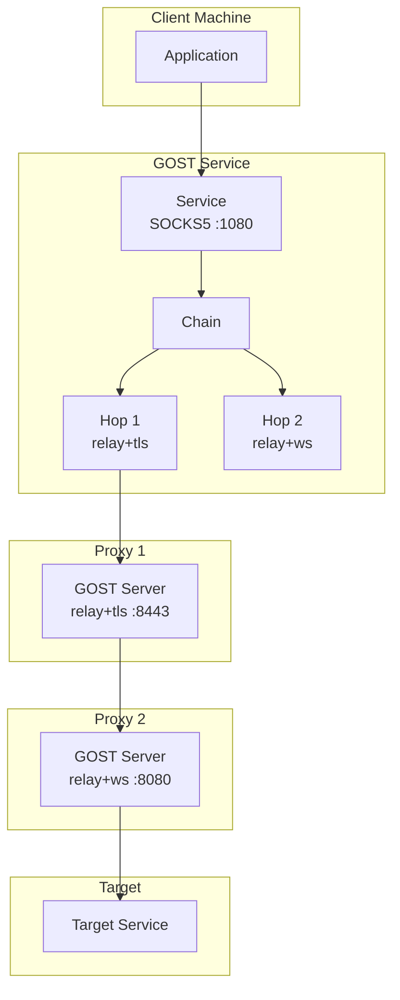
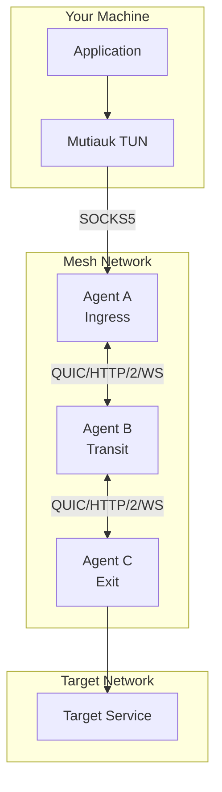
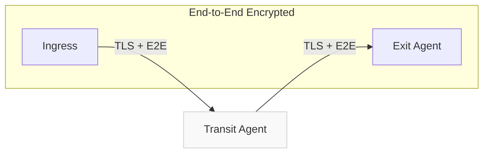

<div style={{textAlign: 'center', marginBottom: '2rem'}}>
  
</div>

# GOST vs Muti Metroo

GOST (GO Simple Tunnel) and Muti Metroo are both Go-based networking tools that create encrypted tunnels, but they serve different design philosophies. GOST emphasizes protocol flexibility and composability, while Muti Metroo focuses on mesh networking with end-to-end encryption. This comparison helps you choose the right tool for your use case.

## Quick Comparison

| Aspect | GOST | Muti Metroo |
|--------|------|-------------|
| **Architecture** | Service + Chain model | Mesh network |
| **Multi-hop** | Manual chain configuration | Automatic flood-based routing |
| **Encryption** | TLS (per-hop) | TLS + E2E (transit cannot decrypt) |
| **Transport** | TCP, TLS, WS, QUIC, HTTP/2, HTTP/3, KCP, gRPC, WebTransport, ICMP, FTCP | QUIC, HTTP/2, WebSocket |
| **Proxy Protocols** | HTTP, SOCKS4, SOCKS5, Shadowsocks, SNI, Relay | SOCKS5 |
| **TUN Interface** | Native | Mutiauk companion (Linux) |
| **Configuration** | CLI + YAML/JSON + Web API | YAML config file |
| **Hot Reload** | Yes (SIGHUP) | Restart required |
| **Metrics** | Prometheus + Grafana | None (design decision) |
| **Remote Shell** | No | Yes (authenticated) |
| **File Transfer** | HTTP file server (static) | Yes (streaming, bidirectional) |
| **ICMP Support** | ICMP tunnel transport | ICMP ping through mesh |
| **Web Dashboard** | No | Yes (metro map visualization) |
| **Service Mode** | Yes | Yes (systemd, launchd, Windows) |
| **Authentication** | Username/password, TLS | mTLS, bcrypt passwords |

## Architecture Comparison

### GOST: Service-Chain Model

GOST uses a **service-oriented model** where services (listeners) connect to handlers via chains (forwarding paths):



**How it works:**
1. Define services (listeners with handlers)
2. Configure chains with hops (each hop specifies transport + protocol)
3. Each hop connects to a GOST server on the next node
4. Chains are explicitly defined - you control every hop

### Muti Metroo: Mesh Network

Muti Metroo creates a **mesh network** where agents discover routes automatically:



**How it works:**
1. Deploy agents on available hosts (any topology)
2. Agents connect as peers (bidirectional connections)
3. Exit agents advertise routes via flood-based routing
4. Traffic automatically finds path to destination
5. No manual chain configuration needed

## Protocol Support

### GOST Protocol Flexibility

GOST's key strength is **protocol composability** - combine any proxy protocol with any transport:

**Proxy Protocols:**
- HTTP/HTTPS proxy
- SOCKS4/SOCKS4A
- SOCKS5 (with UDP support)
- Shadowsocks (SS)
- SNI proxy
- Relay (transparent forwarding)
- DNS proxy
- TUN/TAP

**Transport Protocols:**
- TCP (plain)
- TLS 1.3
- WebSocket (WS/WSS)
- QUIC
- HTTP/2 (H2/H2C)
- HTTP/3
- KCP (UDP-based reliable transport)
- gRPC
- WebTransport
- ICMP (tunnel over ICMP)
- Fake TCP (FTCP)
- SSH

**Example combinations:**
```yaml
services:
  # SOCKS5 over WebSocket over TLS
  - name: socks-wss
    addr: :1080
    handler:
      type: socks5
    listener:
      type: wss

  # HTTP proxy over QUIC
  - name: http-quic
    addr: :8080
    handler:
      type: http
    listener:
      type: quic
```

### Muti Metroo Protocol Focus

Muti Metroo focuses on three battle-tested transports optimized for the mesh use case:

**Transport Protocols:**
- QUIC (primary, multiplexed)
- HTTP/2 (firewall-friendly)
- WebSocket (HTTP/1.1 compatible)

**Proxy Protocol:**
- SOCKS5 (with UDP ASSOCIATE)

```yaml
listeners:
  - address: ":4433"
    transport: quic
    tls:
      cert: "./certs/server.crt"
      key: "./certs/server.key"
```

## Multi-hop Capabilities

### GOST: Manual Chain Configuration

GOST requires explicit chain configuration for multi-hop:

```yaml
services:
  - name: service-0
    addr: :1080
    handler:
      type: socks5
      chain: chain-0

chains:
  - name: chain-0
    hops:
      - name: hop-0
        nodes:
          - name: node-0
            addr: proxy1.example.com:8443
            connector:
              type: relay
            dialer:
              type: tls
      - name: hop-1
        nodes:
          - name: node-0
            addr: proxy2.example.com:8080
            connector:
              type: relay
            dialer:
              type: ws
```

**Characteristics:**
- Full control over each hop's protocol and transport
- Must configure GOST server on each intermediate node
- Adding/removing hops requires reconfiguring chain
- Supports load balancing and failover within hops

### Muti Metroo: Automatic Routing

Routes propagate automatically - no chain configuration:

```yaml
# Agent C (Exit) - just declare what you can reach
exit:
  cidr_routes:
    - cidr: "10.0.0.0/8"
    - cidr: "192.168.0.0/16"

# Agent A (Ingress) - routes discovered automatically
socks5:
  enabled: true
  address: "127.0.0.1:1080"
```

**Characteristics:**
- Routes flood through the mesh automatically
- Longest-prefix match for route selection
- Adding agents requires no reconfiguration
- Optimal path selected by hop count

```bash
# Traffic to 10.x.x.x finds exit agent automatically
curl --socks5 localhost:1080 http://10.20.30.40/
```

## Encryption Comparison

### GOST: Per-Hop Encryption

GOST encrypts each hop independently with TLS:


- Each proxy can see decrypted traffic
- TLS termination at every hop
- Trust required for all intermediate nodes

### Muti Metroo: End-to-End Encryption

Muti Metroo adds E2E encryption on top of TLS:



- X25519 key exchange per stream
- ChaCha20-Poly1305 encryption
- Transit agents relay encrypted frames they cannot read
- Only ingress and exit can decrypt

## Configuration Approaches

### GOST: Maximum Flexibility

GOST offers multiple configuration methods:

**CLI (quick testing):**
```bash
gost -L socks5://:1080 -F relay+tls://proxy1:8443 -F relay+ws://proxy2:8080
```

**YAML/JSON config:**
```yaml
services:
  - name: service-0
    addr: :1080
    handler:
      type: socks5
      chain: chain-0
```

**Web API (dynamic):**
```bash
# Add service at runtime
curl -X POST http://localhost:8080/api/services \
  -d '{"name":"svc1","addr":":1081","handler":{"type":"http"}}'
```

**Hot reload:**
```bash
# Reload config without restart
kill -SIGHUP $(pidof gost)
```

### Muti Metroo: Operational Simplicity

Muti Metroo uses a single YAML config file:

```yaml
agent:
  display_name: "edge-agent"

listeners:
  - address: ":4433"
    transport: quic

peers:
  - address: "core.example.com:4433"
    transport: quic

socks5:
  enabled: true
  address: "127.0.0.1:1080"

exit:
  cidr_routes:
    - cidr: "10.0.0.0/8"
```

**Changes require restart** - but the design is intentional:
- Predictable behavior
- No runtime state drift
- Easier debugging
- Simpler operational model

## Observability

### GOST: Prometheus Metrics

GOST provides comprehensive Prometheus metrics:

```yaml
metrics:
  addr: :9000
  path: /metrics
```

Metrics include:
- Connection counts
- Bytes transferred
- Request latency histograms
- Error rates
- Chain hop statistics

Grafana dashboards available for visualization.

### Muti Metroo: Operational Simplicity

Muti Metroo intentionally omits Prometheus metrics:

> Agents may be deployed ad hoc and are often short-lived. Setting up monitoring infrastructure adds complexity for many use cases. Operational simplicity is prioritized over observability.

Alternative observability:
- `/healthz` endpoint with JSON stats
- Web dashboard with metro map
- Structured logging (JSON format available)
- HTTP API for status queries

## TUN Interface Support

### GOST: Native TUN

GOST includes native TUN/TAP support:

```yaml
services:
  - name: tun
    addr: :8421
    handler:
      type: tun
    listener:
      type: tun
    metadata:
      net: 10.10.10.1/24
```

- Built into GOST binary
- Works on Linux, macOS, Windows
- Requires elevated privileges

### Muti Metroo: Mutiauk Companion

Muti Metroo uses a separate companion tool:

```bash
# Start Mutiauk TUN daemon
sudo mutiauk daemon start

# Configure routes
mutiauk route add 10.0.0.0/8

# Traffic flows through SOCKS5 automatically
curl http://10.20.30.40/
```

**Advantages of separation:**
- Muti Metroo agent doesn't need root
- TUN concerns isolated
- Linux-only (targeted platform)

## Reverse Proxy and Traffic Routing

### GOST: Advanced Reverse Proxy

GOST provides sophisticated reverse proxy capabilities:

**Traffic sniffing:**
```yaml
services:
  - name: service-0
    addr: :8080
    handler:
      type: http
      metadata:
        sniffing: true
```

**Rule-based routing with matchers:**
```yaml
chains:
  - name: chain-0
    hops:
      - name: hop-0
        selector:
          strategy: round
          filters:
            - host: "*.google.com"
```

**Header manipulation:**
```yaml
services:
  - name: service-0
    handler:
      type: http
      metadata:
        header:
          X-Custom-Header: value
```

### Muti Metroo: CIDR and Domain Routing

Muti Metroo uses declarative exit routing:

```yaml
exit:
  cidr_routes:
    - cidr: "10.0.0.0/8"
    - cidr: "192.168.1.0/24"

  domain_routes:
    - pattern: "*.internal.corp"
    - pattern: "api.example.com"
```

- Routes advertised automatically through mesh
- Longest-prefix match for CIDR
- Pattern matching for domains

## When to Use GOST

GOST excels when:

- **Protocol flexibility**: Need to combine specific proxy protocols with specific transports (HTTP over QUIC, SS over WebSocket, etc.)
- **Prometheus metrics**: Require comprehensive observability with Grafana dashboards
- **Traffic manipulation**: Need reverse proxy features like sniffing, header rewriting, rule-based routing
- **Hot reload**: Configuration changes must apply without restart
- **More transports**: Require KCP, gRPC, HTTP/3, WebTransport, or ICMP tunneling
- **Dynamic configuration**: Need Web API for runtime service management
- **Native TUN**: Want TUN interface without a separate tool

**Typical workflow:**
```bash
# Quick CLI setup
gost -L socks5://:1080 -F relay+wss://proxy.example.com:443

# Or multi-hop chain
gost -L socks5://:1080 \
  -F relay+tls://hop1.example.com:8443 \
  -F relay+ws://hop2.example.com:8080
```

## When to Use Muti Metroo

Muti Metroo excels when:

- **Mesh topology**: Need automatic routing through complex network topologies
- **E2E encryption**: Transit nodes must not see decrypted traffic
- **Simpler multi-hop**: Want automatic route discovery without manual chain configuration
- **Built-in features**: Need remote shell, file transfer, ICMP ping, web dashboard
- **Certificate authentication**: Prefer mTLS over username/password
- **Single agent per host**: Want simpler deployment (not server + client like chain models)
- **Always-on infrastructure**: Building persistent mesh with automatic reconnection

**Typical workflow:**
```yaml
# Deploy agents with config
# Routes propagate automatically

# Agent A (Ingress)
socks5:
  enabled: true
  address: "127.0.0.1:1080"

# Agent C (Exit)
exit:
  cidr_routes:
    - cidr: "10.0.0.0/8"
```

```bash
# Access any destination through mesh
curl --socks5 localhost:1080 http://10.20.30.40/

# Or transparent with Mutiauk
sudo mutiauk daemon start
curl http://10.20.30.40/
```

## Summary

| Choose | When You Need |
|--------|---------------|
| **GOST** | Protocol composability, Prometheus metrics, traffic manipulation, hot reload, more transport options, dynamic Web API configuration |
| **Muti Metroo** | Mesh networking, automatic multi-hop routing, E2E encryption (transit cannot decrypt), remote shell/file transfer, simpler deployment model |

Both tools are powerful Go-based networking solutions. GOST provides unparalleled protocol flexibility and composability - you can combine almost any proxy protocol with any transport and build complex chains. Muti Metroo focuses on mesh networking where routes propagate automatically and end-to-end encryption ensures transit nodes cannot see your data.

If you need fine-grained control over protocols and transports with comprehensive metrics, GOST is the better choice. If you need a mesh network with automatic routing and true end-to-end encryption, Muti Metroo provides a more integrated solution.

## See Also

- [Core Concepts - Architecture](/concepts/architecture) - How Muti Metroo works
- [Security - E2E Encryption](/security/e2e-encryption) - How E2E encryption protects transit
- [Features - Port Forwarding](/features/port-forwarding) - Reverse tunnel functionality
- [Mutiauk TUN Interface](/mutiauk) - Transparent routing with TUN
