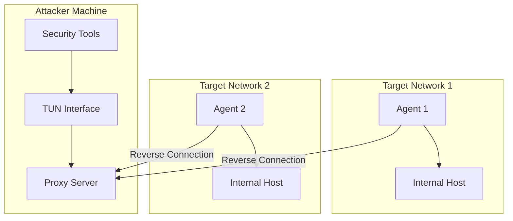
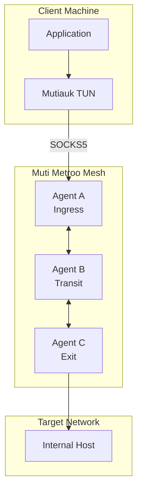
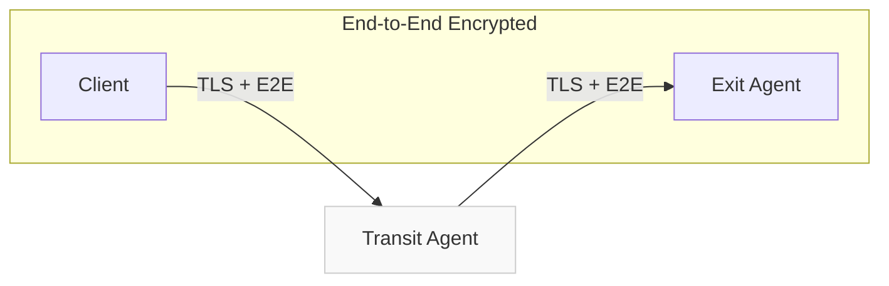

<div style={{textAlign: 'center', marginBottom: '2rem'}}>
  
</div>

# Ligolo-ng vs Muti Metroo

Both Ligolo-ng and Muti Metroo create network tunnels using TUN interfaces, but they take fundamentally different architectural approaches. This comparison helps you choose the right tool for your use case.

## Quick Comparison

| Aspect | Ligolo-ng | Muti Metroo (+ Mutiauk) |
|--------|-----------|-------------------------|
| **Architecture** | Proxy + Agent (star topology) | Mesh network (any topology) |
| **TUN Location** | Server-side (proxy machine) | Client-side (Mutiauk) |
| **Proxy Server** | Requires root/admin for TUN | None needed (agents run unprivileged) |
| **Agent Privileges** | None required | None required |
| **Multi-hop** | Manual listener chaining | Native flood-based routing |
| **Encryption** | TLS transport | TLS transport + E2E encryption |
| **Transports** | TCP/TLS, WebSocket | QUIC, HTTP/2, WebSocket |
| **Protocol Support** | TCP, UDP, ICMP | TCP, UDP, ICMP |
| **Performance** | ~100+ Mbps | ~100+ Mbps |
| **Primary Focus** | Pentesting pivoting | Infrastructure connectivity |

## Architecture Comparison

### Ligolo-ng: Centralized Proxy Model

Ligolo-ng uses a **star topology** where a central proxy server manages all connections:



**How it works:**
1. Start the proxy server on your attack machine (creates TUN interface)
2. Deploy agents on target networks (they connect back to proxy)
3. Configure routes on the proxy to point to the TUN interface
4. Traffic from your tools goes through TUN to agents to targets

### Muti Metroo: Decentralized Mesh Model

Muti Metroo uses a **mesh topology** where agents connect to each other and routes propagate automatically:



**How it works:**
1. Deploy agents anywhere (they form peer connections in any direction)
2. Routes flood through the mesh automatically
3. Connect via SOCKS5 or use Mutiauk for transparent TUN-based routing
4. Traffic flows through the mesh to the exit agent with the matching route

## TUN Interface Approach

### Ligolo-ng: Server-Side TUN

The TUN interface lives on the **proxy server** (typically your attack machine):

- **Advantage**: Transparent to all tools - anything that uses the network stack works
- **Requirement**: Root/admin on the proxy server to create TUN
- **Location**: Your machine (where you run tools)

```bash
# On proxy server (requires root)
sudo ip tuntap add user $USER mode tun ligolo
sudo ip link set ligolo up

# Start proxy
./proxy -selfcert

# Add routes after agent connects
sudo ip route add 192.168.1.0/24 dev ligolo
```

### Muti Metroo + Mutiauk: Client-Side TUN

The TUN interface lives on the **client machine** where you need transparent routing:

- **Advantage**: Agents run unprivileged, TUN only where needed
- **Requirement**: Root on the client machine for Mutiauk (optional)
- **Alternative**: Use SOCKS5 directly without TUN (no root needed)

```bash
# Option 1: SOCKS5 only (no root)
curl --socks5 localhost:1080 http://internal-server/

# Option 2: Transparent routing with Mutiauk (requires root)
sudo mutiauk daemon start
# All traffic to configured routes goes through mesh automatically
curl http://internal-server/
```

## Multi-hop Capabilities

### Ligolo-ng: Manual Double Pivoting

To reach networks behind multiple hops, you chain listeners manually:

```
[Proxy] <-- Agent1 (Network A) <-- Agent2 (Network B) --> Target
```

Setup requires:
1. Start listener on Agent1 for Agent2 to connect
2. Run Agent2 connecting through Agent1's listener
3. Manage each hop explicitly

### Muti Metroo: Native Multi-hop Routing

Routes propagate automatically through flood-based routing:

```
[Client] --> Agent A --> Agent B --> Agent C --> Target
```

Setup:
1. Connect agents in any topology (chain, tree, mesh)
2. Exit agents advertise their routes
3. Ingress automatically finds the path - no manual configuration

```yaml
# Agent C config - just advertise the route
exit:
  cidr_routes:
    - cidr: "10.0.0.0/8"
# Routes automatically propagate to all other agents
```

## Security Model

### Ligolo-ng: Transport Encryption

- TLS encrypts the tunnel between agent and proxy
- Supports Let's Encrypt, custom certs, or self-signed
- Certificate fingerprint validation for self-signed certs

### Muti Metroo: Transport + End-to-End Encryption

- TLS encrypts peer-to-peer connections (transport layer)
- **Additional E2E encryption**: X25519 key exchange + ChaCha20-Poly1305
- Transit agents cannot decrypt your traffic - only ingress and exit can



The transit agent relays encrypted frames it cannot read.

## Transport Options

### Ligolo-ng

| Transport | Description |
|-----------|-------------|
| TCP/TLS | Default, reverse TCP connection with TLS |
| WebSocket | For HTTP proxy traversal (`--proxy` flag) |

### Muti Metroo

| Transport | Description | Best For |
|-----------|-------------|----------|
| QUIC | UDP-based, fastest | Direct connections |
| HTTP/2 | TCP-based, firewall-friendly | Corporate networks |
| WebSocket | Maximum compatibility | HTTP proxies, CDNs |

Muti Metroo agents can use different transports on different peer connections in the same mesh.

## Feature Comparison

| Feature | Ligolo-ng | Muti Metroo |
|---------|-----------|-------------|
| TCP tunneling | Yes | Yes |
| UDP tunneling | Yes | Yes (SOCKS5 UDP ASSOCIATE) |
| ICMP (ping) | Echo only | Echo only |
| File transfer | No | Yes (authenticated) |
| Remote shell | No | Yes (whitelisted, authenticated) |
| Web dashboard | Yes (v0.8+) | Yes (metro map visualization) |
| Auto-reconnect | Yes | Yes (exponential backoff) |
| Config file | Yes (v0.8+) | Yes (YAML) |
| Service mode | Yes (daemon) | Yes (systemd, launchd, Windows) |
| API | Yes | Yes (REST) |

## When to Use Ligolo-ng

Ligolo-ng excels when:

- **Quick pivoting**: You need to pivot through a single network fast
- **Familiar workflow**: You prefer the traditional proxy-agent model
- **All-tools-transparent**: You want any tool to work without SOCKS configuration
- **Pentesting**: Primary use case is security assessments
- **Single operator**: One person accessing multiple networks

**Typical workflow:**
```bash
# Start proxy (your machine)
./proxy -selfcert

# Deploy agent (target)
./agent -connect your-server:11601 -ignore-cert

# Select agent, start tunnel, add route
# Use any tool - traffic flows through TUN
nmap -sT -Pn 192.168.1.0/24
```

## When to Use Muti Metroo

Muti Metroo excels when:

- **Complex topologies**: Multi-site connectivity, chain/tree/mesh networks
- **Multi-hop required**: Traffic needs to traverse multiple network boundaries
- **E2E encryption needed**: Transit nodes must not see your data
- **Infrastructure use**: Permanent or semi-permanent connectivity
- **Restricted networks**: Need HTTP/2 or WebSocket to traverse firewalls
- **Team access**: Multiple users accessing shared infrastructure

**Typical workflow:**
```bash
# Deploy agents (any topology)
muti-metroo run -c config.yaml  # Each site

# Connect via SOCKS5 or Mutiauk
curl --socks5 localhost:1080 http://internal/

# Or transparent routing
sudo mutiauk daemon start
curl http://internal/
```

## Migration Considerations

### From Ligolo-ng to Muti Metroo

If you're considering switching:

| Ligolo-ng Concept | Muti Metroo Equivalent |
|-------------------|------------------------|
| Proxy server | Ingress agent (any agent with SOCKS5 enabled) |
| Agent | Agent (same concept) |
| `tunnel_start` | Automatic (just connect peers) |
| Route commands | Exit route configuration |
| Double pivot listeners | Native multi-hop (automatic) |

### Key Differences to Adapt To

1. **No central proxy**: Any agent can be an ingress point
2. **Routes are declarative**: Configure exits, routes propagate
3. **SOCKS5 or Mutiauk**: Choose per-client how to connect
4. **Peer connections**: Explicit peer configuration vs reverse-only

## Summary

| Choose | When You Need |
|--------|---------------|
| **Ligolo-ng** | Quick pivoting, familiar pentesting workflow, single-hop transparent tunneling |
| **Muti Metroo** | Complex topologies, native multi-hop, E2E encryption, infrastructure connectivity |

Both tools are excellent at what they do. Ligolo-ng provides a streamlined pentesting experience with server-side TUN transparency. Muti Metroo provides a flexible mesh architecture with native multi-hop routing and end-to-end encryption.

## See Also

- [Core Concepts - Architecture](/concepts/architecture) - How Muti Metroo works
- [Mutiauk TUN Interface](/mutiauk) - Transparent routing with TUN
- [Transports](/concepts/transports) - QUIC, HTTP/2, WebSocket options
- [Security - E2E Encryption](/security/e2e-encryption) - How E2E encryption works
