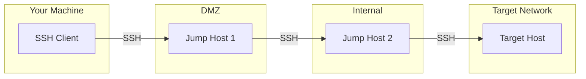
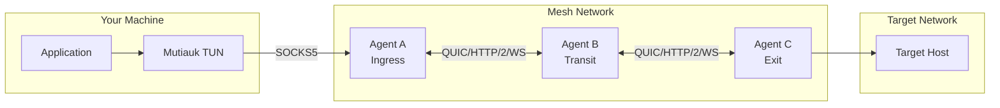
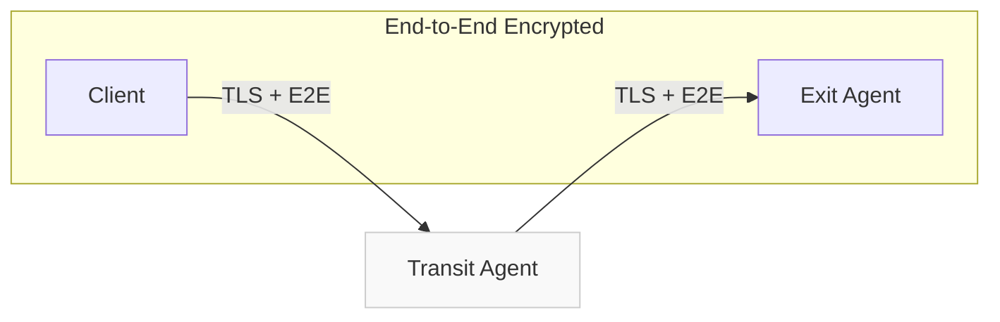

<div style={{textAlign: 'center', marginBottom: '2rem'}}>
  
</div>

# SSH Jump Hosts vs Muti Metroo

SSH jump hosts (ProxyJump) and Muti Metroo both solve the problem of reaching hosts across network boundaries. This comparison helps you choose the right approach for your use case.

## Quick Comparison

| Aspect | SSH Jump | Muti Metroo + Mutiauk |
|--------|----------|----------------------|
| **Setup** | SSH config + keys on each host | Agent deployment + YAML config |
| **Protocol Support** | SSH only (TCP via port forwarding) | TCP, UDP, ICMP natively |
| **Multi-hop** | ProxyJump chain (linear) | Native flood-based routing (any topology) |
| **Authentication** | SSH keys or passwords | TLS certificates + optional mTLS |
| **Encryption** | SSH encryption | TLS transport + E2E encryption |
| **Application Support** | SSH-aware apps or explicit port forwards | Any app via SOCKS5 or TUN |
| **Firewall Traversal** | Port 22 (often blocked) | HTTP/2, WebSocket (port 443) |
| **Persistence** | Session-based | Always-on mesh |
| **Root Required** | No | No (Mutiauk TUN: yes) |
| **Dependencies** | OpenSSH on all hosts | Single binary, no dependencies |

## Architecture Comparison

### SSH Jump: Linear Chain

SSH jump hosts create a **linear chain** where each hop is a separate SSH connection:



**How it works:**
1. SSH client connects to Jump Host 1
2. Jump Host 1 opens SSH connection to Jump Host 2
3. Jump Host 2 opens SSH connection to Target
4. Each hop requires SSH server running and credentials configured

### Muti Metroo: Mesh Network

Muti Metroo creates a **mesh network** where agents connect in any topology and routes propagate automatically:



**How it works:**
1. Deploy agents on available hosts (no SSH server required)
2. Agents form peer connections (can be in any direction)
3. Routes flood through the mesh automatically
4. Traffic finds its path to the exit agent

## Multi-hop Configuration

### SSH: ProxyJump Chain

Configure multi-hop access in `~/.ssh/config`:

```
# Two-hop jump
Host target-server
    HostName 10.20.30.40
    User admin
    ProxyJump jump1,jump2

Host jump1
    HostName jump1.example.com
    User jumpuser

Host jump2
    HostName 192.168.1.10
    User jumpuser
    ProxyJump jump1
```

Or use command line:

```bash
# Single jump
ssh -J jump1.example.com admin@target

# Multiple jumps
ssh -J jump1.example.com,jump2.internal admin@target
```

**Requirements:**
- SSH server on every hop
- Credentials (keys/passwords) for each hop
- Manual chain configuration for each target

### Muti Metroo: Automatic Routing

Configure agents with peer connections:

```yaml
# Agent B (transit) - connects to A and C
peers:
  - id: "agent-a-id..."
    transport: quic
    address: "agent-a.example.com:4433"
  - id: "agent-c-id..."
    transport: quic
    address: "192.168.1.50:4433"
```

```yaml
# Agent C (exit) - advertises routes
exit:
  cidr_routes:
    - cidr: "10.20.30.0/24"
```

**That's it.** Routes propagate automatically. No per-target configuration needed.

```bash
# Access any host in the advertised range
curl --socks5 localhost:1080 http://10.20.30.40/

# Or with Mutiauk for transparent access
curl http://10.20.30.40/
```

## Protocol Support

### SSH: TCP Only (via Port Forwarding)

SSH natively handles SSH protocol only. For other protocols, you need explicit port forwards:

```bash
# Local port forward (TCP only)
ssh -L 8080:internal-web:80 jump-host

# Dynamic SOCKS proxy
ssh -D 1080 jump-host

# Then use with SOCKS-aware tools
curl --socks5 localhost:1080 http://internal-web/
```

**Limitations:**
- No native UDP support
- No ICMP (can't ping through SSH)
- Each port forward must be configured explicitly
- SOCKS proxy works but adds complexity

### Muti Metroo: Native TCP, UDP, ICMP

```bash
# TCP - works via SOCKS5 or Mutiauk
curl --socks5 localhost:1080 http://internal-web/

# UDP - native via SOCKS5 UDP ASSOCIATE
# DNS queries, game traffic, etc. work transparently

# ICMP - ping through the mesh
muti-metroo ping <exit-agent-id> 10.20.30.40
```

With Mutiauk TUN, all protocols work transparently:

```bash
sudo mutiauk daemon start

# TCP
curl http://internal-web/

# UDP (DNS)
dig @10.20.30.1 internal.corp

# ICMP
ping 10.20.30.40
```

## Application Integration

### SSH: Manual Configuration Per-App

**Option 1: SOCKS proxy**

```bash
# Start SOCKS proxy
ssh -D 1080 -J jump1,jump2 target-network-host

# Configure each application
curl --socks5 localhost:1080 http://internal/
export http_proxy=socks5://localhost:1080
```

**Option 2: Explicit port forwards**

```bash
# Forward specific ports
ssh -L 8080:web-server:80 -L 5432:db-server:5432 jump-host

# Access via localhost
curl http://localhost:8080
psql -h localhost -p 5432
```

**Option 3: SSH native (for SSH-aware tools)**

```bash
# Git over SSH
git clone ssh://jump1/user@internal-git/repo.git

# SCP
scp -J jump1,jump2 file.txt target:/path/
```

### Muti Metroo: Universal Access

**Option 1: SOCKS5 proxy (no root)**

```bash
# Any SOCKS5-aware application works
curl --socks5 localhost:1080 http://internal/
```

**Option 2: Mutiauk TUN (transparent)**

```bash
sudo mutiauk daemon start

# Every application works - no configuration
curl http://internal/
psql -h db-server.internal
ping web-server.internal
```

## Firewall Traversal

### SSH: Port 22 Challenges

SSH typically requires port 22, which is often:
- Blocked by corporate firewalls
- Monitored and logged
- Rate-limited or geo-blocked
- Requires firewall exceptions

**Workarounds exist but add complexity:**
```bash
# SSH over HTTPS port (if server configured)
ssh -p 443 user@host

# SSH over HTTP proxy
ssh -o ProxyCommand='nc -X connect -x proxy:8080 %h %p' user@host
```

### Muti Metroo: Built-in Firewall Bypass

Multiple transport options designed for restrictive networks:

| Transport | Port | Firewall Behavior |
|-----------|------|-------------------|
| **QUIC** | 4433 (configurable) | May be blocked (UDP) |
| **HTTP/2** | 443 | Looks like HTTPS traffic |
| **WebSocket** | 443 | Works through HTTP proxies |

```yaml
# Through corporate proxy
peers:
  - id: "relay-agent..."
    transport: ws
    address: "wss://relay.example.com:443/mesh"
    proxy: "http://corporate-proxy:8080"
```

## Connection Persistence

### SSH: Session-Based

SSH connections are session-based:
- Connection closes when you disconnect
- Requires reconnection after network interruption
- No automatic recovery
- Must re-authenticate on each connection

```bash
# Connection lost = start over
ssh -J jump1,jump2 target
# Network blip...
# Connection reset. Re-authenticate.
ssh -J jump1,jump2 target
```

**Workarounds:**
- `autossh` for automatic reconnection
- `mosh` for mobile connections
- `tmux`/`screen` for session persistence

### Muti Metroo: Always-On Mesh

Agents maintain persistent connections with automatic recovery:

- Exponential backoff reconnection (1s to 60s)
- Keepalive with configurable intervals
- Route table survives reconnections
- No re-authentication needed

```yaml
# Automatic reconnection built-in
connections:
  idle_threshold: 5m
  timeout: 90s
  keepalive_jitter: 0.2
```

Run as system service for true always-on:

```bash
sudo muti-metroo service install -c /etc/muti-metroo/config.yaml
```

## Security Comparison

### SSH Security Model

- **Authentication**: Public key or password
- **Encryption**: SSH protocol (ChaCha20-Poly1305 or AES)
- **Trust**: Each hop sees plaintext (can be mitigated with SSH tunneling inside SSH)
- **Key management**: Distribute public keys to each host

### Muti Metroo Security Model

- **Authentication**: TLS certificates + optional mTLS
- **Transport encryption**: TLS 1.3
- **E2E encryption**: X25519 + ChaCha20-Poly1305
- **Transit trust**: Transit agents cannot decrypt traffic



## When to Use SSH Jump

SSH jump hosts excel when:

- **Already have SSH access**: Jump hosts are already deployed and configured
- **Simple linear topology**: A -> B -> C chain is sufficient
- **SSH-native workflows**: Using git, scp, rsync over SSH
- **Temporary access**: Quick one-off access to a remote host
- **No additional software**: Can't deploy agents on intermediate hosts
- **Unix/Linux only**: All hosts support SSH

**Typical workflow:**
```bash
# Quick access through jump hosts
ssh -J bastion.example.com admin@internal-server

# Port forward for specific service
ssh -L 5432:db.internal:5432 -J bastion admin@app-server
psql -h localhost -p 5432
```

## When to Use Muti Metroo

Muti Metroo excels when:

- **Need UDP or ICMP**: DNS, VoIP, ping, game traffic
- **Complex topologies**: Multiple sites, redundant paths, mesh networks
- **Firewall traversal**: Port 22 blocked, need HTTP/2 or WebSocket
- **Always-on connectivity**: Persistent access without session management
- **Multiple users**: Team needs shared infrastructure access
- **Any application**: Tools that don't support SOCKS or SSH
- **Transit security**: Don't trust intermediate hosts with your traffic

**Typical workflow:**
```bash
# Deploy agents (once)
muti-metroo run -c config.yaml

# Access everything transparently
sudo mutiauk daemon start
curl http://internal-api/
ping internal-server
dig @internal-dns internal.corp
```

## Hybrid Approach

You can use both together. Access Muti Metroo agents via SSH for management while using the mesh for traffic:

```bash
# SSH to manage an agent
ssh admin@agent-host

# Traffic flows through the mesh
curl --socks5 localhost:1080 http://internal/
```

Or use SSH as a transport for initial agent deployment in locked-down environments.

## Summary

| Choose | When You Need |
|--------|---------------|
| **SSH Jump** | Quick access with existing SSH infrastructure, SSH-native tools, simple chains |
| **Muti Metroo** | UDP/ICMP support, complex topologies, firewall bypass, always-on mesh, E2E encryption |

SSH jump hosts are the pragmatic choice when you already have SSH access and need simple TCP connectivity. Muti Metroo provides a more capable solution for complex networking scenarios, protocol diversity, and persistent infrastructure connectivity.

## See Also

- [Core Concepts - Architecture](/concepts/architecture) - How Muti Metroo works
- [Mutiauk TUN Interface](/mutiauk) - Transparent routing with TUN
- [Transports](/concepts/transports) - QUIC, HTTP/2, WebSocket options
- [Security - E2E Encryption](/security/e2e-encryption) - How E2E encryption works
- [Deployment - System Service](/deployment/system-service) - Always-on deployment
