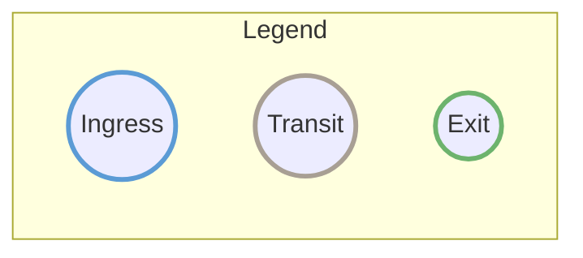
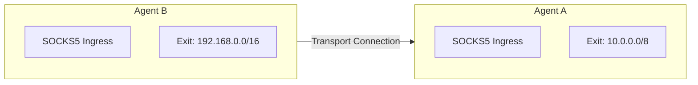

<div style={{textAlign: 'center', marginBottom: '2rem'}}>
  
</div>

# Agent Roles

Each agent in your mesh has a job: accept connections from users, relay traffic between networks, or open connections to destinations. One agent can do all three, or you can specialize agents for different purposes.

## The Three Roles

| Role | What It Does | You Need This When... |
|------|--------------|----------------------|
| **Ingress** | Accepts your SOCKS5 connections | You want to connect through this agent |
| **Transit** | Relays traffic to other agents | You need to bridge network segments |
| **Exit** | Opens connections to destinations | You want traffic to exit from this network |

## Ingress Role

An **ingress agent** is where you connect. Point your browser, curl, or SSH at the SOCKS5 proxy and your traffic enters the mesh.

### What It Does

- Runs a SOCKS5 proxy that you connect to
- Looks up which exit can reach your destination
- Opens a tunnel through the mesh to that exit
- Relays your traffic through the tunnel

### Configuration

```yaml
socks5:
  enabled: true
  address: "127.0.0.1:1080"
  auth:
    enabled: false
  max_connections: 1000
```

### Typical Deployment

- **User workstations**: Local SOCKS5 proxy
- **Edge servers**: Remote access gateway
- **Cloud instances**: Entry point for distributed team

### Example: Ingress-Only Agent

```yaml
agent:
  display_name: "Ingress Gateway"

listeners:
  - transport: quic
    address: "0.0.0.0:4433"
    tls:
      cert: "./certs/agent.crt"
      key: "./certs/agent.key"

peers:
  - id: "transit-agent-id..."
    transport: quic
    address: "relay.example.com:4433"
    tls:
      ca: "./certs/ca.crt"

socks5:
  enabled: true
  address: "0.0.0.0:1080"
  auth:
    enabled: true
    users:
      - username: "team"
        password_hash: "$2a$10$..."

# No exit configuration - pure ingress
```

## Transit Role

A **transit agent** bridges networks. Put one in the cloud, the DMZ, or anywhere that can reach multiple network segments, and it relays traffic between them.

### What It Does

- Connects to agents in different networks
- Forwards traffic between them
- Propagates route information so agents discover each other
- Cannot see the traffic content (end-to-end encrypted)

### Configuration

Transit role is implicit - any agent that connects to multiple peers becomes a transit node:

```yaml
# No specific configuration needed
# Just connect to multiple peers
peers:
  - id: "peer-a-id..."
    transport: quic
    address: "192.168.1.10:4433"
    tls:
      ca: "./certs/ca.crt"

  - id: "peer-b-id..."
    transport: quic
    address: "192.168.1.20:4433"
    tls:
      ca: "./certs/ca.crt"
```

### Typical Deployment

- **Cloud relay**: Bridge between on-premise networks
- **DMZ server**: Connect internal and external networks
- **Geographic hop**: Reduce latency across regions

### Example: Transit-Only Agent

```yaml
agent:
  display_name: "Cloud Transit"

listeners:
  - transport: quic
    address: "0.0.0.0:4433"
    tls:
      cert: "./certs/agent.crt"
      key: "./certs/agent.key"

peers:
  - id: "site-a-agent..."
    transport: quic
    address: "site-a.example.com:4433"
    tls:
      ca: "./certs/ca.crt"

  - id: "site-b-agent..."
    transport: quic
    address: "site-b.example.com:4433"
    tls:
      ca: "./certs/ca.crt"

# No socks5 or exit - pure transit
http:
  enabled: true
  address: ":8080"
```

## Exit Role

An **exit agent** is where traffic leaves the mesh. Put one inside a private network to reach internal resources, or in a cloud region to exit from that location.

### What It Does

- Advertises which destinations it can reach (CIDR routes, domains)
- Opens real TCP connections to those destinations
- Resolves DNS for domain-based routing
- Controls which destinations are allowed

### Configuration

```yaml
exit:
  enabled: true
  routes:
    - "10.0.0.0/8"        # Private network
    - "192.168.0.0/16"    # Another private network
    - "0.0.0.0/0"         # Default route (internet)
  dns:
    servers:
      - "8.8.8.8:53"
      - "1.1.1.1:53"
    timeout: 5s
```

### Typical Deployment

- **Internet gateway**: Default route for all traffic
- **Private network access**: Routes to internal resources
- **Service endpoint**: Access to specific services/CIDRs

### Example: Exit-Only Agent

```yaml
agent:
  display_name: "Exit Gateway"

listeners:
  - transport: quic
    address: "0.0.0.0:4433"
    tls:
      cert: "./certs/agent.crt"
      key: "./certs/agent.key"

exit:
  enabled: true
  routes:
    - "10.0.0.0/8"        # Company internal network
  dns:
    servers:
      - "10.0.0.1:53"     # Internal DNS
    timeout: 5s

# No socks5 - pure exit
http:
  enabled: true
  address: ":8080"
```

## Combined Roles

Agents can combine multiple roles. Common patterns:

### Ingress + Transit

Acts as entry point and relay:

```yaml
socks5:
  enabled: true
  address: "127.0.0.1:1080"

peers:
  - id: "remote-exit-id..."
    address: "remote.example.com:4433"
```

### Transit + Exit

Relays traffic and provides exit for specific routes:

```yaml
peers:
  - id: "ingress-id..."
    address: "ingress.example.com:4433"

exit:
  enabled: true
  routes:
    - "10.0.0.0/8"
```

### All Roles (Standalone)

Single agent that does everything:

```yaml
agent:
  display_name: "All-in-One"

listeners:
  - transport: quic
    address: "0.0.0.0:4433"

socks5:
  enabled: true
  address: "127.0.0.1:1080"

exit:
  enabled: true
  routes:
    - "0.0.0.0/0"
  dns:
    servers:
      - "8.8.8.8:53"
```

## Role Selection Guide

| What You Want | How To Set It Up |
|---------------|------------------|
| Tunnel from my laptop to the internet | Single agent with Ingress + Exit |
| Reach a remote office network | Ingress on your laptop, Exit inside the office |
| Connect multiple offices together | Transit in the cloud, Exit at each site |
| Team access to internal resources | Ingress at each user location, Exit inside the network |
| Exit from different geographic regions | Transit hub, regional Exit agents |

## Role Visualization

The web dashboard (`/ui/`) displays each agent's roles as colored rings around the node:



| Ring Color | Role | Meaning |
|------------|------|---------|
| Blue | Ingress | SOCKS5 proxy enabled |
| Gray | Transit | Relay only (no ingress/exit) |
| Green | Exit | Has CIDR or domain routes |

Agents with multiple roles display multiple concentric rings. Hover over any agent in the dashboard to see detailed role information, SOCKS5 address (for ingress), and exit routes.

## Roles vs. Connection Direction

A common misconception is that connection direction determines agent roles. This is **not true**.

### Key Principle

**Transport connection direction (who dials whom) is independent of agent roles (ingress/transit/exit).**

Consider this topology where Agent B dials Agent A:



Even though B dialed A, virtual streams can flow **both directions**:

- A SOCKS5 client on Agent A can tunnel to `192.168.0.0/16` via Agent B's exit
- A SOCKS5 client on Agent B can tunnel to `10.0.0.0/8` via Agent A's exit

### Practical Implications

| Concern | Depends On |
|---------|-----------|
| Which agent can be ingress | SOCKS5 configuration, not connection direction |
| Which agent can be exit | Exit routes configuration, not connection direction |
| Which agent initiates streams | Route table, not connection direction |
| Connection direction choice | Network constraints (firewalls, NAT) |

:::tip Design Principle
Think of transport connections as **bidirectional pipes**. Once connected, it doesn't matter which end opened the connection - data and routes flow freely in both directions. Choose connection direction based on network accessibility, not functionality.
:::

See [Architecture - Connection Model](/concepts/architecture#connection-model) for technical details.

## Best Practices

1. **Minimize exit points**: Fewer exits are easier to monitor and secure
2. **Place transit in DMZ**: Transit agents don't need to access sensitive resources
3. **Use specific routes**: Avoid `0.0.0.0/0` on exits unless necessary
4. **Separate concerns**: Don't combine ingress and exit on the same agent in production
5. **Enable HTTP API**: Enable HTTP API for health checks and dashboard on every agent

## Next Steps

- [Transports](/concepts/transports) - Choose the right transport for each role
- [Routing](/concepts/routing) - How routes propagate between roles
- [Security](/security/overview) - Secure each role appropriately
