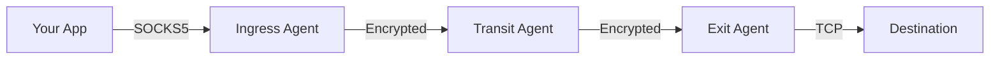
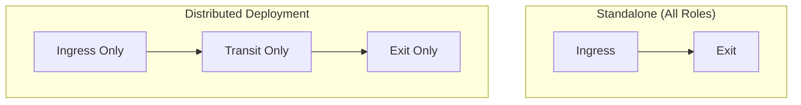

  

# Agent Roles

Each agent in your mesh has a job: accept connections from users, relay traffic between networks, or open connections to destinations. One agent can do all three, or you can specialize agents for different purposes.

## The Three Roles

| Role | What It Does | You Need This When... |
|------|--------------|----------------------|
| **Ingress** | Accepts your SOCKS5 connections | You want to connect through this agent |
| **Transit** | Relays traffic to other agents | You need to bridge network segments |
| **Exit** | Opens connections to destinations | You want traffic to exit from this network |

## Ingress Role

An **ingress agent** is where you connect. Point your browser, curl, or SSH at the SOCKS5 proxy and your traffic enters the mesh.

**What it does:**
- Runs a SOCKS5 proxy that you connect to
- Looks up which exit can reach your destination
- Opens a tunnel through the mesh to that exit
- Relays your traffic through the tunnel

**Typical deployment:**
- User workstations (local SOCKS5 proxy)
- Edge servers (remote access gateway)
- Cloud instances (entry point for distributed teams)

## Transit Role

A **transit agent** bridges networks. Put one in the cloud, the DMZ, or anywhere that can reach multiple network segments, and it relays traffic between them.

**What it does:**
- Connects to agents in different networks
- Forwards traffic between them
- Propagates route information so agents discover each other
- Cannot see the traffic content (end-to-end encrypted)

**Typical deployment:**
- Cloud relay (bridge between on-premise networks)
- DMZ server (connect internal and external networks)
- Geographic hop (reduce latency across regions)

:::info Implicit Role
Transit role is implicit - any agent that connects to multiple peers automatically becomes a transit node. No specific configuration is needed.
:::

## Exit Role

An **exit agent** is where traffic leaves the mesh. Put one inside a private network to reach internal resources, or in a cloud region to exit from that location.

**What it does:**
- Advertises which destinations it can reach (CIDR routes, domains)
- Opens real TCP connections to those destinations
- Resolves DNS for domain-based routing
- Controls which destinations are allowed

**Typical deployment:**
- Internet gateway (default route for all traffic)
- Private network access (routes to internal resources)
- Service endpoint (access to specific services/CIDRs)

## Combined Roles

Agents can combine multiple roles. Common patterns:

| Pattern | Description | Use Case |
|---------|-------------|----------|
| **Ingress + Exit** | Entry point that also exits traffic | Standalone proxy, simple setups |
| **Ingress + Transit** | Entry point that relays to other exits | Gateway with multiple exit options |
| **Transit + Exit** | Relay that also provides exit routes | Bridge between networks with local exit |
| **All Three** | Does everything | Single-agent deployments |

## Role Selection Guide

| What You Want | How To Set It Up |
|---------------|------------------|
| Tunnel from my laptop to the internet | Single agent with Ingress + Exit |
| Reach a remote office network | Ingress on your laptop, Exit inside the office |
| Connect multiple offices together | Transit in the cloud, Exit at each site |
| Team access to internal resources | Ingress at each user location, Exit inside the network |
| Exit from different geographic regions | Transit hub, regional Exit agents |

## Role Visualization

The web dashboard (`/ui/`) displays each agent's roles as colored rings around the node:

| Ring Color | Role | Meaning |
|------------|------|---------|
| Blue | Ingress | SOCKS5 proxy enabled |
| Gray | Transit | Relay only (no ingress/exit) |
| Green | Exit | Has CIDR or domain routes |

Agents with multiple roles display multiple concentric rings. Hover over any agent in the dashboard to see detailed role information, SOCKS5 address (for ingress), and exit routes.

## Best Practices

1. **Minimize exit points**: Fewer exits are easier to monitor and secure
2. **Place transit in DMZ**: Transit agents don't need to access sensitive resources
3. **Use specific routes**: Avoid `0.0.0.0/0` on exits unless necessary
4. **Separate concerns**: Don't combine ingress and exit on the same agent in production
5. **Enable HTTP API**: Enable health checks and dashboard on every agent

:::tip Connection Direction
Transport connection direction (who dials whom) is independent of agent roles. See [Architecture - Connection Model](/concepts/architecture#connection-model) for details.
:::

## Next Steps

- [Transports](/concepts/transports) - Choose the right transport for each role
- [Routing](/concepts/routing) - How routes propagate between roles
- [Configuration Reference](/configuration/overview) - Configure each role
