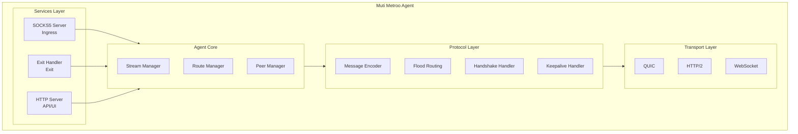
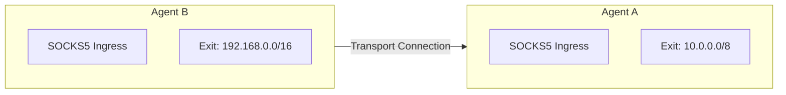
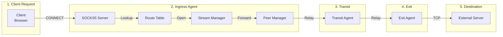
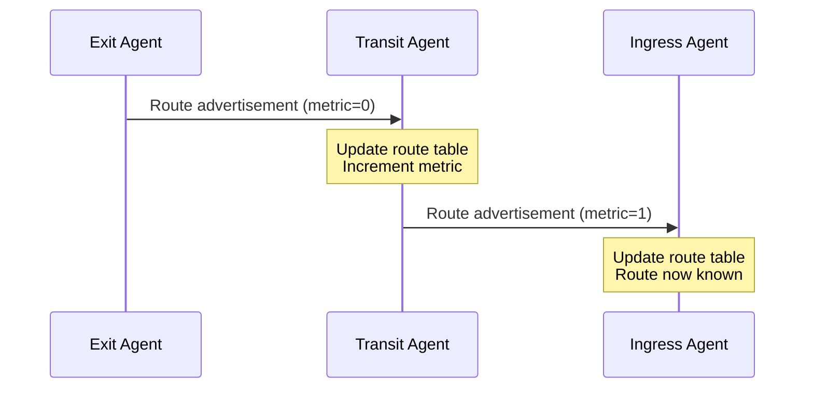
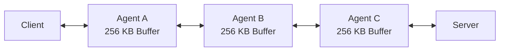

<div style={{textAlign: 'center', marginBottom: '2rem'}}>
  
</div>

# Architecture Overview

Muti Metroo is designed as a modular, userspace mesh networking agent. This document explains the high-level architecture and how components interact.

## Design Principles

1. **Userspace Operation**: No root/kernel access required - runs entirely in userspace
2. **Transport Agnostic**: Support heterogeneous transports (QUIC, HTTP/2, WebSocket) in the same mesh
3. **Multi-Hop Routing**: Dynamic route discovery and propagation
4. **Resilient Connections**: Automatic reconnection with exponential backoff
5. **Resource Efficient**: Configurable limits and stream multiplexing

## High-Level Architecture



## Core Components

### Agent Core

The central orchestrator that:

- Initializes and coordinates all subsystems
- Dispatches incoming frames to appropriate handlers
- Manages agent lifecycle (startup, shutdown, signals)
- Maintains agent identity

### Stream Manager

Handles virtual streams:

- Creates and tracks virtual streams between ingress and exit agents
- Manages stream multiplexing over peer connections
- Enforces resource limits (max streams, buffer sizes)
- Handles stream lifecycle (open, data transfer, close)

### Route Manager

Manages the routing table:

- Stores routes with longest-prefix match lookup
- Tracks route metrics and next-hop peers
- Handles route expiration (TTL)
- Provides subscription API for route changes

### Peer Manager

Manages peer connections:

- Initiates outbound connections (dialer)
- Accepts inbound connections (listener)
- Handles handshake and authentication
- Manages keepalives and timeouts
- Implements reconnection with backoff

### Protocol Layer

Handles communication between agents:

- **Message Processing**: Encodes and decodes messages between peers
- **Flood Routing**: Propagates route advertisements with loop prevention
- **Handshake**: Establishes peer connections with identity verification
- **Keepalive**: Monitors connection health and detects failures

### Transport Layer

Pluggable transport implementations:

- **QUIC**: UDP-based, best performance, built-in TLS
- **HTTP/2**: TCP-based, firewall-friendly, TLS required
- **WebSocket**: Maximum compatibility, works through HTTP proxies

## Connection Model

Understanding the difference between transport connections and virtual streams is key to designing flexible mesh topologies.

### Transport Connections vs. Virtual Streams

**Transport connections** are the underlying network pipes between agents. When Agent B has Agent A configured as a `peer`, Agent B **dials** Agent A (who must have a `listener`):

```
Transport: Agent B (dialer) -----> Agent A (listener)
```

**Virtual streams** are logical TCP tunnels created on top of transport connections. They represent actual data flows through the mesh.

**Key insight**: The transport connection direction does NOT determine virtual stream direction. Once two agents are connected, **either agent can initiate virtual streams to the other**.

### Bidirectional Routing

Consider this topology where Agent B dials Agent A:



Even though B dialed A, virtual streams can flow **both directions**:

- A SOCKS5 client on Agent A can tunnel to `192.168.0.0/16` via Agent B's exit
- A SOCKS5 client on Agent B can tunnel to `10.0.0.0/8` via Agent A's exit

The same capabilities exist if the connection is reversed (A dials B instead).

### Practical Implications

1. **Connection direction is a deployment choice**: Choose based on network constraints (firewalls, NAT), not routing needs
2. **Firewall-friendly topologies**: Place agents behind NAT/firewalls as dialers (`peers`), and public agents as listeners
3. **Role flexibility**: An agent can simultaneously be a listener, an ingress, AND an exit
4. **Routes propagate both ways**: Route advertisements flow through all peer connections regardless of who initiated the connection

:::tip Design Principle
Think of transport connections as bidirectional pipes. Once connected, it doesn't matter which end opened the connection - data and routes flow freely in both directions.
:::

## Data Flow

### Client Request Flow



### Route Advertisement Flow



## Memory Model

Each stream consumes a configurable buffer (default 256 KB) at each hop:



Total memory per stream = buffer_size x number_of_hops

## Thread Model

Muti Metroo uses Go's goroutine-based concurrency:

- **Per-Peer Goroutines**: Reader and writer for each peer connection
- **Per-Stream Goroutines**: I/O relay for each active stream
- **Background Workers**: Route advertisement, keepalive, cleanup

## Security Model

- **Transport Security**: TLS 1.3 for all peer connections
- **Mutual Authentication**: Optional mTLS with client certificates
- **Certificate Pinning**: Validate expected peer Agent IDs
- **Authentication**: SOCKS5 username/password, shell password hashing

See [Security Overview](/security/overview) for details.

## Performance Characteristics

| Aspect | Characteristic |
|--------|----------------|
| **Latency** | +1-5ms per hop (LAN), +50-200ms per hop (WAN) |
| **Throughput** | Limited by slowest link in the chain |
| **Memory** | 256KB buffer per stream per hop |
| **Connections** | Up to 1000 streams per peer (configurable) |

See [Streams](/concepts/streams) for configurable limits.

## Next Steps

- [Agent Roles](/concepts/agent-roles) - Understand ingress, transit, and exit roles
- [Transports](/concepts/transports) - Compare QUIC, HTTP/2, and WebSocket
- [Routing](/concepts/routing) - How routes propagate and are selected
