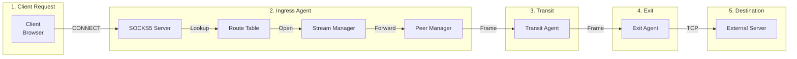
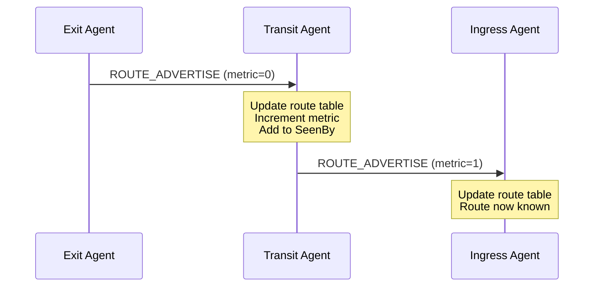

<div style={{textAlign: 'center', marginBottom: '2rem'}}>
  
</div>

# Architecture Overview

Muti Metroo is designed as a modular, userspace mesh networking agent. This document explains the high-level architecture and how components interact.

## Design Principles

1. **Userspace Operation**: No root/kernel access required - runs entirely in userspace
2. **Transport Agnostic**: Support heterogeneous transports (QUIC, HTTP/2, WebSocket) in the same mesh
3. **Multi-Hop Routing**: Dynamic route discovery and propagation
4. **Resilient Connections**: Automatic reconnection with exponential backoff
5. **Resource Efficient**: Configurable limits and stream multiplexing

## High-Level Architecture


## Core Components

### Agent Core

The central orchestrator that:

- Initializes and coordinates all subsystems
- Dispatches incoming frames to appropriate handlers
- Manages agent lifecycle (startup, shutdown, signals)
- Maintains agent identity

### Stream Manager

Handles virtual streams:

- Creates and tracks stream state machines
- Manages stream multiplexing over peer connections
- Enforces resource limits (max streams, buffer sizes)
- Handles stream lifecycle: Open -> Data -> Half-Close -> Close

### Route Manager

Manages the routing table:

- Stores routes with longest-prefix match lookup
- Tracks route metrics and next-hop peers
- Handles route expiration (TTL)
- Provides subscription API for route changes

### Peer Manager

Manages peer connections:

- Initiates outbound connections (dialer)
- Accepts inbound connections (listener)
- Handles handshake and authentication
- Manages keepalives and timeouts
- Implements reconnection with backoff

### Protocol Layer

Handles communication between agents:

- **Frame Processing**: Encodes and decodes messages between peers
- **Flood Routing**: Propagates route advertisements with loop prevention
- **Handshake**: Establishes peer connections with identity verification
- **Keepalive**: Monitors connection health and detects failures

### Transport Layer

Pluggable transport implementations:

- **QUIC**: UDP-based, best performance, built-in TLS
- **HTTP/2**: TCP-based, firewall-friendly, TLS required
- **WebSocket**: Maximum compatibility, works through HTTP proxies

## Data Flow

### Client Request Flow



### Route Advertisement Flow



## Memory Model

Each stream consumes a configurable buffer (default 256 KB) at each hop:


Total memory per stream = buffer_size x number_of_hops

## Thread Model

Muti Metroo uses Go's goroutine-based concurrency:

- **Per-Peer Goroutines**: Reader and writer for each peer connection
- **Per-Stream Goroutines**: I/O relay for each active stream
- **Background Workers**: Route advertisement, keepalive, cleanup

## Package Structure

| Package | Responsibility |
|---------|----------------|
| `agent` | Main orchestrator, lifecycle management |
| `protocol` | Frame encoding/decoding, constants |
| `transport` | QUIC, HTTP/2, WebSocket implementations |
| `peer` | Peer connection lifecycle |
| `stream` | Stream state machine and I/O |
| `routing` | Route table and route manager |
| `flood` | Route propagation via flooding |
| `socks5` | SOCKS5 proxy server |
| `exit` | Exit handler and DNS resolution |
| `health` | HTTP API server, metrics, dashboard |
| `identity` | Agent ID generation and storage |
| `config` | Configuration parsing |
| `certutil` | TLS certificate utilities |

## Key Interfaces

### Transport Interface

```go
type Transport interface {
    Dial(ctx context.Context, addr string) (Connection, error)
    Listen(addr string) (Listener, error)
}
```

### Frame Handler

```go
type FrameHandler interface {
    HandleFrame(peerID AgentID, frame *Frame) error
}
```

### Route Manager

```go
type RouteManager interface {
    AddRoute(route Route) error
    RemoveRoute(cidr string) error
    Lookup(ip net.IP) (*Route, error)
    Subscribe(callback func(Route, RouteEvent))
}
```

## Security Model

- **Transport Security**: TLS 1.3 for all peer connections
- **Mutual Authentication**: Optional mTLS with client certificates
- **Certificate Pinning**: Validate expected peer Agent IDs
- **Authentication**: SOCKS5 username/password, RPC password hashing

See [Security Overview](../security/overview) for details.

## Performance Characteristics

| Aspect | Characteristic |
|--------|----------------|
| **Latency** | +1-5ms per hop (LAN), +50-200ms per hop (WAN) |
| **Throughput** | Limited by slowest link and 16KB frame size |
| **Memory** | 256KB buffer per stream per hop |
| **Connections** | Up to 1000 streams per peer (configurable) |

See [Streams](streams) for configurable limits.

## Next Steps

- [Agent Roles](agent-roles) - Understand ingress, transit, and exit roles
- [Transports](transports) - Compare QUIC, HTTP/2, and WebSocket
- [Routing](routing) - How routes propagate and are selected
