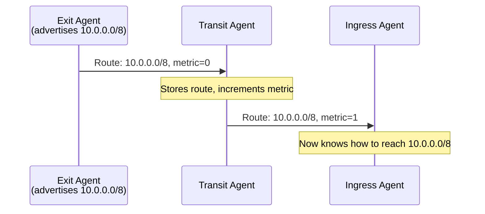
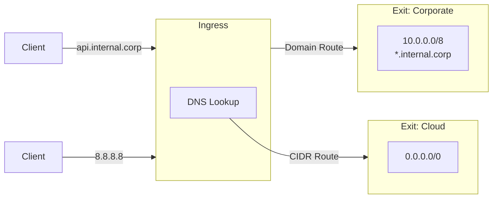
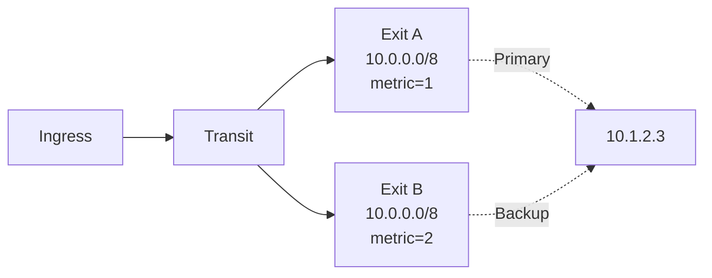

  

# Routing

When you connect to a destination, your traffic automatically finds its way to the right exit. You don't configure paths manually - exit agents advertise what they can reach, and the mesh figures out how to get there.

**How it works in practice:**
- Exit agent inside corporate network advertises `10.0.0.0/8`
- Exit agent in the cloud advertises `0.0.0.0/0` (everything else)
- You connect to `10.1.2.3` - traffic goes to corporate exit
- You connect to `8.8.8.8` - traffic goes to cloud exit

## Route Propagation

Routes spread through the mesh using flood-based advertising. Each exit announces its routes, and agents pass them along to their peers:

**Key properties:**
- Routes include a **metric** (hop count) that increases at each relay
- Routes have a **TTL** and expire if not refreshed
- Loop prevention ensures routes don't circulate indefinitely

## Route Types

Muti Metroo supports two types of routes:

| Type | Matches | Example | DNS Resolution |
|------|---------|---------|----------------|
| **CIDR** | IP addresses | `10.0.0.0/8` | At ingress agent |
| **Domain** | Domain names | `*.internal.corp` | At exit agent |

## Route Selection

### Priority Order

For domain-based requests (connecting to a hostname):

1. **Domain routes** are checked first
2. If no domain route matches, DNS resolution happens at the ingress
3. **CIDR routes** are then used based on the resolved IP

For IP-based requests (connecting to an IP address):

1. **CIDR routes** are used directly

### CIDR Route Matching (Longest Prefix)

When multiple CIDR routes match a destination, the **most specific route wins**:

| CIDR | Next Hop | Metric |
|------|----------|--------|
| 1.2.3.4/32 | Agent A | 3 |
| 1.2.3.0/24 | Agent B | 2 |
| 0.0.0.0/0 | Agent C | 1 |

| Destination | Winner | Reason |
|-------------|--------|--------|
| 1.2.3.4 | Agent A | /32 is most specific |
| 1.2.3.100 | Agent B | /24 is more specific than /0 |
| 8.8.8.8 | Agent C | Only /0 matches |

If routes have the same prefix length, the one with the **lowest metric** (fewest hops) wins.

### Domain Route Matching

Domain routes support two pattern types:

| Pattern | Matches | Does NOT Match |
|---------|---------|----------------|
| `api.example.com` | `api.example.com` | `foo.example.com` |
| `*.example.com` | `foo.example.com` | `example.com`, `a.b.example.com` |

Wildcards use **single-level matching** only. If multiple agents advertise the same pattern, lowest metric wins.

## Route Expiration

Routes are not permanent. They expire if the advertising agent:
- Goes offline
- Stops refreshing the advertisement
- Becomes unreachable through the mesh

The mesh automatically removes stale routes, and traffic switches to alternative paths if available.

## Redundant Paths

Multiple agents can advertise the same route for high availability:

- Both routes are stored
- Traffic uses the route with the lowest metric
- If one exit disconnects, traffic automatically switches to the other

## Best Practices

1. **Use specific routes**: Prefer `/24` over `/0` when possible for better control
2. **Minimize default routes**: Only one exit should advertise `0.0.0.0/0` in most topologies
3. **Match topology depth**: Set max hops to match your actual mesh depth
4. **Consider route count**: More routes mean more memory at each agent

## Next Steps

- [Streams](/concepts/streams) - How data flows through routes
- [Exit Routing](/features/exit-routing) - Configure exit routes
- [Configuration Reference](/configuration/overview) - Routing configuration options
