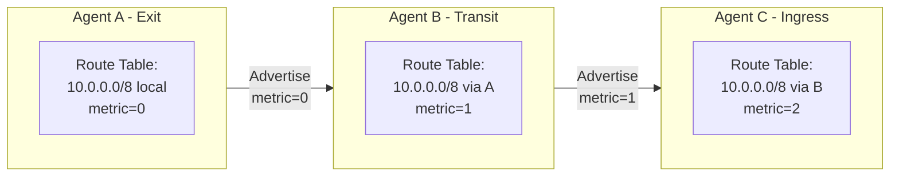
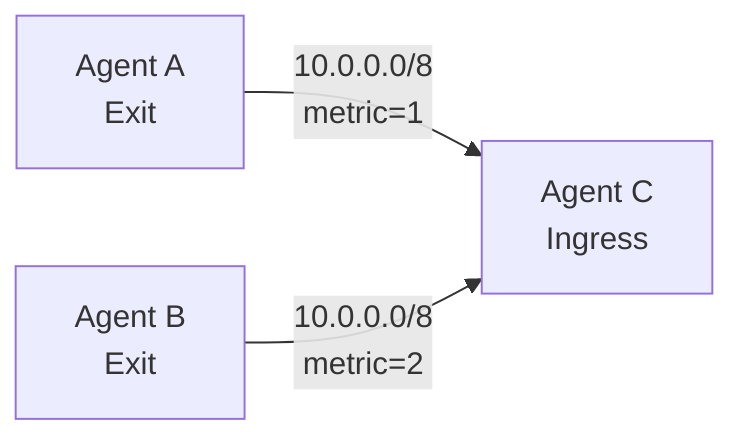

<div style={{textAlign: 'center', marginBottom: '2rem'}}>
  
</div>

# Routing in Muti Metroo

Muti Metroo uses flood-based route propagation with longest-prefix match selection. This document explains how routes are advertised, propagated, and selected.

## Overview

Routing in Muti Metroo works similarly to distance-vector routing protocols:

1. **Exit agents** advertise their available routes
2. **Routes flood** through the mesh, incrementing hop count
3. **Each agent** maintains a routing table
4. **Lookups** use longest-prefix match to select the best route

## Route Advertisement

Exit agents advertise their routes via `ROUTE_ADVERTISE` frames:

```yaml
exit:
  enabled: true
  routes:
    - "10.0.0.0/8"        # Metric 0 (direct)
    - "192.168.0.0/16"    # Metric 0 (direct)
    - "0.0.0.0/0"         # Default route
```

Each route includes:

| Field | Description |
|-------|-------------|
| **CIDR** | Network prefix (e.g., `10.0.0.0/8`) |
| **Metric** | Hop count from originating agent |
| **TTL** | Time until route expires |
| **Origin** | Agent ID that originated the route |
| **SeenBy** | List of agents that have seen this advertisement |

## Route Propagation (Flooding)

Routes propagate through the mesh using flooding:



### Flooding Algorithm

1. **Receive advertisement** from peer
2. **Check SeenBy list** - skip if already processed
3. **Update local routing table** with new/better route
4. **Increment metric** (hop count)
5. **Add self to SeenBy**
6. **Forward to all other peers** (except those in SeenBy)

### Loop Prevention

Two mechanisms prevent routing loops:

1. **SeenBy List**: Each advertisement tracks which agents have seen it
2. **Max Hops**: Routes exceeding `routing.max_hops` are dropped

```yaml
routing:
  max_hops: 16    # Maximum path length
```

## Route Selection

When an ingress agent needs to route traffic, it performs a **longest-prefix match**:

### Algorithm

1. Find all routes where CIDR contains the destination IP
2. Sort by prefix length (longest first)
3. If tied, sort by metric (lowest first)
4. Return the best match

### Example

Routing table:

| CIDR | Next Hop | Metric |
|------|----------|--------|
| 1.2.3.4/32 | Agent A | 3 |
| 1.2.3.0/24 | Agent B | 2 |
| 1.2.0.0/16 | Agent C | 1 |
| 0.0.0.0/0 | Agent D | 1 |

Lookups:

| Destination | Matches | Winner | Reason |
|-------------|---------|--------|--------|
| 1.2.3.4 | All 4 | Agent A | /32 is longest prefix |
| 1.2.3.100 | 3 (not /32) | Agent B | /24 is longest |
| 1.2.100.1 | 2 (/16, /0) | Agent C | /16 is longest |
| 8.8.8.8 | 1 (/0 only) | Agent D | Only match |

## Route Expiration

Routes have a configurable TTL:

```yaml
routing:
  route_ttl: 5m              # Routes expire after 5 minutes
  advertise_interval: 2m     # Re-advertise every 2 minutes
```

Timeline:

```mermaid
gantt
    title Route Lifecycle
    dateFormat X
    axisFormat %s min

    section Route TTL
    Initial advertisement (TTL=5m)    :0, 2
    Re-advertise (TTL reset)          :2, 4
    Re-advertise (TTL reset)          :4, 6
    Agent offline                     :crit, 6, 9
    Route expires                     :done, 9, 10
```



### Manual Route Trigger

Force immediate route advertisement:

```bash
curl -X POST http://localhost:8080/routes/advertise
```

Use after:
- Configuration changes
- Network topology changes
- Agent restart

## Redundant Paths

Multiple agents can advertise the same route:



Behavior:
- Both routes stored in routing table
- Agent C prefers Agent A (lower metric)
- If Agent A disconnects, traffic switches to Agent B

## Viewing Routes

### HTTP API

```bash
# View local routing table
curl http://localhost:8080/healthz

# View routes from specific agent
curl http://localhost:8080/agents/{agent-id}/routes
```

### Dashboard

Access the web dashboard at `http://localhost:8080/ui/` to see:
- All routes in the routing table
- Route metrics and next hops
- Route origin agents

## Configuration Reference

```yaml
routing:
  # How often to re-advertise routes
  advertise_interval: 2m

  # How often to advertise node info
  node_info_interval: 2m

  # Time until routes expire without refresh
  route_ttl: 5m

  # Maximum path length (hops)
  max_hops: 16
```

## Route Metrics

Prometheus metrics for routing:

| Metric | Type | Description |
|--------|------|-------------|
| `muti_metroo_routes_total` | Gauge | Routes in routing table |
| `muti_metroo_route_advertises_total` | Counter | Route advertisements |
| `muti_metroo_route_withdrawals_total` | Counter | Route withdrawals |
| `muti_metroo_route_flood_latency_seconds` | Histogram | Propagation latency |

## Troubleshooting

### No Route to Host

```bash
# Check if route exists
curl http://localhost:8080/healthz | jq '.routes'

# Verify peer is connected
curl http://localhost:8080/healthz | jq '.peers'

# Check exit agent is advertising
curl http://exit-agent:8080/healthz
```

### Route Not Propagating

Common causes:
- Max hops exceeded
- Agent already in SeenBy list
- TTL expired
- Peer connection down

Debug:
```bash
# Enable debug logging
muti-metroo run -c config.yaml --log-level debug

# Look for routing logs
grep -i "route" agent.log
```

### Suboptimal Route Selection

Check for:
- Multiple routes with same prefix
- Unexpected metrics
- Missing direct connections

```bash
# View detailed route info
curl http://localhost:8080/agents/{agent-id}/routes | jq
```

## Best Practices

1. **Use specific routes**: Prefer `/24` over `/0` when possible
2. **Monitor route count**: High route counts increase memory usage
3. **Set appropriate TTL**: Balance responsiveness vs. stability
4. **Limit max hops**: Match your topology depth
5. **Use route metrics**: Prefer direct connections when available

## Next Steps

- [Streams](streams) - How data flows through routes
- [Exit Routing](../features/exit-routing) - Configure exit routes
- [Troubleshooting Connectivity](../troubleshooting/connectivity) - Debug routing issues
