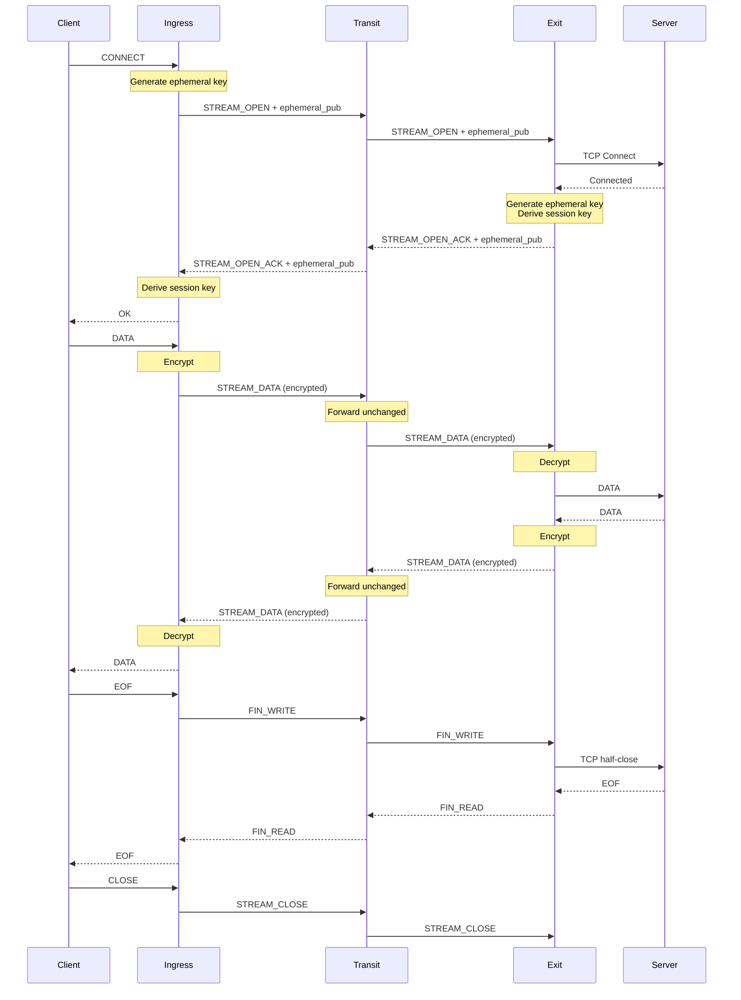
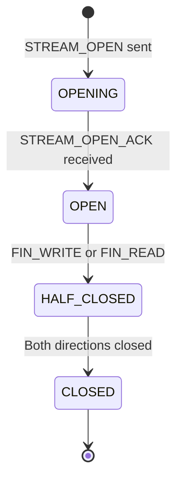
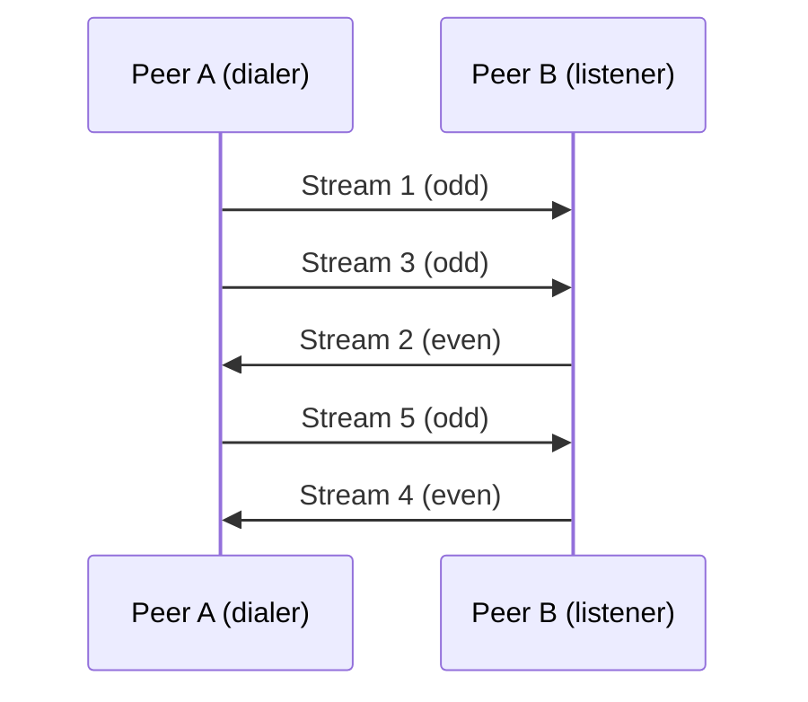
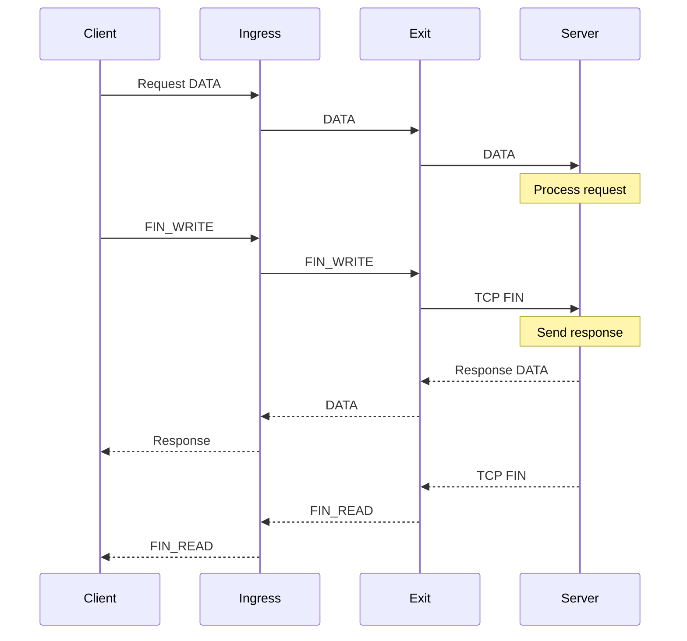

<div style={{textAlign: 'center', marginBottom: '2rem'}}>
  
</div>

# Stream Multiplexing

Muti Metroo uses virtual streams to multiplex multiple connections over a single peer connection. This document explains how streams work.

## Overview

A **stream** represents a single TCP-like connection flowing through the mesh. Streams are:

- **Multiplexed**: Many streams share one peer connection
- **Bidirectional**: Data flows both directions
- **Encrypted**: End-to-end encryption between ingress and exit
- **Buffered**: Each hop buffers data for flow control
- **Half-closable**: Can close one direction independently

## Stream Lifecycle



## Stream States

Each stream progresses through these states:



### State Descriptions

| State | Description |
|-------|-------------|
| **OPENING** | STREAM_OPEN sent, waiting for ACK |
| **OPEN** | Both directions active |
| **HALF_CLOSED_LOCAL** | We sent FIN, remote still sending |
| **HALF_CLOSED_REMOTE** | Remote sent FIN, we still sending |
| **CLOSED** | Both directions closed |

## Stream ID Allocation

Stream IDs are allocated to prevent collisions:

- **Dialer (initiator)**: Odd IDs (1, 3, 5, ...)
- **Listener (acceptor)**: Even IDs (2, 4, 6, ...)
- **Stream ID 0**: Reserved for control channel



## Buffering

Each stream has a buffer at each hop:


### Buffer Configuration

```yaml
limits:
  buffer_size: 262144    # 256 KB per stream per hop
```

### Flow Control

When a buffer fills:
1. Backpressure propagates to upstream
2. Sender is blocked until space available
3. Prevents memory exhaustion

## Stream Limits

```yaml
limits:
  max_streams_per_peer: 1000   # Concurrent streams per peer
  max_streams_total: 10000     # Total concurrent streams
  max_pending_opens: 100       # Pending STREAM_OPEN requests
  stream_open_timeout: 30s     # Time to open stream
```

### Why Limits Matter

| Limit | Purpose |
|-------|---------|
| max_streams_per_peer | Prevent single peer from exhausting resources |
| max_streams_total | Overall memory and CPU protection |
| max_pending_opens | Prevent STREAM_OPEN flood |
| stream_open_timeout | Fail fast on network issues |

## Stream Data Frames

Data is sent in `STREAM_DATA` frames:

| Field | Size | Description |
|-------|------|-------------|
| Type | 1 byte | 0x04 (STREAM_DATA) |
| Flags | 1 byte | FIN_WRITE, FIN_READ |
| StreamID | 4 bytes | Stream identifier |
| Payload Length | 4 bytes | Length of payload |
| Payload | up to 16 KB | Data bytes |

### Flags

| Flag | Value | Description |
|------|-------|-------------|
| FIN_WRITE | 0x01 | Sender half-close (no more data from sender) |
| FIN_READ | 0x02 | Receiver half-close (no more data expected) |

## End-to-End Encryption

All stream data is encrypted between ingress and exit agents using ChaCha20-Poly1305.

### Key Exchange

During stream open, ephemeral X25519 keypairs are exchanged:

1. **Ingress** generates an ephemeral keypair and includes public key in `STREAM_OPEN`
2. **Transit** forwards the public key unchanged (cannot decrypt)
3. **Exit** generates its own ephemeral keypair, computes shared secret via ECDH
4. **Exit** returns its public key in `STREAM_OPEN_ACK`
5. **Ingress** computes the same shared secret

### Encryption Properties

| Property | Description |
|----------|-------------|
| Forward secrecy | Ephemeral keys per stream |
| Transit opacity | Transit cannot decrypt payloads |
| Authenticated | Tampering detected via Poly1305 |
| Overhead | +28 bytes per frame |

For full details, see [End-to-End Encryption](../security/e2e-encryption).

## Half-Close

Streams support half-close for proper TCP semantics:

### Example: HTTP Request/Response



## Error Handling

### STREAM_OPEN_ERR

Sent when stream cannot be opened:

```yaml
Error codes:
  0x01: Route not found
  0x02: Connection refused
  0x03: Connection timeout
  0x04: Access denied
  0x05: DNS failure
```

### STREAM_RESET

Abrupt stream termination:

```yaml
Error codes:
  0x01: Internal error
  0x02: Protocol error
  0x03: Timeout
  0x04: Cancelled
```

## Stream Metrics

Prometheus metrics for streams:

| Metric | Type | Description |
|--------|------|-------------|
| `muti_metroo_streams_active` | Gauge | Currently active streams |
| `muti_metroo_streams_opened_total` | Counter | Total streams opened |
| `muti_metroo_streams_closed_total` | Counter | Total streams closed |
| `muti_metroo_stream_open_latency_seconds` | Histogram | Time to open stream |
| `muti_metroo_stream_errors_total` | Counter | Stream errors by type |

## Performance Considerations

### Latency

Stream open latency = network RTT x number of hops

| Hops | RTT per hop | Stream open time |
|------|-------------|------------------|
| 2 | 50ms | ~100ms |
| 5 | 50ms | ~250ms |

### Throughput

Limited by:
1. Slowest link in the path
2. Frame size (16 KB max)
3. Buffer sizes
4. CPU at each hop

### Memory

Memory per stream = buffer_size x number_of_hops

| Configuration | Memory per stream | 1000 streams |
|---------------|-------------------|--------------|
| 256 KB buffer, 3 hops | 768 KB | ~750 MB |

## Best Practices

1. **Set appropriate limits**: Match your hardware capacity
2. **Monitor stream counts**: Watch for leaks
3. **Use reasonable timeouts**: 30s is usually enough
4. **Size buffers appropriately**: 256 KB is good default
5. **Watch latency metrics**: Detect congestion early

## Troubleshooting

### Streams Not Opening

```bash
# Check pending opens
curl http://localhost:8080/healthz | jq '.pending_opens'

# Check stream limits
curl http://localhost:8080/healthz | jq '.streams, .max_streams'

# Enable debug logging
muti-metroo run --log-level debug
```

### High Latency

- Check network RTT between hops
- Verify no congestion (buffer full)
- Check CPU usage at transit nodes

### Memory Issues

- Reduce max_streams_total
- Reduce buffer_size
- Add more agents to distribute load

## Next Steps

- [End-to-End Encryption](../security/e2e-encryption) - Encryption details
- [Protocol Frames](../protocol/frames) - Detailed frame format
- [Limits Reference](../protocol/limits) - All configurable limits
- [Performance Troubleshooting](../troubleshooting/performance) - Optimization tips
