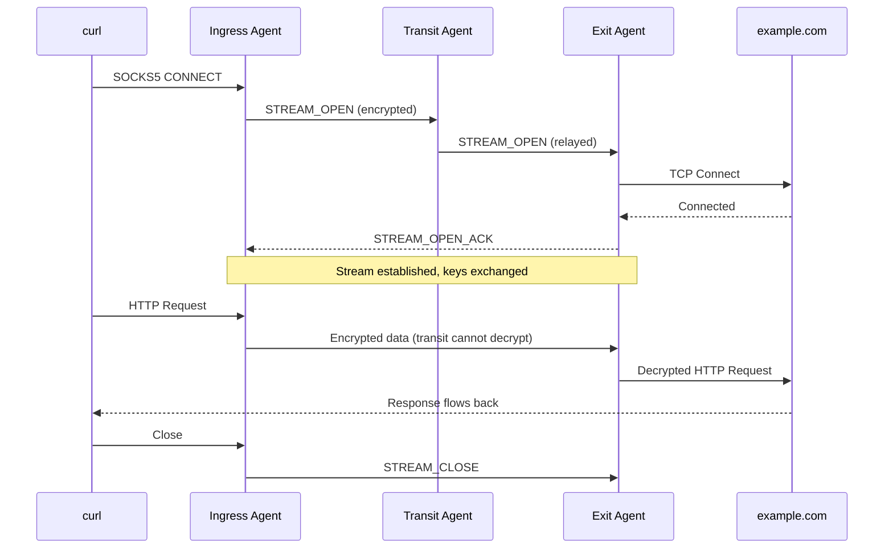
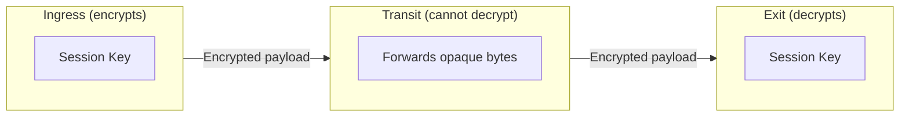
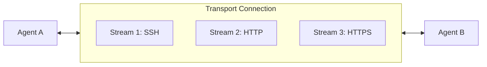
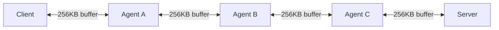

  

# Streams

Each connection through the mesh - every curl request, SSH session, or browser tab - becomes a stream. Hundreds of streams share a single connection between agents, so you don't need a new network connection for each request.

**What this means for you:**
- Open many connections without overwhelming the network
- Each stream is encrypted end-to-end (transit agents can't read your data)
- Streams are independent - one slow connection doesn't block others

## Stream Lifecycle

When you run `curl -x socks5://localhost:1080 https://example.com`:

Transit agents forward the encrypted data without seeing the contents.

## End-to-End Encryption

Every stream is encrypted between the ingress and exit agents:

**How it works:**
1. During stream open, ingress and exit exchange X25519 ephemeral public keys
2. Both sides derive a shared session key via ECDH
3. All data is encrypted with ChaCha20-Poly1305
4. Transit agents only see encrypted bytes - they cannot read or modify the content

See [End-to-End Encryption](/security/e2e-encryption) for cryptographic details.

## Stream Multiplexing

Multiple streams share a single transport connection:

**Benefits:**
- No connection setup overhead for each request
- Fair scheduling between streams
- Independent flow control per stream

## Buffering and Flow Control

Each stream maintains a buffer at each hop:

When a buffer fills (slow receiver), backpressure propagates upstream. This prevents:
- Memory exhaustion at relay agents
- Overwhelming slow connections
- Unfair resource allocation between streams

Total memory per stream = `buffer_size x number_of_hops`

## Performance Characteristics

### Latency

Stream open latency increases with hop count:

| Hops | RTT per hop | Approximate stream open time |
|------|-------------|------------------------------|
| 2 | 50ms | ~100ms |
| 5 | 50ms | ~250ms |

Once established, data flows at wire speed minus encryption overhead.

### Memory

| Configuration | Memory per stream | 1000 streams |
|---------------|-------------------|--------------|
| 256 KB buffer, 3 hops | 768 KB | ~750 MB |

### Limits

| Limit | Purpose | Default |
|-------|---------|---------|
| Max streams per peer | Prevents single peer from consuming all resources | 1000 |
| Max streams total | Global connection limit | 10000 |
| Max pending opens | Limits connection establishment queue | 100 |
| Stream open timeout | Prevents hung connections | 30s |

## Best Practices

1. **Size buffers appropriately**: 256 KB is a good default for most use cases
2. **Set limits to match capacity**: Consider your hardware when setting max streams
3. **Monitor stream counts**: Watch for connection leaks (streams not closing)
4. **Use reasonable timeouts**: 30s handles most WAN latencies

## Next Steps

- [End-to-End Encryption](/security/e2e-encryption) - Cryptographic details
- [Configuration Reference](/configuration/overview) - Stream limit configuration
