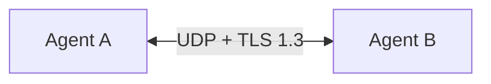
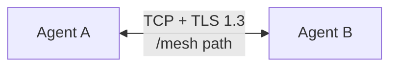
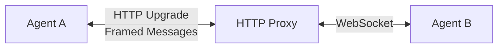
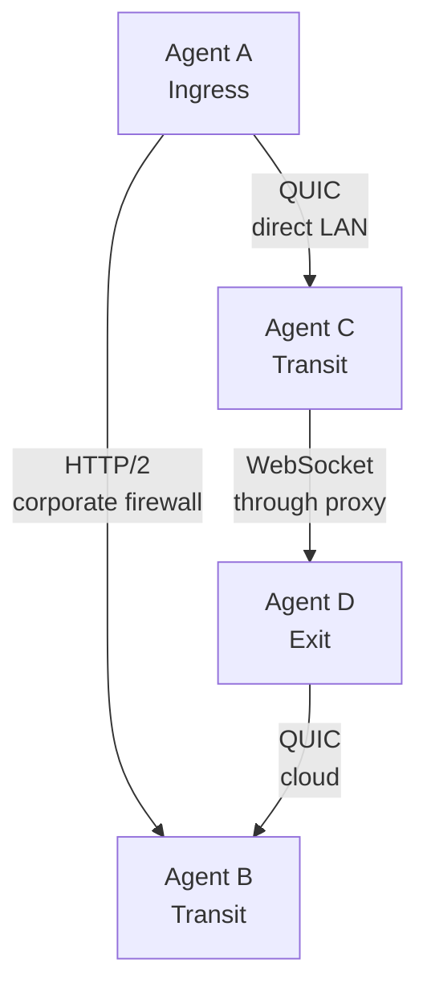

  

# Transport Protocols

Choose the right transport for your network environment. Use QUIC when you control the network, HTTP/2 or WebSocket when you need to get through firewalls and proxies.

## Quick Guide

| Your Situation | Use This |
|----------------|----------|
| Direct connection, no firewall issues | **QUIC** - fastest option |
| Corporate firewall blocks UDP | **HTTP/2** - looks like normal HTTPS |
| Must go through HTTP proxy | **WebSocket** - maximum compatibility |
| Not sure | Start with QUIC, fall back to WebSocket if blocked |

## Transport Comparison

| Transport | Speed | Firewall Friendliness | Best For |
|-----------|-------|----------------------|----------|
| **QUIC** | Fastest | Medium (needs UDP) | Data centers, home networks |
| **HTTP/2** | Good | Good | Corporate networks |
| **WebSocket** | Fair | Excellent | Restrictive proxies, CDNs |

## QUIC Transport

QUIC (Quick UDP Internet Connections) is the recommended transport for most deployments.

**Characteristics:**
- UDP with built-in TLS 1.3
- Native stream multiplexing (no head-of-line blocking)
- Lowest latency, best throughput
- Fast 0-RTT reconnection
- Modern congestion control (BBR)

**When to use:**
- Connecting servers you control (cloud, data center)
- Home or office network without strict firewalls
- When speed matters (large file transfers, low latency)
- Most residential ISP connections (UDP usually works)

**Firewall considerations:**
- Requires UDP port to be open
- May be blocked by corporate firewalls
- NAT traversal generally works well
- Some ISPs throttle or block UDP

## HTTP/2 Transport

HTTP/2 provides a TCP-based alternative with good firewall compatibility.

**Characteristics:**
- TCP with TLS 1.3
- HTTP/2 stream multiplexing
- Good performance, but TCP head-of-line blocking
- Compatible with most firewalls and proxies

**When to use:**
- Corporate network that blocks UDP
- Behind a load balancer or reverse proxy
- Need to blend with normal HTTPS traffic
- QUIC is being blocked or throttled

**Firewall considerations:**
- Uses standard HTTPS port (443)
- Passes through most corporate firewalls
- Compatible with HTTP proxies (without CONNECT)
- Can be hosted behind reverse proxies

## WebSocket Transport

WebSocket provides maximum compatibility, especially through HTTP proxies.

**Characteristics:**
- HTTP upgrade to WebSocket, then framed messages
- Application-level multiplexing over single connection
- Highest overhead, most latency
- Works through HTTP proxies with CONNECT

**When to use:**
- Must go through a corporate HTTP proxy
- Network inspects and blocks non-HTTP traffic
- Hosting behind a CDN or WAF
- Maximum compatibility is more important than speed

**Firewall considerations:**
- Uses standard HTTP/HTTPS ports
- Works through HTTP proxies with CONNECT
- Compatible with most corporate environments
- May work through some WAFs and CDNs

:::info Plain WebSocket Mode
When behind a reverse proxy handling TLS termination, use `plaintext: true` to accept unencrypted WebSocket connections on localhost. See [Reverse Proxy Deployment](/deployment/reverse-proxy).
:::

## Performance Comparison

### Latency (per hop)

| Transport | LAN | WAN |
|-----------|-----|-----|
| QUIC | 1-2ms | 50-100ms |
| HTTP/2 | 2-5ms | 60-150ms |
| WebSocket | 3-10ms | 80-200ms |

### Connection Establishment

| Transport | Initial | Reconnect |
|-----------|---------|-----------|
| QUIC | 1-RTT | 0-RTT |
| HTTP/2 | 2-RTT | 1-RTT (TLS resumption) |
| WebSocket | 2-RTT + HTTP upgrade | 2-RTT |

### Throughput

| Transport | Single Stream | Multi-Stream |
|-----------|---------------|--------------|
| QUIC | Excellent | Excellent |
| HTTP/2 | Good | Good |
| WebSocket | Fair | Fair |

## Mixed Transport Deployments

You can mix transports in a single mesh. Each peer connection chooses the best transport for that specific link:

Routes propagate across all transports - traffic finds the best path regardless of underlying protocol.

## Selection Guide

| Where You Are | Where You're Connecting | Use |
|---------------|------------------------|-----|
| Home network | Cloud server | QUIC |
| Office (no proxy) | Cloud server | QUIC or HTTP/2 |
| Corporate laptop | Through corporate proxy | WebSocket |
| Cloud server | Another cloud server | QUIC |
| Behind CDN/WAF | Anywhere | WebSocket |
| Anywhere | Server behind reverse proxy | HTTP/2 or WebSocket |

## Next Steps

- [Routing](/concepts/routing) - How routes work across transports
- [Configuration Reference](/configuration/overview) - Transport configuration
- [Troubleshooting Connectivity](/troubleshooting/connectivity) - Connection issues
