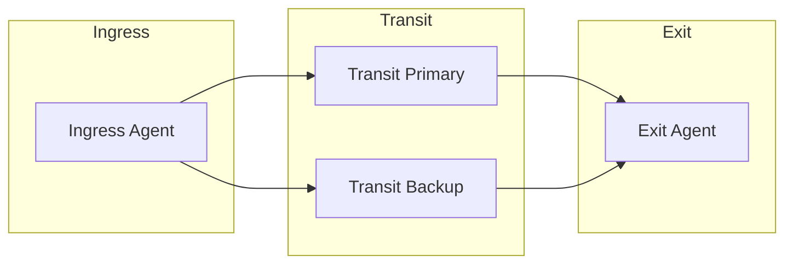
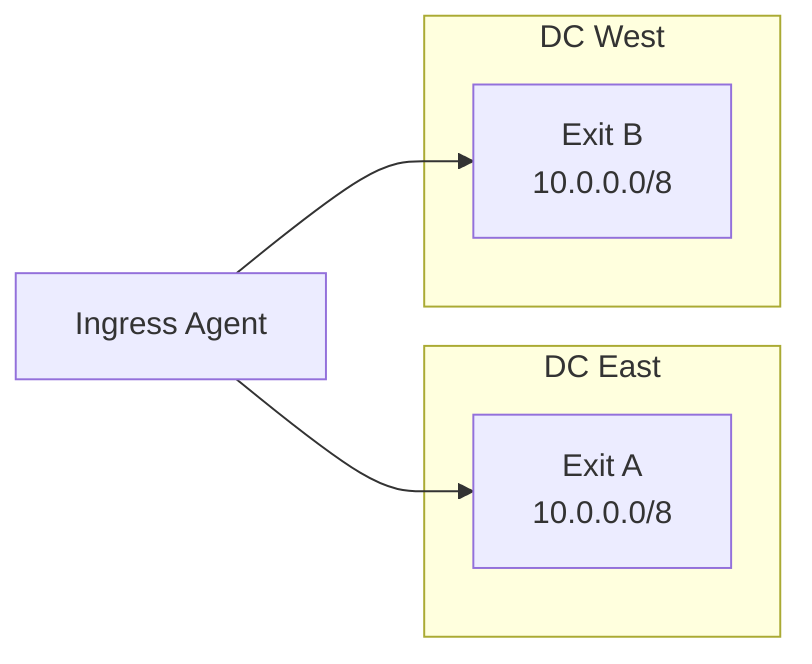
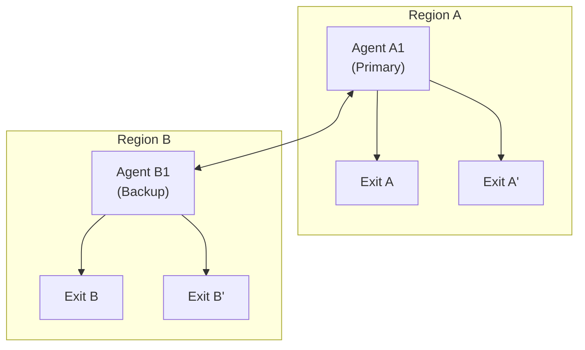
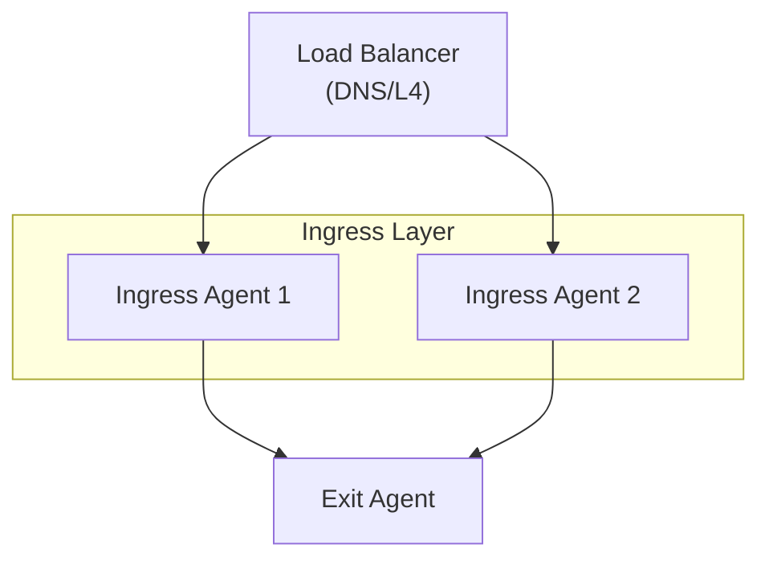

<div style={{textAlign: 'center', marginBottom: '2rem'}}>
  
</div>

# High Availability

Stay connected when servers fail. With redundant paths, traffic automatically reroutes around problems - no manual intervention, no downtime.

**What happens when something fails:**

| If This Fails... | Traffic Automatically... |
|------------------|--------------------------|
| Transit agent | Reroutes through backup transit |
| Exit agent | Switches to another exit advertising the same routes |
| Network link | Uses alternate path if available |
| Primary datacenter | Fails over to secondary region |

**How it works:**
- Multiple routes to the same destination are learned
- Routes expire when the path goes down (configurable TTL)
- Traffic switches to the remaining routes
- When the failed component recovers, traffic returns

## Pattern 1: Redundant Transit

Multiple transit paths between ingress and exit.

### Architecture



### Configuration

**Ingress Agent:**

```yaml
agent:
  display_name: "Ingress"

peers:
  # Primary transit
  - id: "${PRIMARY_TRANSIT_ID}"
    transport: quic
    address: "transit-primary.example.com:4433"
    tls:
      ca: "./certs/ca.crt"

  # Backup transit
  - id: "${BACKUP_TRANSIT_ID}"
    transport: quic
    address: "transit-backup.example.com:4433"
    tls:
      ca: "./certs/ca.crt"

socks5:
  enabled: true
  address: "127.0.0.1:1080"
```

Both transits connect to the exit, which advertises routes. The ingress learns routes via both paths and prefers the one with lower hop count.

### Failover Behavior

1. Primary transit fails
2. Routes via primary expire (TTL, default 5m)
3. Only backup route remains
4. Traffic flows through backup
5. Primary recovers - routes re-advertise
6. Traffic returns to primary (lower metric)

### Faster Failover

Reduce route TTL for faster detection:

```yaml
routing:
  route_ttl: 1m              # 1 minute TTL
  advertise_interval: 30s    # Advertise every 30s
```

## Pattern 2: Multiple Exits

Multiple exit points for the same routes.

### Architecture



### Configuration

**Exit A:**

```yaml
agent:
  display_name: "Exit A (DC East)"

exit:
  enabled: true
  routes:
    - "10.0.0.0/8"
  dns:
    servers:
      - "10.0.0.1:53"
```

**Exit B:**

```yaml
agent:
  display_name: "Exit B (DC West)"

exit:
  enabled: true
  routes:
    - "10.0.0.0/8"
  dns:
    servers:
      - "10.0.0.1:53"
```

The ingress learns the same route from both exits and uses the one with lower metric.

## Pattern 3: Geographic Redundancy

Agents in multiple regions for disaster recovery.

### Architecture



### Cross-Region Peering

```yaml
# Agent A1 (Region A)
agent:
  display_name: "Region A Primary"

peers:
  # Local exit
  - id: "${EXIT_A_ID}"
    transport: quic
    address: "exit-a.region-a.internal:4433"

  # Cross-region peer
  - id: "${AGENT_B1_ID}"
    transport: quic
    address: "agent-b1.region-b.example.com:4433"
```

## Pattern 4: Active-Active Ingress

Multiple ingress points behind a load balancer.

### Architecture



### DNS Round-Robin

```
proxy.example.com.  300  IN  A  192.168.1.10  # Ingress 1
proxy.example.com.  300  IN  A  192.168.1.11  # Ingress 2
```

### L4 Load Balancer

HAProxy example:

```
frontend socks5
    bind *:1080
    mode tcp
    default_backend socks5_backends

backend socks5_backends
    mode tcp
    balance roundrobin
    server ingress1 192.168.1.10:1080 check
    server ingress2 192.168.1.11:1080 check
```

## Monitoring for HA

### Health Checks

```bash
# Check each agent
curl http://ingress1:8080/health
curl http://ingress2:8080/health
curl http://exit:8080/health

# Check peer connectivity
curl http://ingress1:8080/healthz | jq '.peers'

# Check routes
curl http://ingress1:8080/healthz | jq '.routes'
```

### Key Indicators

Monitor these for HA:

| Indicator | Check Method | Alert Condition |
|-----------|--------------|-----------------|
| Peer count | `curl /healthz \| jq '.peers'` | < expected count |
| Route count | `curl /healthz \| jq '.routes'` | < expected count |
| Health status | `curl /health` | Not "OK" |

### External Monitoring

Use external monitoring tools to check agent health:

```bash
#!/bin/bash
# ha-check.sh - Run via cron or monitoring system
AGENTS=("ingress1:8080" "ingress2:8080" "exit:8080")

for agent in "${AGENTS[@]}"; do
    if ! curl -sf "http://$agent/health" > /dev/null; then
        echo "ALERT: Agent $agent is not healthy"
        # Send alert to your monitoring system
    fi
done
```

## Reconnection Tuning

Configure aggressive reconnection for faster recovery:

```yaml
connections:
  reconnect:
    initial_delay: 500ms      # Start fast
    max_delay: 30s            # Cap at 30s
    multiplier: 1.5           # Slower backoff
    jitter: 0.3               # 30% jitter
    max_retries: 0            # Never give up
```

## Best Practices

1. **Minimum two paths**: Always have redundant routes
2. **Geographic diversity**: Spread agents across regions
3. **Independent failure domains**: Different networks, power, etc.
4. **Monitor everything**: Alerts before users notice
5. **Test failover**: Regularly test by killing components
6. **Document topology**: Know what depends on what

## Testing Failover

### Manual Testing

```bash
# Kill a transit agent
docker stop transit-primary

# Verify traffic still flows
curl -x socks5://localhost:1080 https://example.com

# Check routes updated
curl http://localhost:8080/healthz | jq '.routes'

# Bring transit back
docker start transit-primary

# Verify primary route restored
sleep 120  # Wait for advertisement
curl http://localhost:8080/healthz | jq '.routes'
```

### Chaos Testing

Test resilience with controlled failures:

```bash
# Simulate network delay (Linux with tc)
docker exec agent1 tc qdisc add dev eth0 root netem delay 100ms

# Kill a random agent container
docker kill $(docker ps -q --filter "name=agent" | shuf -n 1)

# Verify mesh recovers
sleep 30
curl http://localhost:8080/healthz | jq '{peers: .peer_count, routes: .route_count}'
```

For development, the codebase includes an internal chaos testing package (`internal/chaos`) for automated fault injection.

## See Also

- [API - Health](/api/health) - Health check endpoints
- [API - Routes](/api/routes) - Route advertisement API
- [Docker Deployment](/deployment/docker) - Container-based HA testing

## Next Steps

- [Troubleshooting](/troubleshooting/connectivity) - Debug connectivity
- [Deployment Scenarios](/deployment/scenarios) - More deployment patterns
