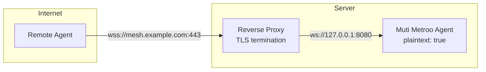

import Tabs from '@theme/Tabs';
import TabItem from '@theme/TabItem';

<div style={{textAlign: 'center', marginBottom: '2rem'}}>
  
</div>

# Reverse Proxy Deployment

Put agents behind Nginx, Caddy, or Apache to use your existing certificate infrastructure and share a public endpoint with other services.

**When to use this:**

- You have an existing reverse proxy infrastructure
- You want centralized certificate management (e.g., Let's Encrypt via Certbot)
- You need to consolidate multiple services behind a single public endpoint
- Corporate security policies require all traffic to pass through a proxy

### Architecture



## Muti Metroo Configuration

Configure the agent to listen on plaintext WebSocket. The `plaintext: true` option disables TLS on the listener since the proxy handles encryption.

```yaml
agent:
  display_name: "Backend Agent"
  data_dir: "/var/lib/muti-metroo"

listeners:
  # Plaintext WebSocket listener for reverse proxy
  - transport: ws
    address: "127.0.0.1:8080"
    path: "/mesh"
    plaintext: true

exit:
  enabled: true
  routes:
    - "10.0.0.0/8"

http:
  enabled: true
  address: "127.0.0.1:8081"
```

**Important notes:**

- Bind to `127.0.0.1` (localhost) to prevent direct external access
- The proxy connects to the agent over the local network
- mTLS (mutual TLS) is not available in this mode since TLS terminates at the proxy
- Peer authentication still works via the PEER_HELLO handshake
- End-to-end encryption (X25519 + ChaCha20-Poly1305) still protects stream payloads

## Reverse Proxy Configuration

<Tabs>
  <TabItem value="nginx" label="Nginx" default>

### Nginx Configuration

```nginx
# /etc/nginx/sites-available/muti-metroo

upstream muti_metroo {
    server 127.0.0.1:8080;
}

server {
    listen 443 ssl http2;
    server_name mesh.example.com;

    # TLS certificates (e.g., from Let's Encrypt)
    ssl_certificate /etc/letsencrypt/live/mesh.example.com/fullchain.pem;
    ssl_certificate_key /etc/letsencrypt/live/mesh.example.com/privkey.pem;

    # Modern TLS configuration
    ssl_protocols TLSv1.2 TLSv1.3;
    ssl_ciphers ECDHE-ECDSA-AES128-GCM-SHA256:ECDHE-RSA-AES128-GCM-SHA256;
    ssl_prefer_server_ciphers off;

    location /mesh {
        proxy_pass http://muti_metroo;
        proxy_http_version 1.1;

        # WebSocket upgrade headers
        proxy_set_header Upgrade $http_upgrade;
        proxy_set_header Connection "upgrade";

        # Pass client info
        proxy_set_header Host $host;
        proxy_set_header X-Real-IP $remote_addr;
        proxy_set_header X-Forwarded-For $proxy_add_x_forwarded_for;
        proxy_set_header X-Forwarded-Proto $scheme;

        # Long-lived connections (24 hours)
        proxy_read_timeout 86400s;
        proxy_send_timeout 86400s;

        # Disable buffering for real-time communication
        proxy_buffering off;
    }
}

# Optional: redirect HTTP to HTTPS
server {
    listen 80;
    server_name mesh.example.com;
    return 301 https://$server_name$request_uri;
}
```

Enable the site:

```bash
sudo ln -s /etc/nginx/sites-available/muti-metroo /etc/nginx/sites-enabled/
sudo nginx -t
sudo systemctl reload nginx
```

  </TabItem>
  <TabItem value="caddy" label="Caddy">

### Caddy Configuration

Caddy automatically provisions TLS certificates via Let's Encrypt.

```
# /etc/caddy/Caddyfile

mesh.example.com {
    # Automatic HTTPS with Let's Encrypt

    # WebSocket proxy to Muti Metroo
    reverse_proxy /mesh 127.0.0.1:8080 {
        # WebSocket support is automatic in Caddy

        # Long connection timeout (24 hours)
        transport http {
            read_timeout 24h
            write_timeout 24h
        }
    }
}
```

Reload Caddy:

```bash
sudo systemctl reload caddy
```

  </TabItem>
  <TabItem value="apache" label="Apache">

### Apache Configuration

Requires `mod_proxy` and `mod_proxy_wstunnel` modules.

```bash
sudo a2enmod proxy proxy_wstunnel proxy_http ssl
```

```apacheconf
# /etc/apache2/sites-available/muti-metroo.conf

<VirtualHost *:443>
    ServerName mesh.example.com

    # TLS certificates
    SSLEngine on
    SSLCertificateFile /etc/letsencrypt/live/mesh.example.com/fullchain.pem
    SSLCertificateKeyFile /etc/letsencrypt/live/mesh.example.com/privkey.pem

    # Modern TLS configuration
    SSLProtocol all -SSLv3 -TLSv1 -TLSv1.1

    # WebSocket proxy
    ProxyPreserveHost On
    ProxyRequests Off

    # WebSocket upgrade for /mesh path
    RewriteEngine On
    RewriteCond %{HTTP:Upgrade} websocket [NC]
    RewriteCond %{HTTP:Connection} upgrade [NC]
    RewriteRule ^/mesh(.*)$ ws://127.0.0.1:8080/mesh$1 [P,L]

    # Fallback for non-WebSocket requests
    ProxyPass /mesh http://127.0.0.1:8080/mesh
    ProxyPassReverse /mesh http://127.0.0.1:8080/mesh

    # Long timeout for WebSocket connections
    ProxyTimeout 86400
</VirtualHost>

# Optional: redirect HTTP to HTTPS
<VirtualHost *:80>
    ServerName mesh.example.com
    Redirect permanent / https://mesh.example.com/
</VirtualHost>
```

Enable the site:

```bash
sudo a2ensite muti-metroo
sudo apache2ctl configtest
sudo systemctl reload apache2
```

  </TabItem>
</Tabs>

## Connecting to the Proxied Agent

Remote agents connect using the public `wss://` URL. From their perspective, it looks like a standard TLS-secured WebSocket connection.

```yaml
# Remote agent configuration
agent:
  display_name: "Remote Agent"

peers:
  - id: "${BACKEND_AGENT_ID}"
    transport: ws
    address: "wss://mesh.example.com/mesh"
    tls:
      insecure_skip_verify: false

socks5:
  enabled: true
  address: "127.0.0.1:1080"
```

## Security Considerations

### What still works

- **Peer authentication**: The PEER_HELLO handshake validates agent identities regardless of TLS
- **End-to-end encryption**: Stream payloads are encrypted with ChaCha20-Poly1305; transit nodes (including the proxy) cannot read them
- **Certificate verification**: Remote agents verify the proxy's TLS certificate

### What does not work

- **mTLS (mutual TLS)**: Client certificates cannot be used since TLS terminates at the proxy
- **Certificate pinning**: Agents pin the proxy's certificate, not the backend agent's

### Best practices

1. **Bind to localhost**: Always bind the plaintext listener to `127.0.0.1` to prevent direct access
2. **Firewall rules**: Block external access to the plaintext port (e.g., 8080)
3. **Use TLS 1.3**: Configure the proxy to prefer TLS 1.3 for better security
4. **Enable HSTS**: Consider adding HTTP Strict Transport Security headers
5. **Monitor logs**: Watch proxy access logs for unusual connection patterns

## Troubleshooting

### Connection refused

- Verify the agent is running: `systemctl status muti-metroo`
- Check the listener is bound: `ss -tlnp | grep 8080`
- Verify the proxy can reach the agent: `curl -v http://127.0.0.1:8080/mesh`

### WebSocket upgrade failed

- Ensure WebSocket headers are passed correctly
- Check for conflicting `Connection` or `Upgrade` header handling
- Verify the path matches (`/mesh` in both proxy and agent config)

### Connection drops after timeout

- Increase `proxy_read_timeout` (Nginx) or equivalent
- Consider implementing keepalives at the application level
- Check for intermediate firewalls with connection timeouts

## Related

- [Concepts - Transports](/concepts/transports) - Transport protocol details
- [Configuration - Listeners](/configuration/listeners) - Listener configuration reference
- [Deployment - Scenarios](/deployment/scenarios) - Other deployment patterns
