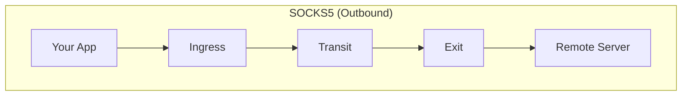
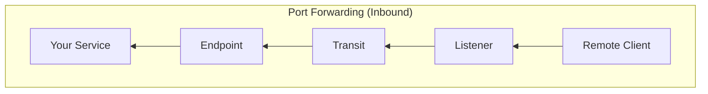

<div style={{textAlign: 'center', marginBottom: '2rem'}}>
  
</div>

# Port Forwarding

Expose local services through your mesh network. Run a web server on your machine and make it accessible from any agent in the mesh - even when you're many network hops away.

```bash
# From a remote office site:
curl http://nearest-agent:8080/configs/setup.sh -o /tmp/setup.sh
```

This downloads from your central server, tunneled through the mesh.

## How It Works

Port forwarding creates **reverse tunnels** - the opposite direction from SOCKS5 proxy:





**Endpoints** run on the agent with access to your service. **Listeners** run on agents where remote clients will connect.

## Port Forwarding vs SOCKS5

| Aspect | SOCKS5 Proxy | Port Forwarding |
|--------|--------------|-----------------|
| **Direction** | Outbound (you reach remote) | Inbound (remote reaches you) |
| **Use case** | Access remote resources | Expose local services |
| **Who initiates** | Your local application | Remote application |
| **Configuration** | `socks5` + `exit` sections | `forward` section |
| **Example** | Browse internal network via proxy | Serve configuration files to remote agents |

## Configuration

Port forwarding uses **routing keys** to match listeners with endpoints:

```yaml
# On YOUR machine (where the service runs) - the "endpoint"
forward:
  endpoints:
    - key: "my-files"            # Routing key (advertised to mesh)
      target: "localhost:80"     # Your local service

# On REMOTE agents (where clients connect) - the "listeners"
forward:
  listeners:
    - key: "my-files"            # Must match endpoint key
      address: ":8080"           # Port remote clients use
      max_connections: 100       # Optional limit
```

See [Configuration - Forward](/configuration/forward) for full reference.

## Common Scenarios

### Configuration Distribution

Serve configuration files, scripts, and updates to remote sites:

```yaml
# Central server
forward:
  endpoints:
    - key: "config-server"
      target: "localhost:8000"
```

```bash
# Start a simple HTTP server
python3 -m http.server 8000 --directory ./configs
```

```yaml
# Remote site agents
forward:
  listeners:
    - key: "config-server"
      address: "127.0.0.1:8080"
```

From any remote site: `curl http://local-agent:8080/site-config.yaml -o config.yaml`

### Internal Service Access

Make internal services accessible from remote sites:

```yaml
# Headquarters (where the service runs)
forward:
  endpoints:
    - key: "internal-api"
      target: "localhost:3000"
```

```yaml
# Branch office agents
forward:
  listeners:
    - key: "internal-api"
      address: "127.0.0.1:3000"
```

Applications at branch offices can access the internal API at `localhost:3000`.

### Multiple Services

Expose several services through different routing keys:

```yaml
forward:
  endpoints:
    - key: "http-docs"
      target: "localhost:80"
    - key: "file-share"
      target: "localhost:445"
    - key: "ssh-access"
      target: "localhost:22"
```

## Security Features

- **E2E Encryption**: Each connection gets its own encrypted session (X25519 + ChaCha20-Poly1305). Transit agents cannot decrypt traffic.

- **Routing Key Matching**: Only pre-configured keys work. Unknown keys are rejected.

- **Connection Limits**: Set `max_connections` on listeners to prevent resource exhaustion.

- **Configuration Based**: Port forwarding is configured via config files for consistent deployment.

## Monitoring

View all active port forward routes in the [Web Dashboard](/features/web-dashboard):

| Column | Description |
|--------|-------------|
| **Key** | Routing key linking listeners to endpoints |
| **Ingress** | Agent running the listener |
| **Listener** | Listen address on ingress |
| **Exit** | Agent running the endpoint |
| **Target** | Service address on exit |
| **Hops** | Number of mesh hops |

The table shows all ingress-exit combinations. If multiple agents have listeners or endpoints for the same key, all pairings are displayed.

You can also query the data programmatically:

```bash
curl http://localhost:8080/api/dashboard | jq '.forward_routes'
```

## Limitations

- **TCP only**: UDP is not supported for port forwarding
- **Fixed keys**: Routing keys must be pre-configured on both endpoints and listeners
- **No dynamic ports**: Unlike ngrok, ports are not dynamically assigned

## Related

- [Configuration - Forward](/configuration/forward) - Full configuration reference
- [Concepts - Routing](/concepts/routing) - How routes propagate through the mesh
- [Security - E2E Encryption](/security/e2e-encryption) - Encryption details
