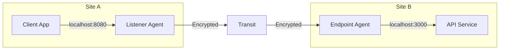
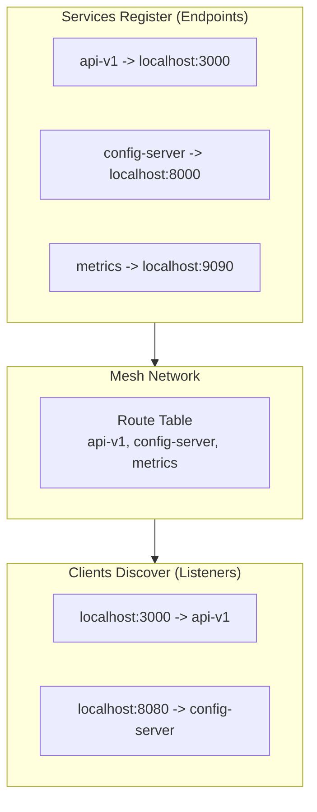

<div style={{textAlign: 'center', marginBottom: '2rem'}}>
  
</div>

# Port Forwarding

Expose local services through your mesh network. Services register themselves with a routing key, and any agent can create a local port that tunnels to that service - like lightweight service discovery built into your mesh.



To the client app, it looks like a normal local port. The mesh handles routing and encryption transparently.

## Service Discovery Pattern

Port forwarding doubles as a lightweight service discovery mechanism:

1. **Services register** by configuring an endpoint with a routing key
2. **Keys propagate** through the mesh automatically
3. **Any agent** can create a listener for that key
4. **Client apps** connect to a local port as if the service were local



**Benefits:**
- No separate service registry infrastructure needed
- Services are discoverable across network boundaries
- Client apps don't need mesh awareness - they just connect to localhost
- E2E encryption protects all traffic automatically

## How It Works

Port forwarding creates **reverse tunnels** - the opposite direction from SOCKS5 proxy:

| Direction | Flow | Use Case |
|-----------|------|----------|
| **SOCKS5** | Your app -> Mesh -> Remote server | Access remote resources |
| **Port Forward** | Remote client -> Mesh -> Your service | Expose local services |

**Endpoints** run on agents with access to your service. **Listeners** run on agents where clients will connect.

## Configuration

Port forwarding uses **routing keys** to match listeners with endpoints:

```yaml
# On the SERVICE side (endpoint) - where your service runs
forward:
  endpoints:
    - key: "my-api"              # Routing key (advertised to mesh)
      target: "localhost:3000"   # Your local service

# On the CLIENT side (listener) - where apps connect
forward:
  listeners:
    - key: "my-api"              # Must match endpoint key
      address: ":3000"           # Local port for client apps
      max_connections: 100       # Optional limit
```

See [Configuration - Forward](/configuration/forward) for full reference.

## Common Scenarios

### Configuration Distribution

Serve configuration files, scripts, and updates to remote sites:

```yaml
# Central server (endpoint)
forward:
  endpoints:
    - key: "config-server"
      target: "localhost:8000"
```

```bash
# Start a simple HTTP server
python3 -m http.server 8000 --directory ./configs
```

```yaml
# Remote site agents (listeners)
forward:
  listeners:
    - key: "config-server"
      address: "127.0.0.1:8080"
```

From any remote site:
```bash
curl http://localhost:8080/site-config.yaml -o config.yaml
```

### Internal API Gateway

Make internal APIs accessible from all sites without VPN:

```yaml
# API server at headquarters (endpoint)
forward:
  endpoints:
    - key: "internal-api"
      target: "localhost:3000"
```

```yaml
# All branch office agents (listeners)
forward:
  listeners:
    - key: "internal-api"
      address: "127.0.0.1:3000"
```

Applications at any branch office can call `http://localhost:3000/api/...` as if the API were local.

### Database Access

Provide secure database access across sites:

```yaml
# Database server (endpoint)
forward:
  endpoints:
    - key: "postgres-main"
      target: "localhost:5432"
```

```yaml
# Developer workstations (listeners)
forward:
  listeners:
    - key: "postgres-main"
      address: "127.0.0.1:5432"
```

Developers connect to `localhost:5432` - standard database tools work unchanged.

### Multiple Services

Register several services with different keys:

```yaml
# Service host (multiple endpoints)
forward:
  endpoints:
    - key: "http-docs"
      target: "localhost:80"
    - key: "api-gateway"
      target: "localhost:8080"
    - key: "metrics"
      target: "localhost:9090"
```

### High Availability

Multiple agents can register the same endpoint key for redundancy:

```yaml
# Primary server
forward:
  endpoints:
    - key: "api-v1"
      target: "localhost:3000"

# Secondary server (same key)
forward:
  endpoints:
    - key: "api-v1"
      target: "localhost:3000"
```

Listeners will route to the nearest available endpoint based on hop count.

## Security Features

- **E2E Encryption**: Each connection gets its own encrypted session (X25519 + ChaCha20-Poly1305). Transit agents cannot decrypt traffic.

- **Key-Based Access**: Only pre-configured routing keys work. Services must explicitly register to be discoverable.

- **Connection Limits**: Set `max_connections` on listeners to prevent resource exhaustion.

- **Local Binding**: Bind listeners to `127.0.0.1` to restrict access to local applications only.

## Monitoring

View active port forward routes in the [Web Dashboard](/features/web-dashboard) or query programmatically:

```bash
curl http://localhost:8080/api/dashboard | jq '.forward_routes'
```

The response shows all endpoint-listener pairings with hop counts.

## Limitations

- **TCP only**: UDP is not supported for port forwarding
- **Static keys**: Routing keys must be pre-configured (no dynamic registration API)
- **Fixed ports**: Unlike ngrok, listener ports are not dynamically assigned

## Related

- [Configuration - Forward](/configuration/forward) - Full configuration reference
- [Concepts - Routing](/concepts/routing) - How routes propagate through the mesh
- [Security - E2E Encryption](/security/e2e-encryption) - Encryption details
