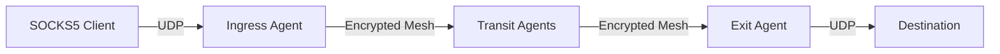

<div style={{textAlign: 'center', marginBottom: '2rem'}}>
  
</div>

# UDP Relay

Muti Metroo supports tunneling UDP traffic through the mesh network using SOCKS5 UDP ASSOCIATE (RFC 1928).

## Overview

UDP relay enables connectionless UDP traffic (DNS, NTP, game protocols) to be tunneled through the encrypted mesh network. Traffic flows from a SOCKS5 client through the ingress agent, across transit nodes, and out through an exit node.



All UDP datagrams are encrypted end-to-end between ingress and exit using ChaCha20-Poly1305.

## Requirements

UDP relay requires:

1. **Ingress agent** with SOCKS5 enabled
2. **Exit agent** with UDP relay enabled
3. A route from ingress to exit

## Configuration

### Exit Node

Enable UDP relay on exit nodes:

```yaml
udp:
  enabled: true
  allowed_ports:
    - "53"     # DNS
    - "123"    # NTP
  max_associations: 1000
  idle_timeout: 5m
  max_datagram_size: 1472
```

See [Configuration - UDP](/configuration/udp) for full reference.

### Ingress Node

No special configuration needed. UDP ASSOCIATE is automatically available when SOCKS5 is enabled and an exit with UDP support is reachable.

```yaml
socks5:
  enabled: true
  address: "127.0.0.1:1080"
```

## Usage

### DNS Queries

Use standard DNS tools through the SOCKS5 proxy:

```bash
# Using proxychains
proxychains4 dig @8.8.8.8 example.com

# Using socksify
socksify dig @8.8.8.8 example.com
```

### Python Example

```python
import socket
import struct

# Connect to SOCKS5 proxy
proxy = socket.socket(socket.AF_INET, socket.SOCK_STREAM)
proxy.connect(('127.0.0.1', 1080))

# SOCKS5 greeting (no auth)
proxy.send(b'\x05\x01\x00')
proxy.recv(2)  # Method selection

# UDP ASSOCIATE request
proxy.send(b'\x05\x03\x00\x01\x00\x00\x00\x00\x00\x00')
reply = proxy.recv(10)

# Parse relay address
relay_ip = socket.inet_ntoa(reply[4:8])
relay_port = struct.unpack('>H', reply[8:10])[0]

# Create UDP socket
udp = socket.socket(socket.AF_INET, socket.SOCK_DGRAM)

# Build SOCKS5 UDP header + DNS query
# RSV(2) + FRAG(1) + ATYP(1) + ADDR + PORT(2) + DATA
header = b'\x00\x00\x00\x01'  # RSV, FRAG=0, ATYP=IPv4
header += socket.inet_aton('8.8.8.8')  # Destination IP
header += struct.pack('>H', 53)  # Destination port
header += dns_query  # Your DNS query bytes

# Send through relay
udp.sendto(header, (relay_ip, relay_port))

# Receive response
response, _ = udp.recvfrom(4096)
dns_response = response[10:]  # Skip SOCKS5 header
```

## Port Whitelist

For security, exit nodes use a port whitelist:

```yaml
udp:
  allowed_ports:
    - "53"     # DNS only
    - "123"    # NTP
```

Special values:

| Value | Description |
|-------|-------------|
| `"53"` | Specific port |
| `"*"` | All ports (dangerous - see warning below) |
| `[]` | No ports allowed (UDP disabled) |

:::danger Security Risk: Wildcard Port Access

Never use `["*"]` (all ports) in production environments. This allows:

- **Arbitrary UDP tunneling**: Attackers can tunnel any UDP-based protocol through your exit node
- **Amplification attacks**: Your node can be used for UDP-based DDoS amplification (DNS, NTP, memcached)
- **Abuse exposure**: Your exit IP becomes liable for malicious traffic
- **Data exfiltration**: Unrestricted UDP enables covert data channels

Always use an explicit port whitelist limited to protocols you actually need (e.g., DNS on 53, NTP on 123).

:::

## Limitations

| Limitation | Value | Description |
|------------|-------|-------------|
| Max datagram size | 1472 bytes | MTU minus IP/UDP headers |
| Fragmentation | Not supported | Fragmented datagrams are rejected |
| Association lifetime | Tied to TCP | Ends when TCP control connection closes |

### No Fragmentation Support

UDP datagrams with `FRAG > 0` are rejected. Most applications do not use SOCKS5-level fragmentation. If you encounter issues, check if your application is fragmenting at the SOCKS5 layer.

## End-to-End Encryption

UDP traffic is encrypted between ingress and exit:

1. Ingress generates ephemeral X25519 keypair
2. Exit generates ephemeral X25519 keypair
3. Both derive shared secret via ECDH
4. Each datagram encrypted with ChaCha20-Poly1305

Transit nodes cannot decrypt UDP payloads.

## Troubleshooting

### UDP ASSOCIATE Fails

```
Error: UDP relay is disabled
```

- Verify exit node has `udp.enabled: true`
- Check that a route exists to the exit node
- Ensure exit node is connected to the mesh

### Port Not Allowed

```
Error: port 5000 not allowed
```

- Add port to `udp.allowed_ports` on exit node
- Or use `["*"]` to allow all ports (testing only)

### Datagram Too Large

```
Error: datagram too large
```

- Reduce payload size to under 1472 bytes
- Check `udp.max_datagram_size` configuration

### Association Timeout

UDP associations expire after `idle_timeout` (default 5 minutes) of inactivity. Send keepalive datagrams if needed.

## Security Considerations

1. **Port whitelist**: Only allow necessary ports (53, 123)
2. **Avoid wildcard**: Don't use `["*"]` in production
3. **Authentication**: Use SOCKS5 authentication to control access
4. **Monitor associations**: Check `max_associations` limit

## Related

- [Configuration - UDP](/configuration/udp) - Full configuration reference
- [Features - SOCKS5 Proxy](/features/socks5-proxy) - SOCKS5 ingress setup
- [Features - Exit Routing](/features/exit-routing) - Route configuration
- [Configuration - Exit](/configuration/exit) - Exit node setup
