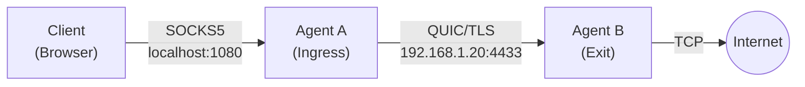
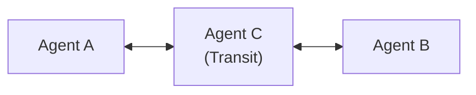

<div style={{textAlign: 'center', marginBottom: '2rem'}}>
  
</div>

# Your First Mesh Network

This guide walks you through creating your first multi-agent mesh network. By the end, you will have:

- Two agents communicating securely
- Traffic flowing through the mesh
- Understanding of how routing works

## Architecture Overview

We will create this simple topology:



- **Agent A**: Accepts SOCKS5 connections, forwards to mesh
- **Agent B**: Receives traffic from mesh, connects to external destinations

## Prerequisites

- Muti Metroo [installed](/getting-started/installation)
- Two machines or terminals (can use same machine with different ports)
- Network connectivity between agents

## Step 1: Generate Shared CA

Both agents will use certificates signed by the same CA:

```bash
# On Agent A's machine (or shared location)
muti-metroo cert ca --cn "My Mesh CA" -o ./certs

# Copy ca.crt and ca.key to Agent B
# (or generate Agent B's cert using the same CA)
```

## Step 2: Generate Agent Certificates

### Agent A Certificate

```bash
muti-metroo cert agent --cn "agent-a" \
  --ip "192.168.1.10" \
  --dns "agent-a.local" \
  -o ./certs \
  --ca ./certs/ca.crt \
  --ca-key ./certs/ca.key
```

### Agent B Certificate

```bash
muti-metroo cert agent --cn "agent-b" \
  --ip "192.168.1.20" \
  --dns "agent-b.local" \
  -o ./certs-b \
  --ca ./certs/ca.crt \
  --ca-key ./certs/ca.key
```

## Step 3: Initialize Agent Identities

### Agent A

```bash
muti-metroo init -d ./data-a
# Note the Agent ID: aaaa1111....
```

### Agent B

```bash
muti-metroo init -d ./data-b
# Note the Agent ID: bbbb2222....
```

## Step 4: Configure Agent B (Exit Node)

Create `config-b.yaml`:

```yaml
agent:
  id: "auto"
  display_name: "Agent B (Exit)"
  data_dir: "./data-b"
  log_level: "info"

# Global TLS configuration
tls:
  ca: "./certs/ca.crt"           # CA for verifying client certs (mTLS)
  cert: "./certs-b/agent-b.crt"  # Agent certificate
  key: "./certs-b/agent-b.key"   # Agent private key
  mtls: true                     # Require valid client certificates

# Listen for peer connections
listeners:
  - transport: quic
    address: "0.0.0.0:4433"
    # Uses global TLS settings

# Exit node - open connections to internet
exit:
  enabled: true
  routes:
    - "0.0.0.0/0"              # Default route - all traffic
  dns:
    servers:
      - "8.8.8.8:53"
    timeout: 5s

# HTTP API
http:
  enabled: true
  address: ":8081"             # Different port if on same machine
```

Start Agent B:

```bash
muti-metroo run -c ./config-b.yaml
```

Note the Agent ID from the output (e.g., `bbbb2222333344445555666677778888`).

## Step 5: Configure Agent A (Ingress Node)

Create `config-a.yaml` with Agent B's ID:

```yaml
agent:
  id: "auto"
  display_name: "Agent A (Ingress)"
  data_dir: "./data-a"
  log_level: "info"

# Global TLS configuration
tls:
  ca: "./certs/ca.crt"           # CA for verifying peers
  cert: "./certs/agent-a.crt"    # Agent certificate
  key: "./certs/agent-a.key"     # Agent private key

# Listen for peer connections (optional, for other agents)
listeners:
  - transport: quic
    address: "0.0.0.0:4434"    # Different port if on same machine
    # Uses global TLS settings

# Connect to Agent B
peers:
  - id: "bbbb2222333344445555666677778888"  # Agent B's ID
    transport: quic
    address: "192.168.1.20:4433"            # Agent B's address
    # Uses global CA and cert/key

# SOCKS5 proxy for client connections
socks5:
  enabled: true
  address: "127.0.0.1:1080"

# HTTP API
http:
  enabled: true
  address: ":8080"
```

Start Agent A:

```bash
muti-metroo run -c ./config-a.yaml
```

## Step 6: Verify Connection

### Check Agent A's Peers

```bash
curl http://localhost:8080/healthz
```

Expected output:

```json
{
  "status": "healthy",
  "agent_id": "aaaa1111...",
  "peers": 1,
  "routes": 1,
  "streams": 0
}
```

### Check Logs

Agent A should show:

```
INFO  Connected to peer peer_id=bbbb2222... addr=192.168.1.20:4433
INFO  Route added cidr=0.0.0.0/0 next_hop=bbbb2222... metric=1
```

Agent B should show:

```
INFO  Accepted peer connection peer_id=aaaa1111... addr=192.168.1.10:xxxxx
```

## Step 7: Test the Mesh

Now test that traffic flows through the mesh:

```bash
# From Agent A's machine
curl -x socks5://localhost:1080 https://example.com
```

You should see the webpage content. In the logs:

**Agent A:**
```
INFO  SOCKS5 connect request dest=example.com:443
INFO  Stream opened stream_id=1 dest=example.com:443
```

**Agent B:**
```
INFO  Stream open request stream_id=1 dest=example.com:443
INFO  Exit connection established dest=93.184.216.34:443
```

## Step 8: Test More Applications

### SSH Through the Mesh

```bash
ssh -o ProxyCommand='nc -x localhost:1080 %h %p' user@remote-server
```

### Browser Proxy

Configure your browser to use `localhost:1080` as SOCKS5 proxy.

### curl with Verbose Output

```bash
curl -v -x socks5://localhost:1080 https://httpbin.org/ip
```

## Understanding the Data Flow

1. **Client** connects to Agent A's SOCKS5 server (port 1080)
2. **Agent A** looks up route for destination IP
3. **Routing table** shows 0.0.0.0/0 via Agent B
4. **Agent A** opens a stream to Agent B
5. **Agent B** opens TCP connection to destination
6. **Agent B** confirms the stream is ready
7. **Data flows** bidirectionally through the mesh
8. **Stream closes** when the connection terminates

## Viewing the Dashboard

Access the web dashboard:

```bash
# Agent A dashboard
open http://localhost:8080/ui/

# Agent B dashboard
open http://localhost:8081/ui/
```

The metro map shows both agents and their connection.

## Adding a Third Agent (Transit)

To add a transit node between A and B:



Agent C configuration:

```yaml
agent:
  id: "auto"
  display_name: "Agent C (Transit)"
  data_dir: "./data-c"
  log_level: "info"

# Global TLS configuration
tls:
  ca: "./certs/ca.crt"
  cert: "./certs-c/agent-c.crt"
  key: "./certs-c/agent-c.key"

listeners:
  - transport: quic
    address: "0.0.0.0:4435"
    # Uses global TLS settings

# Connect to Agent B
peers:
  - id: "bbbb2222..."
    transport: quic
    address: "192.168.1.20:4433"
    # Uses global CA and cert/key

# No socks5 or exit - pure transit
http:
  enabled: true
  address: ":8082"
```

Update Agent A to connect to Agent C instead of Agent B:

```yaml
peers:
  - id: "cccc3333..."     # Agent C's ID
    transport: quic
    address: "192.168.1.30:4435"
    # Uses global CA from tls section
```

Routes will propagate: Agent A learns about Agent B's 0.0.0.0/0 route through Agent C.

## Troubleshooting

### No Route to Host

```
Error: no route to 93.184.216.34
```

- Check Agent B is running and has exit enabled
- Verify connection between agents
- Check routes: `curl http://localhost:8080/healthz`

### Connection Refused

```
Error: connection refused
```

- Verify Agent B is listening on correct address
- Check firewall rules
- Verify TLS certificates

### Certificate Error

```
Error: certificate verify failed
```

- Ensure both agents use certs signed by same CA
- Check certificate expiration
- Verify peer ID matches certificate

See [Troubleshooting Guide](../troubleshooting/common-issues) for more help.

## Next Steps

- [Core Concepts](../concepts/architecture) - Understand the architecture
- [Configuration Reference](../configuration/overview) - All configuration options
- [Deployment Scenarios](../deployment/scenarios) - Real-world deployment patterns
- [Security Best Practices](../security/best-practices) - Production hardening
