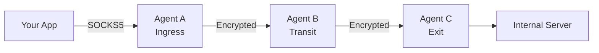
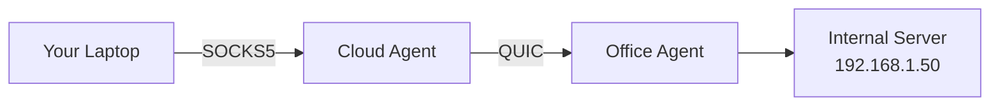
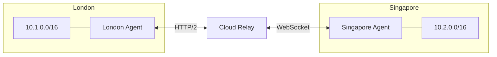
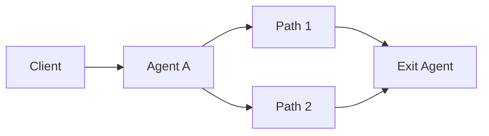

  

# Muti Metroo

**Your private metro system for network traffic** - connect distributed infrastructure with encrypted relay chains.

Muti Metroo creates encrypted tunnels through multiple relay points, letting you reach resources behind firewalls without VPN infrastructure. Deploy a single binary, connect your agents, and route traffic through any network topology.

  <a href="/getting-started/overview" className="button button--primary button--lg">
    Get Started in 2 Minutes
  </a>

## Why Muti Metroo?

| Challenge | Solution |
| --------- | -------- |
| **Firewalls block your traffic** | HTTP/2 and WebSocket transports blend with normal HTTPS |
| **Complex network paths** | Multi-hop routing finds the path automatically |
| **Hard to deploy** | Single binary, no root, no kernel modules |
| **Per-app proxy config is tedious** | TUN interface routes all traffic transparently |
| **Transit nodes see your data** | End-to-end encryption - transit cannot decrypt |

## Key Features

| Feature | Description |
| ------- | ----------- |
| **Multi-Hop Routing** | Traffic flows through chains, trees, or full mesh - routes propagate automatically |
| **E2E Encryption** | X25519 + ChaCha20-Poly1305 - transit nodes cannot read your traffic |
| **Firewall Traversal** | QUIC, HTTP/2, and WebSocket transports for restrictive networks |
| **SOCKS5 Proxy** | TCP and UDP support with optional authentication |
| **TUN Interface** | Transparent routing with [Mutiauk](/mutiauk) - no per-app configuration |
| **Web Dashboard** | Visual metro map showing mesh topology in real-time |

[See all features](/configuration/overview)

## Use Cases

### Reach Internal Resources

Access servers behind NAT or firewalls through multi-hop relay chains. No VPN infrastructure needed.

### Connect Multiple Sites

Link office locations through a mesh. Each site accesses resources at other sites seamlessly.

### Resilient Connectivity

Deploy redundant paths with automatic failover. Agents reconnect with exponential backoff if connections drop.

## How It Works

1. **Deploy agents** on available hosts - they connect as peers
2. **Routes propagate** automatically through flood-based advertising
3. **Connect via SOCKS5** on any ingress agent
4. **Traffic flows** through the mesh to the exit with the matching route
5. **Exit agents** open real connections to destinations

## Next Steps

| Goal | Start Here |
| ---- | ---------- |
| **Try it now** | [Getting Started](/getting-started/overview) - 2-minute Docker demo |
| **Understand the architecture** | [Core Concepts](/concepts/architecture) |
| **Compare alternatives** | [Comparisons](/comparisons/vs-ligolo-ng) |
| **Deploy to production** | [Deployment Guide](/deployment/scenarios) |
| **Troubleshoot issues** | [Troubleshooting](/troubleshooting/common-issues) |
