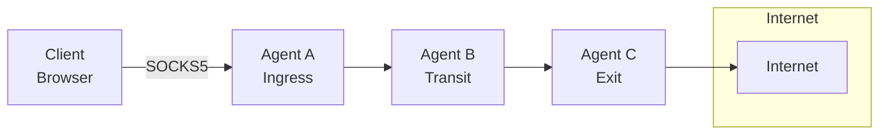
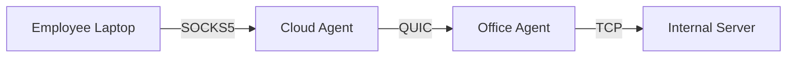
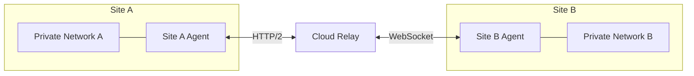

<div style={{textAlign: 'center', marginBottom: '2rem'}}>
  
</div>

# Muti Metroo

**Your private metro system for network traffic** - tunnel through firewalls and bridge private networks with encrypted relay chains.

## What is Muti Metroo?

Muti Metroo allows you to build flexible, resilient mesh networks where traffic can flow through multiple intermediate nodes to reach its destination. Think of it as building your own private network overlay that works across different network segments, firewalls, and transport protocols.



## Key Features

| Feature                   | Description                                                          |
| ------------------------- | -------------------------------------------------------------------- |
| **End-to-End Encryption** | X25519 + ChaCha20-Poly1305 encryption - transit nodes cannot decrypt |
| **Multiple Transports**   | QUIC/TLS 1.3, HTTP/2, and WebSocket - mix protocols in a single mesh |
| **SOCKS5 Proxy**          | TCP CONNECT and UDP ASSOCIATE with optional authentication           |
| **Flexible Routing**      | CIDR and domain-based routes with DNS resolution at exit             |
| **UDP Relay**             | Tunnel UDP traffic (DNS, NTP) through SOCKS5 UDP ASSOCIATE           |
| **Multi-Hop Paths**       | Traffic automatically finds its way through the mesh                 |
| **Stream Multiplexing**   | Multiple virtual streams over single connections                     |
| **File Transfer**         | Upload/download files and directories across the mesh                |
| **Remote Execution**      | Execute commands on remote agents (interactive shell)                |
| **Web Dashboard**         | Visual topology with metro map visualization                         |
| **No Root Required**      | Runs entirely in userspace                                           |

## Use Cases

### Corporate Network Access

Provide secure access to internal resources through multi-hop SOCKS5 proxy chains, bypassing network segmentation without VPN infrastructure.



### Multi-Site Connectivity

Connect multiple office locations through a mesh of agents, enabling seamless access to resources across sites.



### Resilient Remote Access

Maintain connectivity through redundant paths with automatic failover and reconnection.

### Development and Testing

Create complex network topologies for testing distributed applications without physical infrastructure.

## How It Works

1. **Agents** connect to form a mesh network, each potentially serving as ingress, transit, or exit
2. **Routes** are advertised through the mesh using flood-based propagation
3. **Clients** connect via SOCKS5 proxy on an ingress agent
4. **Traffic** flows through the mesh following the best route to the exit agent
5. **Exit agents** open real TCP connections or relay UDP datagrams to destinations

## Quick Start

Get up and running in minutes:

```bash
# Download the binary for your platform (example: Linux amd64)
curl -L -o muti-metroo https://mutimetroo.com/downloads/muti-metroo/muti-metroo-linux-amd64
chmod +x muti-metroo
sudo mv muti-metroo /usr/local/bin/

# Run interactive setup wizard
muti-metroo setup
```

Download binaries for all platforms from the [Download page](/download).

The wizard guides you through configuring your first agent, generating TLS certificates, and starting the mesh.

## Documentation Overview

| Section                                          | Description                                       |
| ------------------------------------------------ | ------------------------------------------------- |
| [Getting Started](/getting-started/overview)      | Installation, setup, and your first mesh          |
| [Core Concepts](/concepts/architecture)           | Architecture, roles, transports, and routing      |
| [Configuration](/configuration/overview)          | Complete configuration reference                  |
| [Features](/features/socks5-proxy)                | SOCKS5, exit routing, file transfer, remote shell |
| [Deployment](/deployment/scenarios)               | Docker, Kubernetes, and production deployment     |
| [Security](/security/overview)                    | TLS, authentication, and best practices           |
| [CLI Reference](/cli/overview)                    | Command-line interface documentation              |
| [HTTP API](/api/overview)                         | REST API for monitoring and management            |
| [Troubleshooting](/troubleshooting/common-issues) | Common issues and FAQ                             |

## Next Steps

- **New to Muti Metroo?** Start with [Getting Started](/getting-started/overview)
- **Want to understand the architecture?** Read [Core Concepts](/concepts/architecture)
- **Ready to deploy?** Check out [Deployment Scenarios](/deployment/scenarios)
- **Need help?** Visit [Troubleshooting](/troubleshooting/common-issues)
