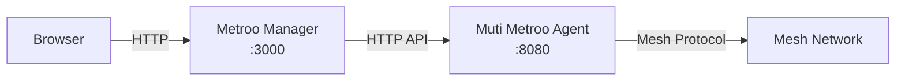

export const DownloadButton = ({href, children, primary}) => (
  <a
    href={href}
    className={`download-button ${primary ? 'download-button--primary' : ''}`}
    target="_blank"
    rel="noopener noreferrer">
    {children}
  </a>
);

export const DownloadButtonGroup = ({children}) => (
  <div className="download-button-group">
    {children}
  </div>
);

import Tabs from '@theme/Tabs';
import TabItem from '@theme/TabItem';

# Metroo Manager - Web Dashboard

<div style={{textAlign: 'center', marginBottom: '2rem'}}>
  
</div>

**Metroo Manager** is a lightweight web dashboard for managing and monitoring Muti Metroo mesh networks. It runs as a standalone binary that reverse-proxies a Muti Metroo agent's HTTP API and serves an embedded React SPA.

:::info Requires Running Agent
Metroo Manager connects to a Muti Metroo agent's HTTP API. The agent must have `http.enabled: true` with `http.dashboard: true` and `http.remote_api: true` in its configuration.
:::

## Features

| Feature | Description |
|---------|-------------|
| **Topology Map** | Interactive visualization of all agents and their connections |
| **Dashboard** | Real-time stats for peers, streams, routes, and system info |
| **Route Management** | View and manage CIDR and domain exit routes |
| **Remote Shell** | Browser-based terminal access to remote agents |
| **File Transfer** | Upload and download files to/from remote agents |
| **Mesh Test** | Test connectivity between all agents in the mesh |
| **Sleep/Wake** | Trigger mesh-wide sleep and wake commands |

## Download

<Tabs groupId="manager-os">
  <TabItem value="macos" label="macOS" default>

### Apple Silicon (M-series)

<DownloadButtonGroup>
  <DownloadButton href="https://download.mutimetroo.com/darwin-arm64/metroo-manager" primary>
    Download for macOS (Apple Silicon)
  </DownloadButton>
</DownloadButtonGroup>

### Intel

<DownloadButtonGroup>
  <DownloadButton href="https://download.mutimetroo.com/darwin-amd64/metroo-manager">
    Download for macOS (Intel)
  </DownloadButton>
</DownloadButtonGroup>

  </TabItem>
  <TabItem value="linux" label="Linux">

### x86_64 (amd64)

<DownloadButtonGroup>
  <DownloadButton href="https://download.mutimetroo.com/linux-amd64/metroo-manager" primary>
    Download for Linux (amd64)
  </DownloadButton>
</DownloadButtonGroup>

### ARM64 (aarch64)

<DownloadButtonGroup>
  <DownloadButton href="https://download.mutimetroo.com/linux-arm64/metroo-manager">
    Download for Linux (arm64)
  </DownloadButton>
</DownloadButtonGroup>

  </TabItem>
  <TabItem value="windows" label="Windows">

### x86_64 (amd64)

<DownloadButtonGroup>
  <DownloadButton href="https://download.mutimetroo.com/windows-amd64/metroo-manager.exe" primary>
    Download for Windows (amd64)
  </DownloadButton>
</DownloadButtonGroup>

### ARM64

<DownloadButtonGroup>
  <DownloadButton href="https://download.mutimetroo.com/windows-arm64/metroo-manager.exe">
    Download for Windows (arm64)
  </DownloadButton>
</DownloadButtonGroup>

  </TabItem>
</Tabs>

## Quick Start

```bash
# Download (example: macOS Apple Silicon)
curl -L -o metroo-manager https://download.mutimetroo.com/darwin-arm64/metroo-manager
chmod +x metroo-manager

# Launch (connects to local agent on port 8080)
./metroo-manager

# Open in browser
open http://localhost:3000
```

The dashboard opens automatically at `http://localhost:3000` and connects to the Muti Metroo agent's HTTP API at `localhost:8080`.

## CLI Flags

| Flag | Default | Description |
|------|---------|-------------|
| `-addr` | `:3000` | Address for the web UI to listen on |
| `-agent` | `localhost:8080` | Muti Metroo agent HTTP API address |
| `-agent-token` | | Bearer token for agent API authentication |
| `-version` | | Print version and exit |

### Examples

```bash
# Connect to a remote agent
./metroo-manager -agent 192.168.1.10:8080

# Use a custom port for the web UI
./metroo-manager -addr :9090

# Connect to a token-protected agent
./metroo-manager -agent 192.168.1.10:8080 -agent-token mysecrettoken

# Bind to all interfaces (accessible from other machines)
./metroo-manager -addr 0.0.0.0:3000 -agent 10.0.0.5:8080
```

## Agent Configuration Requirements

The Muti Metroo agent must have its HTTP API enabled with dashboard and remote API endpoints active:

```yaml
http:
  enabled: true
  address: ":8080"
  dashboard: true    # Required for /api/* endpoints
  remote_api: true   # Required for /agents/* endpoints
```

If the agent uses bearer token authentication, pass the token via the `-agent-token` flag:

```yaml
# Agent config with token protection
http:
  enabled: true
  address: ":8080"
  token_hash: "$2a$10$..."  # Generated with: muti-metroo hash
  dashboard: true
  remote_api: true
```

```bash
# Connect with token
./metroo-manager -agent localhost:8080 -agent-token yourtoken
```

## Architecture

Metroo Manager acts as a reverse proxy between the browser and a Muti Metroo agent:



- **Browser**: Loads the React SPA from the Manager and makes API calls
- **Manager**: Serves the embedded SPA and proxies API requests to the agent
- **Agent**: Handles mesh operations and returns status/management data

The Manager binary embeds the entire React frontend at build time, so no separate web server or Node.js runtime is needed.

## Feature Details

### Topology Map

The topology map provides a visual overview of all agents in the mesh and their peer connections. Agents are displayed with their display names, agent IDs, and connection status. Click on any agent to view detailed information.

### Dashboard

The dashboard shows real-time statistics for the connected agent, including:

- Connected peers and their connection status
- Active streams and buffer usage
- Route table (CIDR and domain routes)
- System information (OS, architecture, uptime)
- Forward route endpoints and listeners

### Route Management

View all CIDR and domain routes advertised across the mesh. The route table shows the origin agent, hop count, and metric for each route.

### Remote Shell

Access a browser-based terminal on any reachable agent in the mesh. The shell supports both streaming mode (for simple commands) and interactive mode (for programs like `htop` or `vim`). The target agent must have shell access enabled in its configuration.

### File Transfer

Upload and download files to/from any reachable agent through the browser. Supports individual files and directory transfers. The target agent must have file transfer enabled in its configuration.

### Mesh Test

Run connectivity tests between all agents in the mesh. The test sends probe messages between every pair of agents and reports success/failure with latency measurements.

### Sleep/Wake Control

Trigger mesh-wide sleep or wake commands from the dashboard. When sleep is activated, agents enter a low-power polling mode and disconnect from peers. Wake restores normal operation.

## Related

- [Muti Metroo Download](/download) - Main Muti Metroo agent binary
- [HTTP API Reference](/api/overview) - API endpoints that Metroo Manager uses
- [Mutiauk TUN Interface](/mutiauk) - Transparent traffic routing companion tool
- [Dashboard API](/api/dashboard) - JSON endpoints for topology and stats
