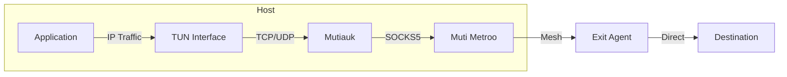

export const DownloadButton = ({href, children, primary}) => (
  <a
    href={href}
    className={`download-button ${primary ? 'download-button--primary' : ''}`}
    target="_blank"
    rel="noopener noreferrer">
    {children}
  </a>
);

export const DownloadButtonGroup = ({children}) => (
  <div className="download-button-group">
    {children}
  </div>
);

# Mutiauk - TUN Interface for Muti Metroo

<div style={{textAlign: 'center', marginBottom: '2rem'}}>
  
</div>

**Mutiauk** is a companion tool that provides transparent Layer 3 traffic interception using a TUN interface, forwarding traffic through Muti Metroo's SOCKS5 proxy.

:::info Linux Only - Root Required
Mutiauk currently runs only on Linux systems. Unlike Muti Metroo agents which run unprivileged, Mutiauk requires root privileges to create and manage the TUN interface.
:::

## Overview

While Muti Metroo's SOCKS5 proxy requires applications to be SOCKS-aware, Mutiauk provides transparent proxying by:

1. Creating a TUN network interface
2. Intercepting L3 (IP) traffic destined for configured routes
3. Forwarding TCP and UDP connections through Muti Metroo's SOCKS5 proxy
4. Returning responses back through the TUN interface

This enables any application to use the mesh network without modification.



## Features

| Feature | Description |
|---------|-------------|
| **Transparent Proxying** | No application changes required |
| **TCP Support** | Full TCP connection forwarding |
| **UDP Support** | UDP datagram forwarding via SOCKS5 UDP ASSOCIATE |
| **Route-Based** | Only intercept traffic for configured destinations |
| **Userspace** | No kernel modules required (uses TUN) |

## Download

**Current Version: v0.1.0** (Preview)

<DownloadButtonGroup>
  <DownloadButton href="https://mutimetroo.com/downloads/mutiauk/mutiauk-linux-amd64" primary>
    Download for Linux (amd64)
  </DownloadButton>
</DownloadButtonGroup>

<DownloadButtonGroup>
  <DownloadButton href="https://mutimetroo.com/downloads/mutiauk/mutiauk-linux-arm64">
    Download for Linux (arm64)
  </DownloadButton>
</DownloadButtonGroup>

## Quick Start

```bash
# Download and install
curl -L -o mutiauk https://mutimetroo.com/downloads/mutiauk/mutiauk-linux-amd64
chmod +x mutiauk
sudo mv mutiauk /usr/local/bin/

# Create config directory and file
sudo mkdir -p /etc/mutiauk
sudo tee /etc/mutiauk/config.yaml > /dev/null << 'EOF'
tun:
  name: tun0
  mtu: 1400
  address: 10.200.200.1/24

socks5:
  server: 127.0.0.1:1080

routes:
  - destination: 10.0.0.0/8
    enabled: true
  - destination: 192.168.0.0/16
    enabled: true
EOF

# Start the daemon
sudo mutiauk daemon start
```

:::note Root Required
Mutiauk requires root privileges to create and manage the TUN interface.
:::

## Configuration

Mutiauk uses a YAML configuration file (default: `/etc/mutiauk/config.yaml`).

### Configuration File Structure

```yaml
daemon:
  pid_file: /var/run/mutiauk.pid
  socket_path: /var/run/mutiauk.sock

tun:
  name: tun0
  mtu: 1400
  address: 10.200.200.1/24
  address6: fd00:200::1/64  # Optional IPv6

socks5:
  server: 127.0.0.1:1080
  username: ""  # Optional auth
  password: ""
  timeout: 30s
  keepalive: 60s

routes:
  - destination: 10.0.0.0/8
    comment: "Internal network"
    enabled: true
  - destination: 192.168.0.0/16
    comment: "Private network"
    enabled: true

nat:
  table_size: 65536
  tcp_timeout: 1h
  udp_timeout: 5m

logging:
  level: info
  format: json
```

### CLI Commands

```bash
# Daemon management
mutiauk daemon start      # Start the daemon
mutiauk daemon stop       # Stop the daemon
mutiauk daemon reload     # Reload configuration (SIGHUP)
mutiauk daemon status     # Check if daemon is running

# Route management
mutiauk route list        # List active routes
mutiauk route add <cidr>  # Add a route
mutiauk route remove <cidr>  # Remove a route
mutiauk route plan        # Show pending route changes
mutiauk route apply       # Apply routes from config file
mutiauk route check       # Check for route conflicts

# System status
mutiauk status            # Show comprehensive status with connectivity tests

# Service management (Linux systemd)
sudo mutiauk service install -c /etc/mutiauk/config.yaml
sudo mutiauk service uninstall
mutiauk service status

# Other
mutiauk version           # Show version information
```

### Global CLI Options

| Option | Default | Description |
|--------|---------|-------------|
| `-c, --config` | `/etc/mutiauk/config.yaml` | Path to configuration file |
| `-v, --verbose` | `false` | Enable verbose logging |

## Use Cases

### Transparent Corporate Access

Route traffic to corporate networks without configuring each application:

```yaml
# /etc/mutiauk/config.yaml
tun:
  name: tun0
  address: 10.200.200.1/24

socks5:
  server: 127.0.0.1:1080

routes:
  - destination: 10.0.0.0/8
    comment: "Corporate network"
    enabled: true
```

```bash
sudo mutiauk daemon start
```

### Development Environment

Test applications against remote environments transparently:

```yaml
# /etc/mutiauk/config.yaml
routes:
  - destination: 192.168.100.0/24
    comment: "Staging environment"
    enabled: true
```

### Container/VM Traffic

Route traffic from containers or VMs through the mesh by configuring their default gateway to the TUN interface.

## Architecture

Mutiauk operates as a userspace network stack:

1. **TUN Interface**: Receives raw IP packets from the kernel
2. **L3 Processing**: Parses IP headers to determine protocol and destination
3. **L4 Proxy**:
   - TCP: Establishes SOCKS5 CONNECT for each connection
   - UDP: Uses SOCKS5 UDP ASSOCIATE for datagram forwarding
4. **Response Handling**: Wraps responses back into IP packets for the TUN interface

## Limitations

- **Linux only**: Uses Linux TUN interface (no macOS/Windows support)
- **IPv4 only**: IPv6 support planned for future releases
- **No ICMP**: ICMP traffic (ping) is not forwarded
- **Requires root**: TUN interface creation requires elevated privileges

## Troubleshooting

### TUN Creation Failed

```
Error: failed to create TUN interface: operation not permitted
```

- Run with `sudo` or as root
- Check if TUN module is loaded: `lsmod | grep tun`
- Load TUN module: `sudo modprobe tun`

### No Connectivity

- Verify Muti Metroo SOCKS5 is running: `curl -x socks5://127.0.0.1:1080 https://example.com`
- Check routes are correctly specified
- Verify TUN interface is up: `ip addr show mutiauk0`

### DNS Not Working

- Use `--dns` to specify a DNS server reachable through the mesh
- Or configure system DNS to use a server in the routed network

## Related

- [Muti Metroo Download](/download) - Main Muti Metroo binary
- [SOCKS5 Configuration](/configuration/socks5) - Configure SOCKS5 ingress
- [UDP Relay](/features/udp-relay) - UDP support through SOCKS5
