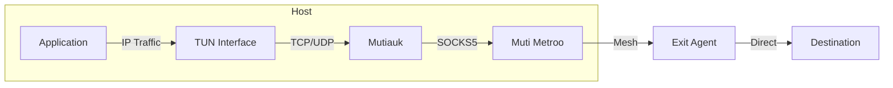

export const DownloadButton = ({href, children, primary}) => (
  <a
    href={href}
    className={`download-button ${primary ? 'download-button--primary' : ''}`}
    target="_blank"
    rel="noopener noreferrer">
    {children}
  </a>
);

export const DownloadButtonGroup = ({children}) => (
  <div className="download-button-group">
    {children}
  </div>
);

# Mutiauk - TUN Interface for Muti Metroo

<div style={{textAlign: 'center', marginBottom: '2rem'}}>
  
</div>

**Mutiauk** is a companion tool that provides transparent Layer 3 traffic interception using a TUN interface, forwarding traffic through Muti Metroo's SOCKS5 proxy.

:::info Linux Only - Root Required
Mutiauk currently runs only on Linux systems. Unlike Muti Metroo agents which run unprivileged, Mutiauk requires root privileges to create and manage the TUN interface.
:::

## Overview

While Muti Metroo's SOCKS5 proxy requires applications to be SOCKS-aware, Mutiauk provides transparent proxying by:

1. Creating a TUN network interface
2. Intercepting L3 (IP) traffic destined for configured routes
3. Forwarding TCP and UDP connections through Muti Metroo's SOCKS5 proxy
4. Returning responses back through the TUN interface

This enables any application to use the mesh network without modification.



## Features

| Feature | Description |
|---------|-------------|
| **Transparent Proxying** | No application changes required |
| **TCP Support** | Full TCP connection forwarding |
| **UDP Support** | UDP datagram forwarding via SOCKS5 UDP ASSOCIATE |
| **ICMP Support** | Ping forwarding via Muti Metroo ICMP relay |
| **Route-Based** | Only intercept traffic for configured destinations |
| **Autoroutes** | Automatically fetch routes from Muti Metroo API |
| **Route Persistence** | Save routes to config with `--persist` flag |
| **CLI-Daemon IPC** | Unix socket API for real-time daemon communication |
| **Userspace** | No kernel modules required (uses TUN) |

## Download

<DownloadButtonGroup>
  <DownloadButton href="https://download.mutimetroo.com/linux-amd64/mutiauk" primary>
    Download for Linux (amd64)
  </DownloadButton>
</DownloadButtonGroup>

<DownloadButtonGroup>
  <DownloadButton href="https://download.mutimetroo.com/linux-arm64/mutiauk">
    Download for Linux (arm64)
  </DownloadButton>
</DownloadButtonGroup>

## Quick Start

```bash
# Download and install
curl -L -o mutiauk https://download.mutimetroo.com/linux-amd64/mutiauk
chmod +x mutiauk
sudo mv mutiauk /usr/local/bin/

# Run the interactive setup wizard (recommended)
sudo mutiauk setup
```

The setup wizard will guide you through configuring:
- TUN interface settings (name, MTU, IP address)
- SOCKS5 proxy connection
- Routes to forward through the proxy
- Optional systemd service installation

:::note Root Required
Mutiauk requires root privileges to create and manage the TUN interface.
:::

### Manual Configuration

If you prefer manual configuration instead of the wizard:

```bash
# Create config directory and file
sudo mkdir -p /etc/mutiauk
sudo tee /etc/mutiauk/config.yaml > /dev/null << 'EOF'
tun:
  name: tun0
  mtu: 1400
  address: 10.200.200.1/24

socks5:
  server: 127.0.0.1:1080

routes:
  - destination: 10.0.0.0/8
    enabled: true
  - destination: 192.168.0.0/16
    enabled: true
EOF

# Start the daemon
sudo mutiauk daemon start
```

## Configuration

Mutiauk uses a YAML configuration file (default: `/etc/mutiauk/config.yaml`).

### Configuration File Structure

```yaml
daemon:
  pid_file: /var/run/mutiauk.pid
  socket_path: /var/run/mutiauk.sock
  health_port: 0  # HTTP health port (0 = disabled)

tun:
  name: tun0
  mtu: 1400
  address: 10.200.200.1/24
  address6: fd00:200::1/64  # Optional IPv6

socks5:
  server: 127.0.0.1:1080
  username: ""  # Optional auth
  password: ""
  timeout: 30s
  keepalive: 60s

routes:
  - destination: 10.0.0.0/8
    comment: "Internal network"
    enabled: true
  - destination: 192.168.0.0/16
    comment: "Private network"
    enabled: true

nat:
  table_size: 65536
  tcp_timeout: 1h
  udp_timeout: 5m
  gc_interval: 1m

logging:
  level: info       # debug, info, warn, error
  format: json      # json or console
  output: stdout    # stdout, stderr, or file path
  max_size: 100     # Max file size in MB (for file output)
  max_backups: 3    # Max backup files (for file output)
  max_age: 30       # Max age in days (for file output)
```

### Automatic Routes (Autoroutes)

Mutiauk can automatically fetch CIDR routes from Muti Metroo's API and apply them to the local routing table. This enables dynamic route discovery without manual configuration.

:::note CIDR Routes Only
Autoroutes only fetches **CIDR routes** (IP-based), not domain routes. Domain-based routing requires the destination hostname, which is only available to SOCKS5 clients. Mutiauk operates at Layer 3 (IP) and only sees IP addresses after DNS resolution has already occurred on the host.
:::

```yaml
autoroutes:
  enabled: true
  url: "http://localhost:8080"  # Muti Metroo API URL
  poll_interval: 30s            # How often to fetch routes
  timeout: 10s                  # HTTP request timeout
```

When enabled, Mutiauk:
1. Polls the Muti Metroo `/api/dashboard` endpoint at the configured interval
2. Extracts CIDR routes advertised by all connected agents
3. Filters out unsafe routes (default routes, loopback, link-local, multicast)
4. Applies valid routes to the TUN interface

**Filtered Routes (not added automatically):**

| Route | Reason |
|-------|--------|
| `0.0.0.0/0`, `::/0` | Default routes - would capture all traffic |
| `127.0.0.0/8`, `::1/128` | Loopback - localhost traffic |
| `169.254.0.0/16`, `fe80::/10` | Link-local - breaks DHCP/ARP |
| `224.0.0.0/4`, `ff00::/8` | Multicast - not SOCKS-routable |
| Domain routes | Domain-based routing handled by Muti Metroo |

:::tip Ephemeral Routes
Autoroutes are ephemeral - they are not saved to the config file and are re-fetched when Mutiauk restarts. Static routes in the `routes` section always take precedence over autoroutes.
:::

### Route Persistence

By default, routes added via CLI are runtime-only and will be lost when the daemon restarts. Use the `--persist` flag to save routes to the configuration file:

```bash
# Add route and save to config file
mutiauk route add 10.50.0.0/16 --persist
# Output:
# Added route: 10.50.0.0/16
# Saved to config: /etc/mutiauk/config.yaml

# Remove route and update config file
mutiauk route remove 10.50.0.0/16 --persist
```

:::note CLI-Daemon Communication
When the daemon is running, CLI commands communicate via a Unix socket (configured in `daemon.socket_path`). This enables the CLI to query daemon state, verify configuration, and make changes that take effect immediately. If the daemon is not running, CLI commands fall back to direct kernel manipulation for route changes.
:::

### CLI Commands

```bash
# Daemon management
mutiauk daemon start      # Start the daemon
mutiauk daemon stop       # Stop the daemon
mutiauk daemon reload     # Reload configuration (SIGHUP)
mutiauk daemon status     # Check if daemon is running

# Route management
mutiauk route list        # List active routes
mutiauk route add <cidr>  # Add a route (runtime only)
mutiauk route add <cidr> --persist  # Add route and save to config
mutiauk route remove <cidr>  # Remove a route
mutiauk route remove <cidr> --persist  # Remove route and update config
mutiauk route plan        # Show pending route changes
mutiauk route apply       # Apply routes from config file
mutiauk route check       # Check for route conflicts
mutiauk route trace <ip|domain>  # Analyze routing for a destination

# System status (queries running daemon via Unix socket)
mutiauk status            # Show daemon info, config path, uptime, connectivity
mutiauk status --json     # Output status in JSON format
mutiauk status --skip-tests  # Skip connectivity tests (faster)

# Setup wizard
sudo mutiauk setup        # Interactive configuration wizard

# Service management (Linux systemd)
sudo mutiauk service install -c /etc/mutiauk/config.yaml
sudo mutiauk service uninstall
mutiauk service status

# Other
mutiauk version           # Show version information
```

### Route Tracing

The `mutiauk route trace` command analyzes routing for a destination IP or domain, showing which interface handles the traffic and the mesh path if routed through Mutiauk.

```bash
# Trace route for an IP address
$ mutiauk route trace 10.10.5.100
Destination:  10.10.5.100
Match:        10.10.0.0/16
Interface:    tun0 (Mutiauk)
Mesh Path:    Agent-A (Host) -> Agent-B (Docker) -> Agent-C (Ubuntu)
Origin:       Agent-C (Ubuntu) [76e822ad]
Hop Count:    2

# Trace route for a domain name
$ mutiauk route trace internal.corp.local
Destination:  internal.corp.local
Resolved:     192.168.50.10
Match:        192.168.0.0/16
Interface:    tun0 (Mutiauk)
Mesh Path:    Agent-A -> Agent-D
Origin:       Agent-D [3a26f525]
Hop Count:    1

# Non-Mutiauk route
$ mutiauk route trace 8.8.8.8
Destination:  8.8.8.8
Match:        0.0.0.0/0 via 192.168.1.1
Interface:    eth0
Note:         Not routed through Mutiauk

# JSON output for scripting
$ mutiauk route trace 10.10.5.100 --json
{
  "destination": "10.10.5.100",
  "resolved_ip": "10.10.5.100",
  "matched_route": "10.10.0.0/16",
  "interface": "tun0",
  "is_mutiauk": true,
  "mesh_path": ["Agent-A (Host)", "Agent-B (Docker)", "Agent-C (Ubuntu)"],
  "origin": "Agent-C (Ubuntu)",
  "origin_id": "76e822ad",
  "hop_count": 2
}
```

This command is useful for debugging routing issues and understanding how traffic flows through the mesh network.

## Setup Wizard

The setup wizard (`mutiauk setup`) provides an interactive guided configuration experience. It walks you through each configuration step with sensible defaults and input validation.

### Wizard Steps

1. **Configuration File Location**
   - Default: `/etc/mutiauk/config.yaml`
   - Creates parent directories if needed
   - Warns before overwriting existing files

2. **TUN Interface Configuration**
   - Interface name (default: `tun0`)
   - MTU size (default: `1400`)
   - IPv4 address in CIDR notation (default: `10.200.200.1/24`)
   - Optional IPv6 address

3. **SOCKS5 Proxy Configuration**
   - Server address and port (e.g., `127.0.0.1:1080`)
   - Optional username/password authentication

4. **Route Configuration**
   - Option to add common private network routes (10.0.0.0/8, 172.16.0.0/12, 192.168.0.0/16)
   - Add custom routes with optional comments

5. **Service Installation** (Linux only)
   - Optionally install as a systemd service
   - Automatically starts and enables the service

### Example Session

```
======================================================================
                       Mutiauk Setup Wizard
======================================================================
                   TUN-based SOCKS5 Proxy Agent

This wizard will help you configure Mutiauk.
Press Enter to accept default values shown in [brackets].

----------------------------------------------------------------------
Configuration File
----------------------------------------------------------------------
Where should the configuration file be saved?

Config file path [/etc/mutiauk/config.yaml]:
[OK] Created directory /etc/mutiauk

----------------------------------------------------------------------
TUN Interface
----------------------------------------------------------------------
Configure the virtual network interface.

Interface name [tun0]:
MTU [1400]:
IPv4 address (CIDR) [10.200.200.1/24]:
Configure IPv6 address? [y/N]:

----------------------------------------------------------------------
SOCKS5 Proxy
----------------------------------------------------------------------
Configure the upstream SOCKS5 proxy server.

SOCKS5 server address [127.0.0.1:1080]:
Does the SOCKS5 server require authentication? [y/N]:

----------------------------------------------------------------------
Routes
----------------------------------------------------------------------
Configure which traffic to route through the SOCKS5 proxy.

Use common private network routes? [Y/n]:
[OK] Added standard private network routes

----------------------------------------------------------------------
Configuration Summary
----------------------------------------------------------------------
  Config file:     /etc/mutiauk/config.yaml
  TUN interface:   tun0
  TUN address:     10.200.200.1/24
  MTU:             1400
  SOCKS5 server:   127.0.0.1:1080
  Routes:          3 configured
                   - 10.0.0.0/8 (Private class A)
                   - 172.16.0.0/12 (Private class B)
                   - 192.168.0.0/16 (Private class C)

----------------------------------------------------------------------
Service Installation
----------------------------------------------------------------------
Install Mutiauk as a systemd service? [Y/n]:
[OK] Service installed and started!
```

### Global CLI Options

| Option | Default | Description |
|--------|---------|-------------|
| `-c, --config` | `/etc/mutiauk/config.yaml` | Path to configuration file |
| `-v, --verbose` | `false` | Enable verbose logging |

## Use Cases

### Transparent Corporate Access

Route traffic to corporate networks without configuring each application:

```yaml
# /etc/mutiauk/config.yaml
tun:
  name: tun0
  address: 10.200.200.1/24

socks5:
  server: 127.0.0.1:1080

routes:
  - destination: 10.0.0.0/8
    comment: "Corporate network"
    enabled: true
```

```bash
sudo mutiauk daemon start
```

### Development Environment

Test applications against remote environments transparently:

```yaml
# /etc/mutiauk/config.yaml
routes:
  - destination: 192.168.100.0/24
    comment: "Staging environment"
    enabled: true
```

### Container/VM Traffic

Route traffic from containers or VMs through the mesh by configuring their default gateway to the TUN interface.

### Network Scanning with Nmap

Use Mutiauk to route nmap scans through the SOCKS5 proxy for transparent network reconnaissance:

```yaml
# /etc/mutiauk/config.yaml
tun:
  name: tun0
  address: 10.200.200.1/24

socks5:
  server: 127.0.0.1:1080

routes:
  - destination: 192.168.50.0/24
    comment: "Target network"
    enabled: true
```

```bash
# Start Mutiauk
sudo mutiauk daemon start

# TCP Connect scan (works transparently through SOCKS5)
nmap -sT -Pn --top-ports 100 192.168.50.1

# UDP scan (uses SOCKS5 UDP ASSOCIATE)
nmap -sU -Pn --top-ports 20 192.168.50.1

# Service version detection
nmap -sT -sV -Pn 192.168.50.1
```

:::tip Nmap Options for Mutiauk
- Use `-sT` (TCP Connect scan) instead of `-sS` (SYN scan) since raw sockets bypass the TUN interface
- Use `-Pn` to skip host discovery (ICMP is not forwarded)
- UDP scans work but show `open|filtered` since ICMP unreachable messages cannot be received through the proxy
:::

### RustScan Alternative

[RustScan](https://github.com/RustScan/RustScan) is a fast port scanner that can be used as an alternative to nmap through Mutiauk:

```bash
# Start Mutiauk
sudo mutiauk daemon start

# Fast TCP scan (RustScan uses TCP Connect internally)
rustscan -a 192.168.50.1 -r 1-1000

# Scan multiple targets
rustscan -a 192.168.50.1,192.168.50.2 --top

# Pass results to nmap for service detection
rustscan -a 192.168.50.1 -- -sV -sC

# UDP scan (same limitations as nmap UDP through tunnel)
rustscan -a 192.168.50.1 --udp -r 1-1000
```

:::note UDP Scanning Limitations
Both RustScan (`--udp`) and nmap (`-sU`) UDP scans show ports as `open|filtered` when scanning through Mutiauk. This is a fundamental limitation of UDP scanning through any proxy:

- UDP port scanning relies on ICMP "port unreachable" messages to identify closed ports
- ICMP responses cannot be forwarded back through SOCKS5 UDP ASSOCIATE
- Without these responses, the scanner cannot distinguish between open ports and filtered/closed ports

This limitation applies to all UDP scanners, not just RustScan.
:::

## Architecture

Mutiauk operates as a userspace network stack:

1. **TUN Interface**: Receives raw IP packets from the kernel
2. **L3 Processing**: Parses IP headers to determine protocol and destination
3. **L4 Proxy**:
   - TCP: Establishes SOCKS5 CONNECT for each connection
   - UDP: Uses SOCKS5 UDP ASSOCIATE for datagram forwarding
4. **Response Handling**: Wraps responses back into IP packets for the TUN interface

## Limitations

- **Linux only**: Uses Linux TUN interface (no macOS/Windows support)
- **Requires root**: TUN interface creation requires elevated privileges

:::tip ICMP Support
Mutiauk supports ICMP echo (ping) forwarding through the Muti Metroo mesh. ICMP echo requests are intercepted and forwarded using a custom SOCKS5 extension. The exit agent must have ICMP enabled - see [ICMP Configuration](/configuration/icmp).
:::

## Troubleshooting

### TUN Creation Failed

```
Error: failed to create TUN interface: operation not permitted
```

- Run with `sudo` or as root
- Check if TUN module is loaded: `lsmod | grep tun`
- Load TUN module: `sudo modprobe tun`

### No Connectivity

- Verify Muti Metroo SOCKS5 is running: `curl -x socks5://127.0.0.1:1080 https://example.com`
- Check routes are correctly specified
- Verify TUN interface is up: `ip addr show tun0`

### DNS Not Working

- Use a DNS server reachable through the mesh
- Or configure system DNS to use a server in the routed network

## Related

- [Mutiauk on GitHub](https://github.com/postalsys/Mutiauk) - Source code and releases
- [Muti Metroo Download](/download) - Main Muti Metroo binary
- [SOCKS5 Configuration](/configuration/socks5) - Configure SOCKS5 ingress
- [UDP Relay](/features/udp-relay) - UDP support through SOCKS5
