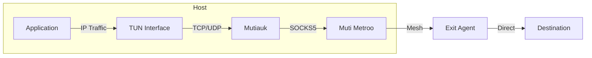

export const DownloadButton = ({href, children, primary}) => (
  <a
    href={href}
    className={`download-button ${primary ? 'download-button--primary' : ''}`}
    target="_blank"
    rel="noopener noreferrer">
    {children}
  </a>
);

export const DownloadButtonGroup = ({children}) => (
  <div className="download-button-group">
    {children}
  </div>
);

# Mutiauk - TUN Interface for Muti Metroo

<div style={{textAlign: 'center', marginBottom: '2rem'}}>
  
</div>

**Mutiauk** is a companion tool that provides transparent Layer 3 traffic interception using a TUN interface, forwarding traffic through Muti Metroo's SOCKS5 proxy.

:::info Linux Only - Root Required
Mutiauk currently runs only on Linux systems. Unlike Muti Metroo agents which run unprivileged, Mutiauk requires root privileges to create and manage the TUN interface.
:::

## Overview

While Muti Metroo's SOCKS5 proxy requires applications to be SOCKS-aware, Mutiauk provides transparent proxying by:

1. Creating a TUN network interface
2. Intercepting L3 (IP) traffic destined for configured routes
3. Forwarding TCP and UDP connections through Muti Metroo's SOCKS5 proxy
4. Returning responses back through the TUN interface

This enables any application to use the mesh network without modification.



## Features

| Feature | Description |
|---------|-------------|
| **Transparent Proxying** | No application changes required |
| **TCP Support** | Full TCP connection forwarding |
| **UDP Support** | UDP datagram forwarding via SOCKS5 UDP ASSOCIATE |
| **Route-Based** | Only intercept traffic for configured destinations |
| **Userspace** | No kernel modules required (uses TUN) |

## Download

**Current Version: v0.1.0** (Preview)

<DownloadButtonGroup>
  <DownloadButton href="#" primary>
    Download for Linux (amd64)
  </DownloadButton>
</DownloadButtonGroup>

<DownloadButtonGroup>
  <DownloadButton href="#">
    Download for Linux (arm64)
  </DownloadButton>
</DownloadButtonGroup>

## Quick Start

```bash
# Download and install
curl -L -o mutiauk https://mutimetroo.com/downloads/mutiauk/mutiauk-linux-amd64
chmod +x mutiauk
sudo mv mutiauk /usr/local/bin/

# Run with default settings (requires Muti Metroo SOCKS5 on localhost:1080)
sudo mutiauk --socks5 127.0.0.1:1080 --routes 10.0.0.0/8,192.168.0.0/16
```

:::note Root Required
Mutiauk requires root privileges to create and manage the TUN interface.
:::

## Configuration

### Command Line Options

| Option | Default | Description |
|--------|---------|-------------|
| `--socks5` | `127.0.0.1:1080` | Muti Metroo SOCKS5 proxy address |
| `--routes` | - | Comma-separated CIDRs to route through TUN |
| `--tun-name` | `mutiauk0` | Name of the TUN interface |
| `--tun-addr` | `10.200.200.1/24` | IP address for TUN interface |
| `--mtu` | `1500` | MTU for TUN interface |
| `--dns` | - | DNS server to use for intercepted DNS queries |

### Example: Route Specific Networks

```bash
# Route corporate network and cloud VPC through the mesh
sudo mutiauk \
  --socks5 127.0.0.1:1080 \
  --routes 10.10.0.0/16,172.16.0.0/12 \
  --dns 10.10.0.53
```

### Example: Route All Traffic

```bash
# Route all traffic (except local) through the mesh
sudo mutiauk \
  --socks5 127.0.0.1:1080 \
  --routes 0.0.0.0/0 \
  --exclude 127.0.0.0/8,192.168.1.0/24
```

## Use Cases

### Transparent Corporate Access

Route traffic to corporate networks without configuring each application:

```bash
# All traffic to 10.x.x.x goes through the mesh
sudo mutiauk --socks5 127.0.0.1:1080 --routes 10.0.0.0/8
```

### Development Environment

Test applications against remote environments transparently:

```bash
# Route staging environment traffic through mesh
sudo mutiauk --socks5 127.0.0.1:1080 --routes 192.168.100.0/24
```

### Container/VM Traffic

Route traffic from containers or VMs through the mesh by configuring their default gateway to the TUN interface.

## Architecture

Mutiauk operates as a userspace network stack:

1. **TUN Interface**: Receives raw IP packets from the kernel
2. **L3 Processing**: Parses IP headers to determine protocol and destination
3. **L4 Proxy**:
   - TCP: Establishes SOCKS5 CONNECT for each connection
   - UDP: Uses SOCKS5 UDP ASSOCIATE for datagram forwarding
4. **Response Handling**: Wraps responses back into IP packets for the TUN interface

## Limitations

- **Linux only**: Uses Linux TUN interface (no macOS/Windows support)
- **IPv4 only**: IPv6 support planned for future releases
- **No ICMP**: ICMP traffic (ping) is not forwarded
- **Requires root**: TUN interface creation requires elevated privileges

## Troubleshooting

### TUN Creation Failed

```
Error: failed to create TUN interface: operation not permitted
```

- Run with `sudo` or as root
- Check if TUN module is loaded: `lsmod | grep tun`
- Load TUN module: `sudo modprobe tun`

### No Connectivity

- Verify Muti Metroo SOCKS5 is running: `curl -x socks5://127.0.0.1:1080 https://example.com`
- Check routes are correctly specified
- Verify TUN interface is up: `ip addr show mutiauk0`

### DNS Not Working

- Use `--dns` to specify a DNS server reachable through the mesh
- Or configure system DNS to use a server in the routed network

## Related

- [Muti Metroo Download](/download) - Main Muti Metroo binary
- [SOCKS5 Configuration](/configuration/socks5) - Configure SOCKS5 ingress
- [UDP Relay](/features/udp-relay) - UDP support through SOCKS5
