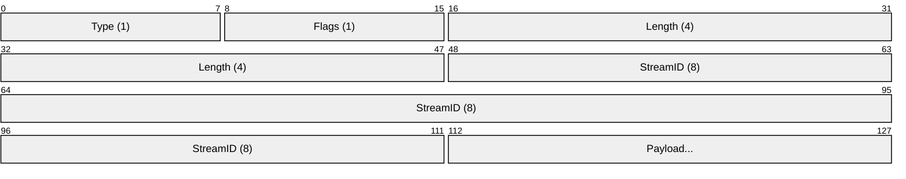

  

# Protocol Overview

Muti Metroo uses a binary frame-based protocol for all peer communication.

## Protocol Version

Current version: **0x01**

## Frame Structure

Every frame has a 14-byte header followed by variable-length payload:

| Offset | Size | Field | Description |
|--------|------|-------|-------------|
| 0 | 1 byte | Type | Frame type identifier |
| 1 | 1 byte | Flags | Frame flags (e.g., FIN_WRITE, FIN_READ) |
| 2-5 | 4 bytes | Length | Payload length (big-endian) |
| 6-13 | 8 bytes | StreamID | Stream identifier (big-endian) |
| 14+ | variable | Payload | Frame payload (0-16384 bytes) |

## Frame Types

See [Frame Types](frames) for complete list.

## Constants

| Constant | Value | Description |
|----------|-------|-------------|
| Protocol Version | 0x01 | Current protocol version |
| Max Frame Payload | 16 KB | Maximum payload size |
| Header Size | 14 bytes | Fixed header size |
| Control Stream ID | 0 | Reserved for control channel |

## Stream ID Allocation

- **Connection initiator (dialer)**: ODD IDs (1, 3, 5, ...)
- **Connection acceptor (listener)**: EVEN IDs (2, 4, 6, ...)
- **StreamID 0**: Reserved for control messages

## Connection Lifecycle

1. **Handshake**: PEER_HELLO / PEER_HELLO_ACK exchange
2. **Operation**: Stream and control frames
3. **Keepalive**: KEEPALIVE / KEEPALIVE_ACK when idle
4. **Disconnect**: Connection close or timeout

## Timeouts

| Operation | Timeout |
|-----------|---------|
| Handshake | 10s |
| Stream open | 30s |
| Keepalive interval | 5m |
| Keepalive timeout | 90s |
| Idle stream | 5m |

See [Limits](limits) for complete limits reference.
