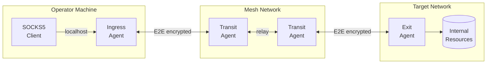

# Red Team Operations Guide

This guide covers operational security (OPSEC) considerations for using Muti Metroo in authorized red team engagements, penetration testing, and security assessments.

:::warning Authorization Required
This documentation is intended for authorized security professionals conducting legitimate penetration tests, red team exercises, or security research. Always ensure you have proper written authorization before deploying Muti Metroo in any environment. Use of Muti Metroo is subject to the [Terms of Service](/terms-of-service).
:::

## Operational Overview

Muti Metroo is a covert mesh networking tool designed for red team operations. It creates encrypted tunnels across multiple nodes, enabling secure command and control (C2) infrastructure that resists detection and attribution.

### What It Does

Deploy agents across compromised hosts to create a self-organizing mesh network. Traffic flows through multiple hops with end-to-end encryption - intermediate nodes relay traffic but cannot inspect it. Operate through the mesh via SOCKS5 proxy or direct shell/file transfer commands.

### Use Cases

**Segmented Network Access**
Reach isolated network segments by chaining through multiple compromised hosts. Deploy an exit agent in the target segment, connect through transit agents, and access internal resources as if you were local.

**Attribution Resistance**
Route traffic through multiple hops across different networks and jurisdictions. Each hop only sees its neighbors - compromise of a single agent doesn't expose the full path or operator location.

**Persistent Covert Channel**
Maintain long-term access with agents installed as system services. Traffic blends with normal HTTPS (HTTP/2, WebSocket) or uses QUIC on standard ports. Configurable protocol identifiers can be disabled for stealth.

**Topology Compartmentalization**
Encrypt mesh topology with management keys so compromised field agents cannot reveal the network structure. Only operator nodes with the private key can view the full mesh.

**Cross-Platform C2**
Execute commands and transfer files across Linux, macOS, and Windows targets from a single interface. Full interactive shell support including Windows PowerShell via ConPTY.

### Core Capabilities

| Capability | Description |
|------------|-------------|
| **Multi-hop routing** | Automatic path discovery, traffic routed through multiple nodes |
| **E2E encryption** | X25519 + ChaCha20-Poly1305 per-stream, transit nodes cannot decrypt |
| **Remote shell** | Interactive PTY (bash, PowerShell, cmd) and streaming command execution |
| **File transfer** | Upload/download files and directories with streaming and compression |
| **Topology protection** | Management key encryption hides mesh structure from compromised agents |
| **Transport options** | QUIC, HTTP/2, WebSocket - with HTTP proxy support for WebSocket |
| **Cross-platform** | Linux, macOS, Windows with full PTY support (ConPTY on Windows) |
| **Persistence** | System service installation (systemd, launchd, Windows Service) |

## Binary Characteristics

| Platform | Binary Size |
|----------|-------------|
| Linux amd64 | ~4 MB |
| Linux arm64 | ~3.5 MB |
| macOS arm64 | ~13 MB |
| macOS amd64 | ~14 MB |
| Windows amd64 | ~4 MB |
| Windows arm64 | ~13 MB |

The binary is statically compiled with no runtime dependencies. Key characteristics:

- Standard executable (no shellcode or injection)
- No external DLL requirements on Windows
- Can be renamed to blend with environment
- Pre-built binaries available at [Download](/download)

## Guide Contents

This red team operations guide is organized into the following sections:

- **[OPSEC Configuration](/red-team/opsec-configuration)** - Protocol identifiers, HTTP endpoint hardening, environment variables
- **[Transport Selection](/red-team/transport-selection)** - Choosing transports for different environments (QUIC, HTTP/2, WebSocket)
- **[C2 Capabilities](/red-team/c2-capabilities)** - Remote command execution, file operations, multi-hop routing
- **[Management Keys](/red-team/management-keys)** - Topology protection with cryptographic compartmentalization
- **[Example Configurations](/red-team/example-configurations)** - Ready-to-use configs for transit, C2, and ingress nodes
- **[Persistence](/red-team/persistence)** - System service installation across platforms
- **[Detection Avoidance](/red-team/detection-avoidance)** - Network and host indicator mitigation
- **[Operational Procedures](/red-team/operational-procedures)** - Cleanup, checklists, and legal considerations

---

For technical security details, see:
- [End-to-End Encryption](/security/e2e-encryption)
- [TLS and mTLS](/security/tls-mtls)
- [Authentication](/security/authentication)
- [Access Control](/security/access-control)
