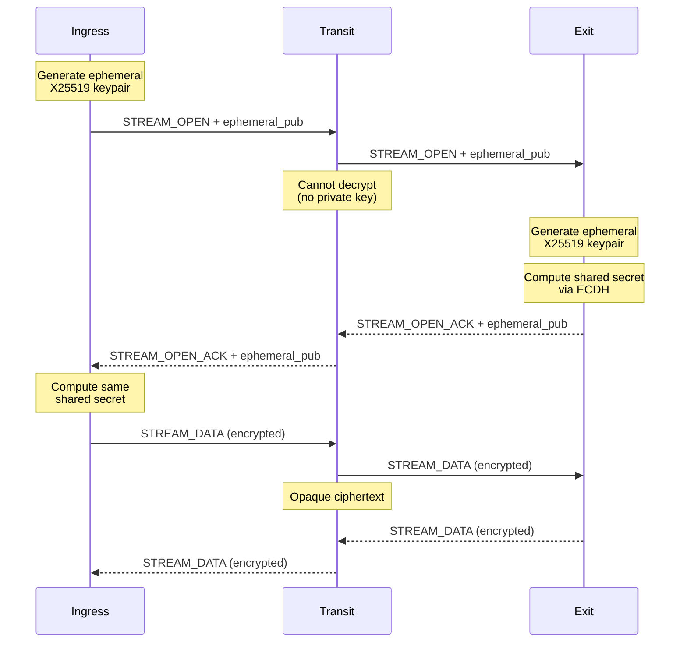

# End-to-End Encryption

Muti Metroo provides end-to-end encryption for all stream data, ensuring that only the ingress (entry) and exit agents can read the payload. Transit agents forward encrypted data without being able to decrypt it.

## Overview

Stream data is encrypted using modern cryptographic primitives:

- **Key Exchange**: X25519 elliptic curve Diffie-Hellman
- **Encryption**: ChaCha20-Poly1305 authenticated encryption (AEAD)
- **Key Derivation**: HKDF-SHA256

This provides:

| Property | Description |
|----------|-------------|
| **Confidentiality** | Only ingress and exit can read stream data |
| **Integrity** | Tampering is detected and rejected |
| **Forward Secrecy** | Each stream uses ephemeral keys |
| **Transit Opacity** | Transit agents see only ciphertext |

## How It Works

### Key Exchange Flow

When a stream is opened, ingress and exit agents perform an ephemeral key exchange:



### Session Key Derivation

After the ECDH key exchange, both sides derive identical session keys:

1. **Shared Secret**: Computed via X25519 ECDH
2. **Key Derivation**: HKDF-SHA256 with stream ID as context
3. **Nonce Management**: Direction-aware counters prevent nonce reuse

```
SharedSecret = X25519(local_private, remote_public)
SessionKey = HKDF-SHA256(SharedSecret, "muti-metroo-e2e" || stream_id || initiator_pub || responder_pub)
```

### Encryption Details

Each `STREAM_DATA` frame payload is encrypted:

| Component | Size | Description |
|-----------|------|-------------|
| Nonce | 12 bytes | Counter + direction bit |
| Ciphertext | Variable | Encrypted data |
| Auth Tag | 16 bytes | Poly1305 authentication tag |

**Total overhead**: 28 bytes per frame

### Nonce Structure

Nonces are constructed to be unique and direction-aware:

```
Nonce (12 bytes):
  - Bytes 0-7: 64-bit counter (incremented per message)
  - Byte 8: Direction bit (0 = initiator->responder, 1 = responder->initiator)
  - Bytes 9-11: Zero padding
```

This ensures:
- No nonce reuse within a stream
- Different nonces for each direction
- Safe concurrent bidirectional encryption

## Security Properties

### Forward Secrecy

Each stream uses freshly generated ephemeral keys. Compromising long-term keys does not reveal past stream data.

### Authenticated Encryption

ChaCha20-Poly1305 provides:
- **Confidentiality**: Data is encrypted
- **Integrity**: Any modification is detected
- **Authentication**: Origin is verified via shared secret

### Transit Opacity

Transit agents:
- Forward encrypted payloads unchanged
- Cannot derive the shared secret (no private keys)
- See only destination metadata (address/port)

### Key Zeroing

Ephemeral private keys are zeroed immediately after computing the shared secret, minimizing exposure window.

## What Is Encrypted

| Data | Encrypted | Notes |
|------|-----------|-------|
| Stream payload (STREAM_DATA) | Yes | Application data |
| Destination address/port | No | Required for routing |
| Stream ID | No | Required for multiplexing |
| Frame headers | No | Required for framing |

## Public Key Distribution

Each agent has a long-term X25519 keypair stored alongside its identity:

- Private key: `{data_dir}/agent_key` (0600 permissions)
- Public key: `{data_dir}/agent_key.pub` (0644 permissions)

Public keys are distributed via `NODE_INFO_ADVERTISE` frames, allowing agents to verify identity.

## Protocol Changes

### STREAM_OPEN

Added field:
- `EphemeralPubKey` (32 bytes): Initiator's ephemeral X25519 public key

### STREAM_OPEN_ACK

Added field:
- `EphemeralPubKey` (32 bytes): Responder's ephemeral X25519 public key

### NODE_INFO_ADVERTISE

Added field:
- `PublicKey` (32 bytes): Agent's long-term X25519 public key

## Performance Impact

| Metric | Impact |
|--------|--------|
| CPU | ~5-10% increase for encryption/decryption |
| Latency | Negligible (stream open adds ~1ms) |
| Bandwidth | +28 bytes per frame |
| Memory | +64 bytes per stream (session key state) |

ChaCha20-Poly1305 is highly optimized and runs at several GB/s on modern CPUs.

## Threat Model

### Protected Against

| Threat | Protection |
|--------|------------|
| Passive eavesdropping at transit | Data encrypted |
| Compromised transit agent | Cannot decrypt payloads |
| Replay attacks | Nonce prevents replay |
| Message tampering | Poly1305 detects modification |
| Future key compromise | Forward secrecy via ephemeral keys |

### Not Protected Against

| Threat | Mitigation |
|--------|------------|
| Compromised ingress/exit | Host security hardening |
| Traffic analysis | Use constant-rate padding (not implemented) |
| Metadata leakage | Destination visible for routing |

## Troubleshooting

### Decryption Failures

If streams fail with decryption errors:

1. **Version mismatch**: Ensure all agents are updated
2. **Corrupted frames**: Check network reliability
3. **Clock skew**: Verify system time is synchronized

### Key Generation Issues

```bash
# Verify keypair exists
ls -la {data_dir}/agent_key*

# Regenerate if corrupted (will change identity)
rm {data_dir}/agent_key*
muti-metroo init -d {data_dir}
```

## Next Steps

- [TLS/mTLS Configuration](tls-mtls) - Transport-layer security
- [Protocol Frames](../protocol/frames) - Detailed frame format
- [Streams](../concepts/streams) - Stream lifecycle
