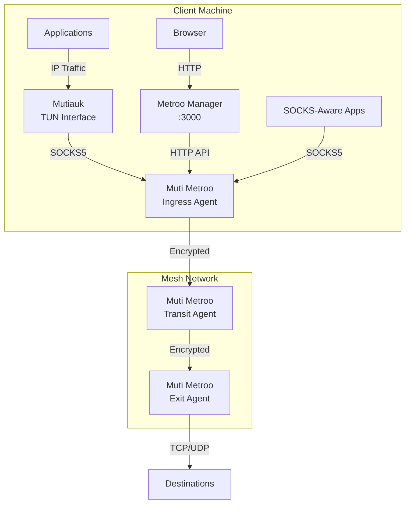

# The Muti Metroo Suite

Muti Metroo is part of a three-component suite designed to cover the full spectrum of mesh networking needs -- from encrypted traffic tunneling, to transparent OS-level routing, to browser-based management. Each component is a standalone binary that can be deployed independently, but together they form a complete networking solution.

## Component Roles

| Component | Purpose | Platform | Requires Root |
|-----------|---------|----------|---------------|
| [**Muti Metroo**](/getting-started/overview) | Mesh networking agent -- encrypted tunnels, SOCKS5 proxy, multi-hop routing | All (Linux, macOS, Windows) | No |
| [**Mutiauk**](/mutiauk) | TUN interface -- transparent L3 traffic interception through the SOCKS5 proxy | Linux only | Yes |
| [**Metroo Manager**](/metroo-manager) | Web dashboard -- browser-based monitoring, management, and remote access | All (Linux, macOS, Windows) | No |

## Architecture

The following diagram shows how the three components interact:



**Traffic paths:**

- **SOCKS-aware applications** connect directly to Muti Metroo's SOCKS5 proxy
- **All other applications** have their traffic transparently intercepted by Mutiauk's TUN interface and forwarded through the SOCKS5 proxy
- **Operators** use Metroo Manager's web UI to monitor the mesh topology, manage routes, access remote shells, and transfer files

## When to Use What

| Scenario | Components Needed | Why |
|----------|-------------------|-----|
| Route traffic from a specific app (browser, curl) | Muti Metroo only | Configure the app to use SOCKS5 proxy directly |
| Route all traffic from a Linux machine transparently | Muti Metroo + Mutiauk | Mutiauk intercepts L3 traffic so no per-app config is needed |
| Monitor and manage the mesh from a browser | Muti Metroo + Metroo Manager | Manager provides a visual dashboard and remote access tools |
| Full deployment with transparent routing and management | All three | Complete solution for production environments |

## Deployment Example

A realistic deployment using all three components:

### Step 1: Deploy Muti Metroo Agents

Set up the mesh by deploying agents on each host. At minimum, you need an ingress agent (where clients connect) and an exit agent (where traffic leaves the mesh).

```bash
# On the ingress host
muti-metroo init -d ./data
muti-metroo run -c ./ingress-config.yaml

# On the exit host
muti-metroo init -d ./data
muti-metroo run -c ./exit-config.yaml
```

The agents connect to each other and advertise routes automatically. See [First Mesh](/getting-started/first-mesh) for a complete walkthrough.

### Step 2: Add Mutiauk for Transparent Routing (Linux)

On any Linux client that needs transparent access to the mesh, install Mutiauk and point it at the local ingress agent's SOCKS5 proxy:

```bash
sudo mutiauk setup
# Configure:
#   SOCKS5 server: 127.0.0.1:1080
#   Routes: networks reachable through the mesh

sudo mutiauk daemon start
```

Now all applications on this machine can reach destinations through the mesh without any proxy configuration.

### Step 3: Add Metroo Manager for Web Monitoring

On any machine with access to an agent's HTTP API, launch Metroo Manager:

```bash
metroo-manager -agent http://192.168.1.10:8080
# Open http://localhost:3000 in your browser
```

The dashboard shows the mesh topology, agent status, routes, and provides remote shell and file transfer access to all reachable agents.

## Component Downloads

| Component | Download |
|-----------|----------|
| Muti Metroo | [Download page](/download) |
| Mutiauk | [Download section](/mutiauk#download) |
| Metroo Manager | [Download section](/metroo-manager#download) |

## Next Steps

- [Getting Started](/getting-started/overview) -- set up your first Muti Metroo mesh
- [Mutiauk](/mutiauk) -- detailed Mutiauk configuration and usage
- [Metroo Manager](/metroo-manager) -- detailed Metroo Manager configuration and features
