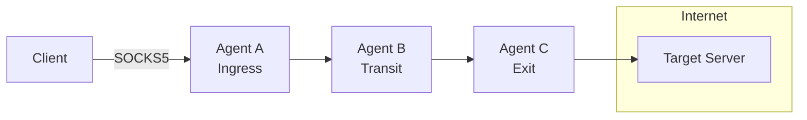
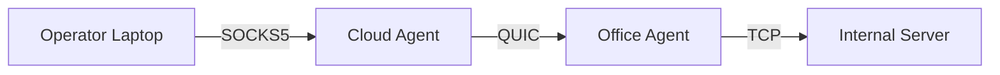
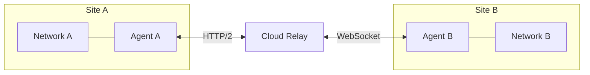

# Introduction

## What is Muti Metroo?

Muti Metroo is a userspace mesh networking agent that creates virtual TCP tunnels across heterogeneous transport layers. It enables multi-hop routing with SOCKS5 ingress and CIDR-based exit routing, operating entirely in userspace without requiring root privileges.

Think of it as building your own private network overlay that works across different network segments, firewalls, and transport protocols.

**Homepage:** [https://mutimetroo.com](https://mutimetroo.com)

## Key Features

| Feature | Description |
|---------|-------------|
| **End-to-End Encryption** | X25519 + ChaCha20-Poly1305 - transit nodes cannot decrypt |
| **Multiple Transports** | QUIC/TLS 1.3, HTTP/2, and WebSocket |
| **SOCKS5 Proxy** | TCP CONNECT and UDP ASSOCIATE with authentication |
| **Flexible Routing** | CIDR and domain-based routes |
| **Multi-Hop Paths** | Traffic automatically finds its way through the mesh |
| **File Transfer** | Upload/download files across the mesh |
| **Remote Execution** | Execute commands on remote agents |
| **Web Dashboard** | Visual topology with metro map visualization |
| **No Root Required** | Runs entirely in userspace |
| **TUN Interface** | Transparent L3 routing with Mutiauk companion tool (Linux) |

## Use Cases

### Corporate Network Access

Provide secure access to internal resources through multi-hop SOCKS5 proxy chains, bypassing network segmentation without VPN infrastructure.

### Multi-Site Connectivity

Connect multiple locations through a mesh of agents, enabling seamless access to resources across sites.

### Resilient Remote Access

Maintain connectivity through redundant paths with automatic failover and reconnection.

## How It Works

1. **Agents** connect to form a mesh network, each potentially serving as ingress, transit, or exit
2. **Routes** are advertised through the mesh using flood-based propagation
3. **Clients** connect via SOCKS5 proxy on an ingress agent
4. **Traffic** flows through the mesh following the best route to the exit agent
5. **Exit agents** open real TCP connections or relay UDP datagrams to destinations

## Document Structure

This manual is organized into the following parts:

- **Part I: Getting Started** - Installation, setup, and quick start
- **Part II: Core Configuration** - Certificates, configuration, roles, and transports
- **Part III: Features** - SOCKS5, exit routing, shell, file transfer, and more
- **Part IV: Deployment** - Service installation and management
- **Part V: Security and Operations** - OPSEC and management keys
- **Part VI: Reference** - Troubleshooting, quick reference, and Mutiauk TUN interface
