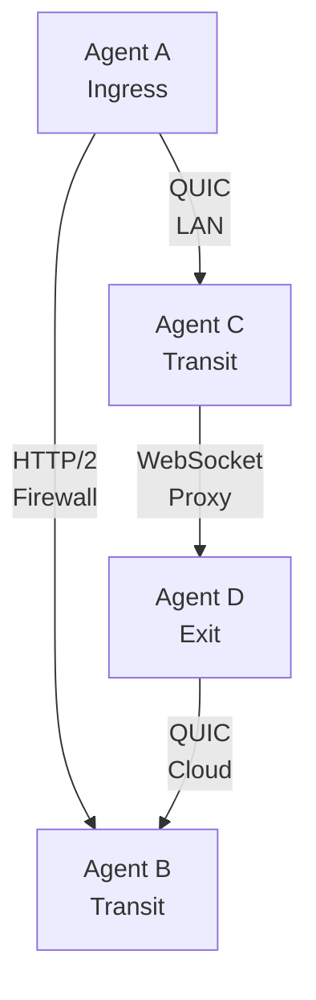

# Transport Protocols

Muti Metroo supports three transport protocols, each with different characteristics. You can mix transports within the same mesh.

## Overview

| Transport | Protocol | Port | Firewall Friendliness | Performance |
|-----------|----------|------|----------------------|-------------|
| **QUIC** | UDP | 4433 | Medium | Best |
| **HTTP/2** | TCP | 443/8443 | Good | Good |
| **WebSocket** | TCP/HTTP | 443/80 | Excellent | Fair |

## QUIC Transport

QUIC (Quick UDP Internet Connections) is the recommended transport for most deployments.

### Characteristics

- **Protocol**: UDP with built-in TLS 1.3
- **Multiplexing**: Native stream multiplexing
- **Performance**: Lowest latency, best throughput
- **Connection**: Fast 0-RTT reconnection

### When to Use

- Direct server-to-server connections
- Low-latency requirements
- High-throughput scenarios
- When UDP is not blocked

### Configuration

**Listener:**

```yaml
listeners:
  - transport: quic
    address: "0.0.0.0:4433"
```

**Peer connection:**

```yaml
peers:
  - id: "peer-id..."
    transport: quic
    address: "192.168.1.10:4433"
```

### Firewall Considerations

- Requires UDP port to be open
- May be blocked by corporate firewalls
- NAT traversal generally works well
- Some ISPs throttle or block UDP

## HTTP/2 Transport

HTTP/2 provides a TCP-based alternative with good firewall compatibility.

### Characteristics

- **Protocol**: TCP with TLS 1.3
- **Multiplexing**: HTTP/2 stream multiplexing
- **Performance**: Good, but TCP head-of-line blocking
- **Compatibility**: Works through most firewalls

### When to Use

- Corporate environments blocking UDP
- When QUIC is not available
- Standard HTTPS infrastructure
- Load balancer compatibility needed

### Configuration

**Listener:**

```yaml
listeners:
  - transport: h2
    address: "0.0.0.0:8443"
    path: "/mesh"
```

**Peer connection:**

```yaml
peers:
  - id: "peer-id..."
    transport: h2
    address: "192.168.1.10:8443"
    path: "/mesh"
```

## WebSocket Transport

WebSocket provides maximum compatibility, especially through HTTP proxies.

### Characteristics

- **Protocol**: HTTP upgrade to WebSocket
- **Multiplexing**: Application-level over single connection
- **Performance**: Highest overhead, most latency
- **Compatibility**: Maximum - works through HTTP proxies

### When to Use

- Restrictive corporate proxies
- When HTTP/2 is blocked or problematic
- Through CDNs or WAFs

### Configuration

**Listener:**

```yaml
listeners:
  - transport: ws
    address: "0.0.0.0:443"
    path: "/mesh"
```

**Peer connection:**

```yaml
peers:
  - id: "peer-id..."
    transport: ws
    address: "wss://relay.example.com:443/mesh"
```

**Through HTTP proxy:**

```yaml
peers:
  - id: "peer-id..."
    transport: ws
    address: "wss://relay.example.com:443/mesh"
    proxy: "http://proxy.corp.local:8080"
    proxy_auth:
      username: "${PROXY_USER}"
      password: "${PROXY_PASS}"
```

### Plain WebSocket Mode (Reverse Proxy)

When behind a reverse proxy that handles TLS termination:

```yaml
listeners:
  - transport: ws
    address: "127.0.0.1:8080"
    path: "/mesh"
    plaintext: true
```

**Security**: Only use behind trusted reverse proxies. Bind to localhost to prevent direct external access.

## Transport Comparison

### Latency (per hop)

| Transport | LAN | WAN |
|-----------|-----|-----|
| QUIC | 1-2ms | 50-100ms |
| HTTP/2 | 2-5ms | 60-150ms |
| WebSocket | 3-10ms | 80-200ms |

### Throughput

| Transport | Single Stream | Multi-Stream |
|-----------|---------------|--------------|
| QUIC | Excellent | Excellent |
| HTTP/2 | Good | Good |
| WebSocket | Fair | Fair |

## Mixed Transport Deployments

You can mix transports in a single mesh:



### Configuration Example

Agent with multiple transports:

```yaml
listeners:
  - transport: quic
    address: "0.0.0.0:4433"

  - transport: h2
    address: "0.0.0.0:8443"
    path: "/mesh"

peers:
  - id: "agent-b-id..."
    transport: h2
    address: "corporate-relay.example.com:443/mesh"

  - id: "agent-c-id..."
    transport: quic
    address: "192.168.1.50:4433"
```

## Transport Selection Guide

| Scenario | Recommended | Reason |
|----------|-------------|--------|
| Data center to data center | QUIC | Best performance |
| Office to cloud | HTTP/2 or QUIC | Depends on firewall |
| Home user to cloud | QUIC | Most ISPs allow UDP |
| Corporate laptop to cloud | WebSocket | Works through proxies |
| Through CDN/WAF | WebSocket | HTTP-based, compatible |
| Large file transfers | QUIC | Best throughput |

## Troubleshooting

### QUIC Connection Fails

```bash
# Check if UDP is reachable
nc -u -v target.example.com 4433

# Check firewall rules
sudo iptables -L -n | grep 4433
```

### HTTP/2 Connection Fails

```bash
# Test HTTP/2 connectivity
curl -v --http2 https://target.example.com:8443/mesh

# Check TLS
openssl s_client -connect target.example.com:8443
```

### WebSocket Connection Fails

```bash
# Test through proxy
curl -v --proxy http://proxy:8080 https://target.example.com/mesh
```
