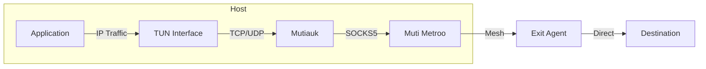
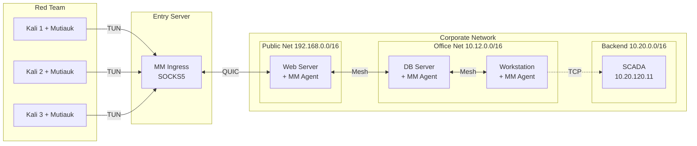

# TUN Interface (Mutiauk)

Mutiauk is the TUN interface companion tool for Muti Metroo, providing transparent Layer 3 traffic interception on Linux systems.

**Platform**: Linux only (requires root privileges)

> **SOCKS5 vs TUN Interface**: The SOCKS5 proxy (Chapter 9) requires applications to support SOCKS5 proxying. The TUN interface captures all IP traffic transparently, enabling any application to use the mesh without modification. Choose SOCKS5 for cross-platform support or TUN for transparent routing on Linux.

## Overview

While Muti Metroo's SOCKS5 proxy requires applications to be SOCKS-aware, Mutiauk provides transparent proxying:

1. Creates a TUN network interface
2. Intercepts L3 (IP) traffic destined for configured routes
3. Forwards TCP and UDP connections through SOCKS5
4. Returns responses through the TUN interface

This enables any application to use the mesh network without modification.



## Features

| Feature | Description |
|---------|-------------|
| **Transparent Proxying** | No application changes required |
| **TCP Support** | Full TCP connection forwarding |
| **UDP Support** | UDP via SOCKS5 UDP ASSOCIATE |
| **Route-Based** | Only intercept configured destinations |
| **Autoroutes** | Fetch routes from Muti Metroo API |
| **Route Persistence** | Save routes to config with `--persist` |

## Download

```bash
# Linux amd64
curl -L -o mutiauk \
  https://github.com/postalsys/Mutiauk/releases/latest/download/mutiauk-linux-amd64

# Linux arm64
curl -L -o mutiauk \
  https://github.com/postalsys/Mutiauk/releases/latest/download/mutiauk-linux-arm64

chmod +x mutiauk
sudo mv mutiauk /usr/local/bin/
```

## Quick Start

Run the interactive setup wizard:

```bash
sudo mutiauk setup
```

The wizard configures:
- TUN interface settings (name, MTU, IP address)
- SOCKS5 proxy connection
- Routes to forward through the proxy
- Optional systemd service installation

## Configuration

Default config file: `/etc/mutiauk/config.yaml`

```yaml
daemon:
  pid_file: /var/run/mutiauk.pid
  socket_path: /var/run/mutiauk.sock

tun:
  name: tun0
  mtu: 1400
  address: 10.200.200.1/24

socks5:
  server: 127.0.0.1:1080
  username: ""              # Optional auth
  password: ""
  timeout: 30s

routes:
  - destination: 10.0.0.0/8
    comment: "Internal network"
    enabled: true
  - destination: 192.168.0.0/16
    comment: "Private network"
    enabled: true

logging:
  level: info
  format: json
```

### Autoroutes

Automatically fetch CIDR routes from Muti Metroo's API.

**Note:** Autoroutes only fetches **CIDR routes** (IP-based), not domain routes. Domain-based routing requires the destination hostname, which is only available to SOCKS5 clients. Mutiauk operates at Layer 3 (IP) and only sees IP addresses after DNS resolution.

```yaml
autoroutes:
  enabled: true
  url: "http://localhost:8080"  # Muti Metroo API URL
  poll_interval: 30s
```

When enabled, Mutiauk:
1. Polls Muti Metroo `/api/dashboard` endpoint
2. Extracts CIDR routes from all connected agents
3. Filters out unsafe routes (default, loopback, link-local)
4. Applies valid routes to the TUN interface

## CLI Commands

### Daemon Management

```bash
sudo mutiauk daemon start      # Start the daemon
sudo mutiauk daemon stop       # Stop the daemon
sudo mutiauk daemon reload     # Reload configuration
sudo mutiauk daemon status     # Check status
```

### Route Management

```bash
mutiauk route list             # List active routes
mutiauk route add <cidr>       # Add route (runtime only)
mutiauk route add <cidr> --persist  # Add and save to config
mutiauk route remove <cidr>    # Remove route
mutiauk route trace <ip>       # Analyze routing for destination
```

### Service Management

```bash
sudo mutiauk service install -c /etc/mutiauk/config.yaml
sudo mutiauk service uninstall
mutiauk service status
```

### Route Tracing

Analyze routing for a destination:

```bash
$ mutiauk route trace 10.10.5.100
Destination:  10.10.5.100
Match:        10.10.0.0/16
Interface:    tun0 (Mutiauk)
Mesh Path:    Agent-A -> Agent-B -> Agent-C
Origin:       Agent-C [76e822ad]
Hop Count:    2

$ mutiauk route trace 8.8.8.8
Destination:  8.8.8.8
Match:        0.0.0.0/0 via 192.168.1.1
Interface:    eth0
Note:         Not routed through Mutiauk
```

## Use Cases

### Red Team Multi-Network Pivot

This example demonstrates a realistic red team deployment where operators use Mutiauk to transparently access a segmented corporate network through multiple pivot points.

**Scenario:**

- Multiple red team operators running Kali Linux with Mutiauk
- Single red team-controlled entry server running Muti Metroo ingress
- Target corporate network with three segments:
  - **Public Web** (192.168.0.0/16) - compromised web server
  - **Office** (10.12.0.0/16) - database server bridges public and office
  - **Backend Infra** (10.20.0.0/16) - SCADA systems, accessed via office workstation



**Connection Flow to SCADA (10.20.120.11):**

1. Operator runs `nmap -sT -Pn 10.20.120.11` on Kali
2. Traffic to 10.20.0.0/16 is captured by Mutiauk TUN interface
3. Mutiauk forwards to local Muti Metroo ingress via SOCKS5
4. Ingress agent routes through mesh: WebServer -> DBServer -> Workstation
5. Workstation agent (exit for 10.20.0.0/16) opens TCP connection to SCADA

**Operator Kali Configuration:**

```yaml
# /etc/mutiauk/config.yaml
socks5:
  server: entry-server.redteam.local:1080

routes:
  - destination: 192.168.0.0/16
    comment: "Corporate public network"
  - destination: 10.12.0.0/16
    comment: "Corporate office network"
  - destination: 10.20.0.0/16
    comment: "Corporate backend/SCADA"
```

**Mesh Agent Configurations:**

```yaml
# Web Server (192.168.1.10) - Entry point from internet
listeners:
  - transport: quic
    address: "0.0.0.0:4433"
exit:
  enabled: true
  routes:
    - "192.168.0.0/16"

# Database Server - Bridges public and office
peers:
  - address: "192.168.1.10:4433"
exit:
  enabled: true
  routes:
    - "10.12.0.0/16"

# Workstation - Bridges office and backend
peers:
  - address: "10.12.1.20:4433"
exit:
  enabled: true
  routes:
    - "10.20.0.0/16"
```

### Transparent Corporate Access

Route all traffic to corporate networks without configuring each application:

```yaml
routes:
  - destination: 10.0.0.0/8
    comment: "Corporate network"
    enabled: true
```

```bash
# Any TCP/UDP application now transparently uses the mesh
ssh user@10.10.5.100
curl http://10.10.5.100
```

**Note:** ICMP (ping) is not forwarded through the tunnel. Use TCP-based connectivity tests instead.

### Network Scanning with Nmap

Route nmap scans through the mesh:

```bash
# TCP Connect scan (works through SOCKS5)
nmap -sT -Pn --top-ports 100 192.168.50.1

# Service version detection
nmap -sT -sV -Pn 192.168.50.1
```

**Nmap tips:**
- Use `-sT` (TCP Connect) instead of `-sS` (SYN scan) - raw sockets bypass TUN
- Use `-Pn` to skip host discovery (ICMP not forwarded)
- UDP scans show `open|filtered` (ICMP unreachable not received)

## Deployment Workflow

### 1. Start Muti Metroo Agent

On the same host, run Muti Metroo with SOCKS5 ingress:

```yaml
# muti-metroo config.yaml
socks5:
  enabled: true
  address: "127.0.0.1:1080"
```

```bash
muti-metroo run -c config.yaml
```

### 2. Configure Mutiauk

```yaml
# /etc/mutiauk/config.yaml
tun:
  name: tun0
  address: 10.200.200.1/24

socks5:
  server: 127.0.0.1:1080

routes:
  - destination: 10.0.0.0/8
    enabled: true
```

### 3. Start Mutiauk

```bash
sudo mutiauk daemon start
```

### 4. Verify

```bash
# Check TUN interface
ip addr show tun0

# Verify route
ip route | grep tun0

# Test connectivity (use TCP, not ping - ICMP is not forwarded)
nc -zv 10.10.5.100 22
curl http://10.10.5.100
```

## Limitations

- **Linux only**: No macOS/Windows support
- **IPv4 only**: IPv6 support planned
- **No ICMP**: Ping traffic not forwarded
- **Requires root**: TUN interface creation needs privileges

## Troubleshooting

### TUN Creation Failed

```
Error: failed to create TUN interface: operation not permitted
```

- Run with `sudo` or as root
- Check TUN module: `lsmod | grep tun`
- Load module: `sudo modprobe tun`

### No Connectivity

- Verify SOCKS5 is running: `curl -x socks5://127.0.0.1:1080 https://example.com`
- Check routes are correctly specified
- Verify TUN interface is up: `ip addr show tun0`

### DNS Not Working

- Configure DNS server reachable through the mesh
- Or use a DNS server in the routed network
