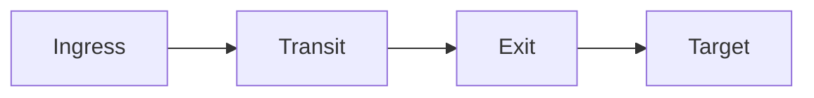

# Building the User Manual

This document describes how to build the Muti Metroo User Manual PDF from source.

## Overview

The manual is built using:
- **Markdown** source files in `src/`
- **Mermaid** diagrams (pre-processed to SVG)
- **Pandoc** for Markdown to PDF conversion
- **Tectonic** or **XeLaTeX** as the PDF engine

## Prerequisites

### macOS

```bash
# Install Pandoc
brew install pandoc

# Install PDF engine (choose one):
brew install tectonic           # Lightweight, recommended
# OR
brew install --cask basictex    # Full LaTeX (requires sudo)

# Install Node.js (for Mermaid)
brew install node
```

### Ubuntu/Debian

```bash
# Install Pandoc and LaTeX
sudo apt-get update
sudo apt-get install -y pandoc texlive-xetex texlive-fonts-recommended texlive-fonts-extra

# Install Node.js
curl -fsSL https://deb.nodesource.com/setup_20.x | sudo -E bash -
sudo apt-get install -y nodejs
```

### Windows

1. Install [Pandoc](https://pandoc.org/installing.html)
2. Install [MiKTeX](https://miktex.org/download) (includes XeLaTeX)
3. Install [Node.js](https://nodejs.org/)

## Building

```bash
cd user-manual

# Install Node dependencies (first time only)
npm install

# Build PDF
make pdf

# Build HTML preview (for quick review)
make html

# Clean build artifacts
make clean

# Check all dependencies are installed
make install-deps
```

## Output

| File | Description |
|------|-------------|
| `build/muti-metroo-user-manual.pdf` | Final PDF output |
| `build/manual.html` | HTML preview (for quick review) |
| `build/processed/` | Intermediate files (Mermaid-processed markdown) |
| `build/combined.md` | Combined markdown (all chapters) |

## CI/CD

The manual is automatically built and attached to GitHub releases:
- Triggered on release publication
- Can also be manually triggered via workflow_dispatch
- PDF is uploaded as a release asset

To manually trigger a build without creating a release:
1. Go to Actions > "User Manual" workflow
2. Click "Run workflow"
3. Download the artifact from the workflow run

## Editing the Manual

### Adding Content

1. Edit the appropriate markdown file in `src/`
2. Files are numbered for ordering (00-cover.md, 01-introduction.md, etc.)
3. Use standard Markdown syntax

### Adding Diagrams

Use Mermaid syntax in fenced code blocks:

````markdown

````

Diagrams are automatically converted to SVG during build.

### Adding New Chapters

1. Create a new file in `src/` with the next number prefix
2. Follow the naming convention: `NN-chapter-name.md`
3. Start with a level-1 heading: `# Chapter Title`

## Troubleshooting

### Mermaid diagrams not rendering

Ensure `@mermaid-js/mermaid-cli` is installed:
```bash
npm install
npx mmdc --version
```

If diagrams fail to render, check the console output during build. The build will fall back to copying the original file if Mermaid processing fails.

### LaTeX/PDF engine errors

Check which PDF engine is available:
```bash
which xelatex tectonic
```

The Makefile auto-detects: prefers xelatex, falls back to tectonic.

Common issues:
- Package errors (XeLaTeX): Update packages with `tlmgr update --all`
- First run slow (Tectonic): Downloads packages on first use, subsequent builds are faster

### HTML looks different from PDF

The HTML output is a simple preview without full styling. For accurate representation, always verify with the PDF output.
