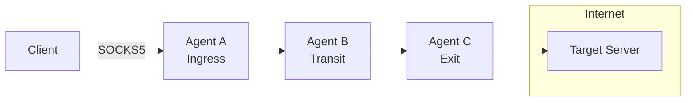
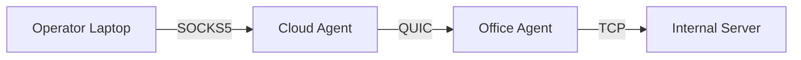
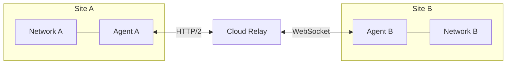
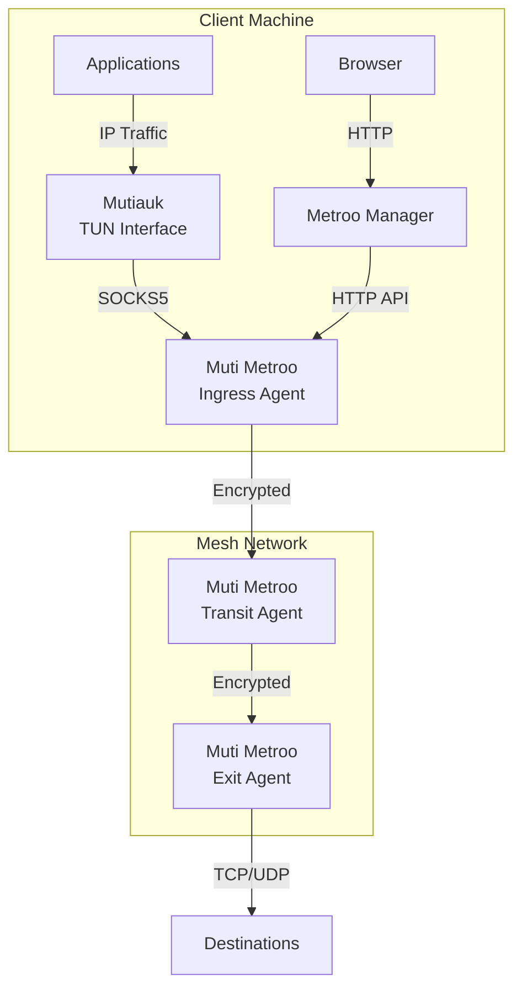

# Introduction

## What is Muti Metroo?

Muti Metroo is a userspace mesh networking agent that creates virtual TCP tunnels across heterogeneous transport layers. It enables multi-hop routing with SOCKS5 ingress and CIDR-based exit routing, operating entirely in userspace without requiring root privileges.

Think of it as building your own private network overlay that works across different network segments, firewalls, and transport protocols.

**Homepage:** [https://mutimetroo.com](https://mutimetroo.com)

## Key Features

| Feature | Description |
|---------|-------------|
| **Multi-Hop Mesh** | Traffic automatically routes through the mesh to reach any exit |
| **SOCKS5 Proxy** | TCP CONNECT and UDP ASSOCIATE with authentication |
| **TUN Interface** | Transparent L3 routing with Mutiauk companion tool (Linux) |
| **Flexible Routing** | CIDR and domain-based exit routes |
| **Multiple Transports** | QUIC/TLS 1.3, HTTP/2, and WebSocket for network traversal |
| **Port Forwarding** | Expose local services through reverse tunnels |
| **Remote Execution** | Execute commands on remote agents |
| **File Transfer** | Upload/download files across the mesh |
| **Dashboard API** | JSON API for topology, status, and mesh connectivity |
| **No Root Required** | Runs entirely in userspace (except TUN interface) |
| **End-to-End Encryption** | X25519 + ChaCha20-Poly1305 - transit nodes cannot decrypt |

## Use Cases

### Corporate Network Access

Provide secure access to internal resources through multi-hop SOCKS5 proxy chains, connecting across network segments without traditional VPN infrastructure.

### Multi-Site Connectivity

Connect multiple locations through a mesh of agents, enabling seamless access to resources across sites.

### Resilient Remote Access

Maintain connectivity through redundant paths with automatic failover and reconnection.

## How It Works

1. **Agents** connect to form a mesh network, each potentially serving as ingress, transit, or exit
2. **Routes** are advertised through the mesh using flood-based propagation
3. **Clients** connect via SOCKS5 proxy on an ingress agent
4. **Traffic** flows through the mesh following the best route to the exit agent
5. **Exit agents** open real TCP connections or relay UDP datagrams to destinations

## The Muti Metroo Suite

Muti Metroo is part of a three-component suite that together provides a complete mesh networking solution:

- **Muti Metroo** (this tool) -- the core mesh networking agent that creates encrypted tunnels, provides SOCKS5 ingress, and handles multi-hop routing. Runs on Linux, macOS, and Windows without root.
- **Mutiauk** -- a companion TUN interface for Linux that transparently intercepts Layer 3 traffic and forwards it through Muti Metroo's SOCKS5 proxy, so applications need no proxy configuration. See Chapter 10 for details.
- **Metroo Manager** -- a lightweight web dashboard for monitoring and managing the mesh from a browser. Provides topology visualization, remote shell, file transfer, and mesh testing. See Chapter 18 for details.

Each component is a standalone binary that can be deployed independently. Use Muti Metroo alone for SOCKS5-based routing, add Mutiauk on Linux clients for transparent routing, and add Metroo Manager for browser-based management.

## Document Structure

This manual is organized into the following parts:

- **Part I: Getting Started** - Installation, setup wizard, and quick start
- **Part II: Core Configuration** - Certificates, configuration, roles, and transports
- **Part III: Traffic Ingress** - SOCKS5 proxy and TUN interface for client traffic
- **Part IV: Routing & Features** - Exit routing, remote shell, file transfer, and more
- **Part V: Monitoring & Management** - HTTP API and service installation
- **Part VI: Security** - Privacy configuration and management keys
- **Part VII: Reference** - Troubleshooting and quick reference
