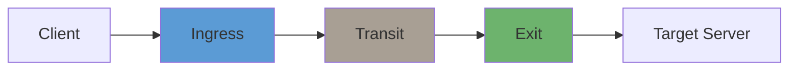
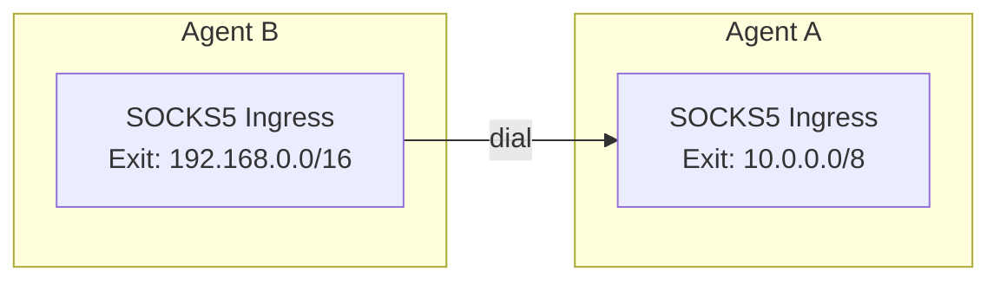

# Agent Roles

Every Muti Metroo agent can serve one or more roles simultaneously. Understanding these roles is essential for designing your mesh topology.

## Role Overview

| Role | Description | Typical Use |
|------|-------------|-------------|
| **Ingress** | Accepts client connections via SOCKS5 | User-facing proxy endpoint |
| **Transit** | Relays traffic between other agents | Network bridge |
| **Exit** | Opens connections to external destinations | Internet/network gateway |



## Ingress Role

An **ingress agent** accepts client connections and initiates streams into the mesh.

### Responsibilities

- Run SOCKS5 server on configured address
- Authenticate clients (if enabled)
- Perform route lookup for destinations
- Open streams to the appropriate exit node
- Relay data between SOCKS5 client and mesh stream

### Configuration

```yaml
socks5:
  enabled: true
  address: "127.0.0.1:1080"
  auth:
    enabled: false
  max_connections: 1000
```

### Typical Deployments

- **Operator workstations**: Local SOCKS5 proxy
- **Edge servers**: Remote access gateway
- **Cloud instances**: Entry point for distributed team

### Example: Ingress-Only Agent

```yaml
agent:
  display_name: "Ingress Gateway"

listeners:
  - transport: quic
    address: "0.0.0.0:4433"

peers:
  - id: "transit-agent-id..."
    transport: quic
    address: "relay.example.com:4433"

socks5:
  enabled: true
  address: "0.0.0.0:1080"
  auth:
    enabled: true
    users:
      - username: "operator"
        password_hash: "$2a$10$..."

# No exit configuration - pure ingress
```

## Transit Role

A **transit agent** relays traffic between other agents without initiating or terminating connections.

### Responsibilities

- Receive data from connected peers
- Forward data to next hop based on routing
- Propagate route advertisements through the mesh
- Provide bridging between network segments

### Configuration

Transit role is implicit - any agent that connects to multiple peers becomes a transit node:

```yaml
# No specific configuration needed
# Just connect to multiple peers
peers:
  - id: "peer-a-id..."
    transport: quic
    address: "192.168.1.10:4433"

  - id: "peer-b-id..."
    transport: quic
    address: "192.168.1.20:4433"
```

### Typical Deployments

- **Cloud relay**: Bridge between on-premise networks
- **DMZ server**: Connect internal and external networks
- **Geographic hop**: Reduce latency across regions

### Example: Transit-Only Agent

```yaml
agent:
  display_name: "Cloud Transit"

listeners:
  - transport: quic
    address: "0.0.0.0:4433"

peers:
  - id: "site-a-agent..."
    transport: quic
    address: "site-a.example.com:4433"

  - id: "site-b-agent..."
    transport: quic
    address: "site-b.example.com:4433"

# No socks5 or exit - pure transit
http:
  enabled: true
  address: ":8080"
```

## Exit Role

An **exit agent** opens real TCP connections to external destinations.

### Responsibilities

- Advertise CIDR routes to the mesh
- Accept stream open requests from ingress agents
- Validate destination against allowed routes
- Open TCP connections to destinations
- Handle DNS resolution for domain names

### Configuration

```yaml
exit:
  enabled: true
  routes:
    - "10.0.0.0/8"
    - "192.168.0.0/16"
    - "0.0.0.0/0"
  dns:
    servers:
      - "8.8.8.8:53"
      - "1.1.1.1:53"
    timeout: 5s
```

**Note:** All agents are reachable by ID for management operations (shell, file transfer, ping, status queries) regardless of whether they have exit routes configured. Exit routes only control which network destinations an agent can reach on behalf of SOCKS5 clients.

### Typical Deployments

- **Internet gateway**: Default route for all traffic
- **Private network access**: Routes to internal resources
- **Service endpoint**: Access to specific services/CIDRs

### Example: Exit-Only Agent

```yaml
agent:
  display_name: "Exit Gateway"

listeners:
  - transport: quic
    address: "0.0.0.0:4433"

exit:
  enabled: true
  routes:
    - "10.0.0.0/8"
  dns:
    servers:
      - "10.0.0.1:53"
    timeout: 5s

# No socks5 - pure exit
http:
  enabled: true
  address: ":8080"
```

## Combined Roles

Agents can combine multiple roles. Common patterns:

### Ingress + Transit

Acts as entry point and relay:

```yaml
socks5:
  enabled: true
  address: "127.0.0.1:1080"

peers:
  - id: "remote-exit-id..."
    address: "remote.example.com:4433"
```

### Transit + Exit

Relays traffic and provides exit for specific routes:

```yaml
peers:
  - id: "ingress-id..."
    address: "ingress.example.com:4433"

exit:
  enabled: true
  routes:
    - "10.0.0.0/8"
```

### All Roles (Standalone)

Single agent that does everything:

```yaml
agent:
  display_name: "All-in-One"

listeners:
  - transport: quic
    address: "0.0.0.0:4433"

socks5:
  enabled: true
  address: "127.0.0.1:1080"

exit:
  enabled: true
  routes:
    - "0.0.0.0/0"
  dns:
    servers:
      - "8.8.8.8:53"
```

## Role Selection Guide

| Scenario | Recommended Roles |
|----------|------------------|
| Local proxy for one user | Ingress + Exit (standalone) |
| Team proxy with cloud exit | Ingress (local) + Exit (cloud) |
| Multi-site connectivity | Transit (cloud) + Exit (each site) |
| Internet gateway for office | Ingress (office) + Exit (DMZ) |

## Roles vs. Connection Direction

A common misconception is that connection direction determines agent roles. This is **not true**.

**Key principle**: Transport connection direction (who dials whom) is independent of agent roles (ingress/transit/exit).

Consider this topology where Agent B dials Agent A:



Even though B dialed A, virtual streams can flow **both directions**:

- A SOCKS5 client on Agent A can tunnel to `192.168.0.0/16` via Agent B's exit
- A SOCKS5 client on Agent B can tunnel to `10.0.0.0/8` via Agent A's exit

**Practical implications:**

| Concern | Depends On |
|---------|-----------|
| Which agent can be ingress | SOCKS5 configuration, not connection direction |
| Which agent can be exit | Exit routes configuration, not connection direction |
| Which agent initiates streams | Route table, not connection direction |
| Connection direction choice | Network constraints (firewalls, NAT) |

Think of transport connections as **bidirectional pipes**. Once connected, it doesn't matter which end opened the connection - data and routes flow freely in both directions. Choose connection direction based on network accessibility, not functionality.

## Best Practices

1. **Minimize exit points**: Fewer exits are easier to monitor and secure
2. **Place transit in DMZ**: Transit agents don't need to access sensitive resources
3. **Use specific routes**: Avoid `0.0.0.0/0` on exits unless necessary
4. **Separate concerns**: Don't combine ingress and exit on the same agent in production
5. **Enable HTTP API**: Enable for health checks and monitoring on every agent
