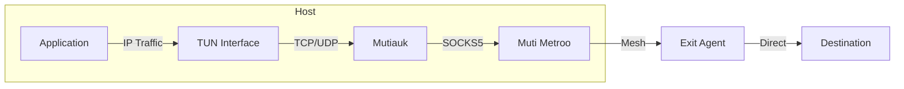
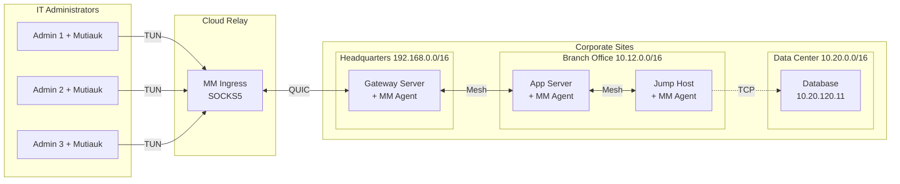

# TUN Interface (Mutiauk)

Mutiauk is the TUN interface companion tool for Muti Metroo, providing transparent Layer 3 traffic interception on Linux systems.

**Platform**: Linux only (requires root privileges)

> **SOCKS5 vs TUN Interface**: The SOCKS5 proxy (Chapter 9) requires applications to support SOCKS5 proxying. The TUN interface captures all IP traffic transparently, enabling any application to use the mesh without modification. Choose SOCKS5 for cross-platform support or TUN for transparent routing on Linux.

## Overview

While Muti Metroo's SOCKS5 proxy requires applications to be SOCKS-aware, Mutiauk provides transparent proxying:

1. Creates a TUN network interface
2. Intercepts L3 (IP) traffic destined for configured routes
3. Forwards TCP and UDP connections through SOCKS5
4. Returns responses through the TUN interface

This enables any application to use the mesh network without modification.



## Features

| Feature | Description |
|---------|-------------|
| **Transparent Proxying** | No application changes required |
| **TCP Support** | Full TCP connection forwarding |
| **UDP Support** | UDP via SOCKS5 UDP ASSOCIATE |
| **ICMP Support** | Ping forwarding via ICMP relay |
| **Route-Based** | Only intercept configured destinations |
| **Autoroutes** | Fetch routes from Muti Metroo API |
| **Route Persistence** | Save routes to config with `--persist` |

## Download

```bash
# Linux amd64
curl -L -o mutiauk \
  https://download.mutimetroo.com/linux-amd64/mutiauk

# Linux arm64
curl -L -o mutiauk \
  https://download.mutimetroo.com/linux-arm64/mutiauk

chmod +x mutiauk
sudo mv mutiauk /usr/local/bin/
```

## Quick Start

Run the interactive setup wizard:

```bash
sudo mutiauk setup
```

The wizard configures:
- TUN interface settings (name, MTU, IP address)
- SOCKS5 proxy connection
- Routes to forward through the proxy
- Optional systemd service installation

## Configuration

Default config file: `/etc/mutiauk/config.yaml`

```yaml
daemon:
  pid_file: /var/run/mutiauk.pid
  socket_path: /var/run/mutiauk.sock
  health_port: 0            # HTTP health port (0 = disabled)

tun:
  name: tun0
  mtu: 1400
  address: 10.200.200.1/24
  address6: fd00:200::1/64  # Optional IPv6

socks5:
  server: 127.0.0.1:1080
  username: ""              # Optional auth
  password: ""
  timeout: 30s
  keepalive: 60s

routes:
  - destination: 10.0.0.0/8
    comment: "Internal network"
    enabled: true
  - destination: 192.168.0.0/16
    comment: "Private network"
    enabled: true

nat:
  table_size: 65536
  tcp_timeout: 1h
  udp_timeout: 5m
  gc_interval: 1m

logging:
  level: info               # debug, info, warn, error
  format: json              # json or console
  output: stdout            # stdout, stderr, or file path
```

### Autoroutes

Automatically fetch CIDR routes from Muti Metroo's API.

**Note:** Autoroutes only fetches **CIDR routes** (IP-based), not domain routes. Domain-based routing requires the destination hostname, which is only available to SOCKS5 clients. Mutiauk operates at Layer 3 (IP) and only sees IP addresses after DNS resolution.

```yaml
autoroutes:
  enabled: true
  url: "http://localhost:8080"  # Muti Metroo API URL
  poll_interval: 30s
```

When enabled, Mutiauk:
1. Polls Muti Metroo `/api/dashboard` endpoint
2. Extracts CIDR routes from all connected agents
3. Filters out unsafe routes (default, loopback, link-local)
4. Applies valid routes to the TUN interface

## CLI Commands

### Daemon Management

```bash
sudo mutiauk daemon start      # Start the daemon
sudo mutiauk daemon stop       # Stop the daemon
sudo mutiauk daemon reload     # Reload configuration
sudo mutiauk daemon status     # Check status
```

### Route Management

```bash
mutiauk route list             # List active routes
mutiauk route add <cidr>       # Add route (runtime only)
mutiauk route add <cidr> --persist  # Add and save to config
mutiauk route remove <cidr>    # Remove route
mutiauk route trace <ip>       # Analyze routing for destination
```

### Service Management

```bash
sudo mutiauk service install -c /etc/mutiauk/config.yaml
sudo mutiauk service uninstall
mutiauk service status
```

### Route Tracing

Analyze routing for a destination:

```bash
$ mutiauk route trace 10.10.5.100
Destination:  10.10.5.100
Match:        10.10.0.0/16
Interface:    tun0 (Mutiauk)
Mesh Path:    Agent-A -> Agent-B -> Agent-C
Origin:       Agent-C [76e822ad]
Hop Count:    2

$ mutiauk route trace 8.8.8.8
Destination:  8.8.8.8
Match:        0.0.0.0/0 via 192.168.1.1
Interface:    eth0
Note:         Not routed through Mutiauk
```

## Use Cases

### Multi-Site Corporate Connectivity

This example demonstrates how IT administrators use Mutiauk to transparently access multiple office locations through a cloud relay.

**Scenario:**

- IT administrators at headquarters with Mutiauk
- Cloud relay server running Muti Metroo ingress
- Corporate network with three office sites:
  - **Headquarters** (192.168.0.0/16) - main office with cloud connectivity
  - **Branch Office** (10.12.0.0/16) - regional office connected via headquarters
  - **Data Center** (10.20.0.0/16) - infrastructure services accessed via branch office



**Connection Flow to Database (10.20.120.11):**

1. Administrator runs `psql -h 10.20.120.11` on their workstation
2. Traffic to 10.20.0.0/16 is captured by Mutiauk TUN interface
3. Mutiauk forwards to cloud Muti Metroo ingress via SOCKS5
4. Ingress agent routes through mesh: Gateway -> AppServer -> JumpHost
5. JumpHost agent (exit for 10.20.0.0/16) opens TCP connection to database

**Administrator Workstation Configuration:**

```yaml
# /etc/mutiauk/config.yaml
socks5:
  server: relay.company.com:1080

routes:
  - destination: 192.168.0.0/16
    comment: "Headquarters network"
  - destination: 10.12.0.0/16
    comment: "Branch office network"
  - destination: 10.20.0.0/16
    comment: "Data center network"
```

**Mesh Agent Configurations:**

```yaml
# Gateway Server (192.168.1.10) - Headquarters entry point
listeners:
  - transport: quic
    address: "0.0.0.0:4433"
exit:
  enabled: true
  routes:
    - "192.168.0.0/16"

# App Server - Bridges headquarters and branch office
peers:
  - address: "192.168.1.10:4433"
exit:
  enabled: true
  routes:
    - "10.12.0.0/16"

# Jump Host - Bridges branch office and data center
peers:
  - address: "10.12.1.20:4433"
exit:
  enabled: true
  routes:
    - "10.20.0.0/16"
```

### Transparent Corporate Access

Route all traffic to corporate networks without configuring each application:

```yaml
routes:
  - destination: 10.0.0.0/8
    comment: "Corporate network"
    enabled: true
```

```bash
# Any TCP/UDP/ICMP traffic now transparently uses the mesh
ssh user@10.10.5.100
curl http://10.10.5.100
ping 10.10.5.100
```

### Network Scanning with Nmap

Route nmap scans through the mesh:

```bash
# TCP Connect scan (works through SOCKS5)
nmap -sT -Pn --top-ports 100 192.168.50.1

# Service version detection
nmap -sT -sV -Pn 192.168.50.1
```

**Nmap tips:**
- Use `-sT` (TCP Connect) instead of `-sS` (SYN scan) - raw sockets bypass TUN
- Use `-Pn` to skip host discovery - nmap uses raw ICMP which bypasses TUN
- Normal `ping` command works (uses TUN), but nmap's built-in ping does not
- UDP scans show `open|filtered` (ICMP port unreachable not forwarded)

### RustScan Alternative

RustScan (<https://github.com/RustScan/RustScan>) is a fast port scanner that can be used as an alternative to nmap:

```bash
# Fast TCP scan
rustscan -a 192.168.50.1 -r 1-1000

# Scan multiple targets
rustscan -a 192.168.50.1,192.168.50.2 --top

# Pass results to nmap for service detection
rustscan -a 192.168.50.1 -- -sV -sC

# UDP scan (same limitations as nmap UDP through tunnel)
rustscan -a 192.168.50.1 --udp -r 1-1000
```

**UDP scanning limitations:**

UDP scanning through Mutiauk has significant limitations:

- **nmap UDP (`-sU`)**: Shows ports as `open|filtered` because ICMP "port unreachable" messages cannot be forwarded back through the proxy
- **RustScan UDP (`--udp`)**: May not find any ports because it relies on receiving UDP responses, which are unreliable through proxy chains

UDP port scanning fundamentally relies on either:
1. Receiving a response from an open port (service-specific)
2. Receiving ICMP "port unreachable" for closed ports

Neither mechanism works reliably through SOCKS5 proxies. For accurate UDP scanning, scan directly from the network segment or use nmap with the understanding that results will show `open|filtered`.

### Using Ping

Mutiauk supports ICMP echo (ping) forwarding through the mesh network via a custom SOCKS5 extension.

```bash
# Standard ping works transparently
ping 10.10.5.100

# Ping with specific count
ping -c 4 192.168.50.1
```

**Requirements:**
- Exit agent must have ICMP enabled (default: enabled)
- Linux exit agents need `ping_group_range` configured:
  ```bash
  sudo sysctl -w net.ipv4.ping_group_range="0 65535"
  ```

**Limitations:**
- Only ICMP echo (ping) is supported
- Other ICMP types (port unreachable, TTL exceeded) are not forwarded
- Traceroute does not work (relies on TTL-exceeded messages)
- Raw socket ping (e.g., from nmap) bypasses TUN - use `-Pn` with nmap

**Tip:** If ping fails, verify ICMP is enabled on the exit agent:

```yaml
# Exit agent config
icmp:
  enabled: true
```

## Deployment Workflow

### 1. Start Muti Metroo Agent

On the same host, run Muti Metroo with SOCKS5 ingress:

```yaml
# muti-metroo config.yaml
socks5:
  enabled: true
  address: "127.0.0.1:1080"
```

```bash
muti-metroo run -c config.yaml
```

### 2. Configure Mutiauk

```yaml
# /etc/mutiauk/config.yaml
tun:
  name: tun0
  address: 10.200.200.1/24

socks5:
  server: 127.0.0.1:1080

routes:
  - destination: 10.0.0.0/8
    enabled: true
```

### 3. Start Mutiauk

```bash
sudo mutiauk daemon start
```

### 4. Verify

```bash
# Check TUN interface
ip addr show tun0

# Verify route
ip route | grep tun0

# Test connectivity
ping -c 3 10.10.5.100
nc -zv 10.10.5.100 22
curl http://10.10.5.100
```

## Limitations

- **Linux only**: No macOS/Windows support
- **Requires root**: TUN interface creation needs privileges

## Troubleshooting

### TUN Creation Failed

```
Error: failed to create TUN interface: operation not permitted
```

- Run with `sudo` or as root
- Check TUN module: `lsmod | grep tun`
- Load module: `sudo modprobe tun`

### No Connectivity

- Verify SOCKS5 is running: `curl -x socks5://127.0.0.1:1080 https://example.com`
- Check routes are correctly specified
- Verify TUN interface is up: `ip addr show tun0`

### DNS Not Working

- Configure DNS server reachable through the mesh
- Or use a DNS server in the routed network
