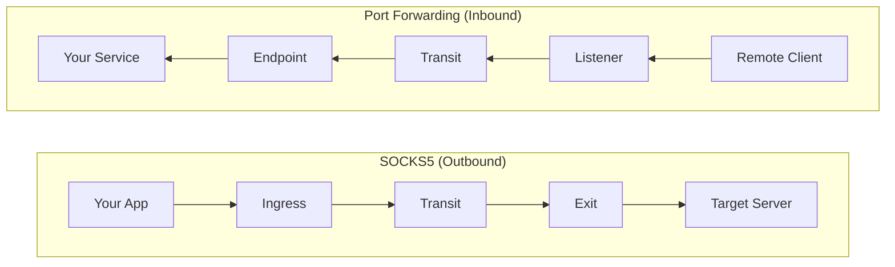

# Port Forwarding

Expose local services to remote parts of the network through the mesh.

## Overview

Port forwarding creates **reverse tunnels** through the mesh network. Unlike SOCKS5 which routes outbound traffic (you reaching remote destinations), port forwarding routes inbound traffic (remote machines reaching your services).

**Primary use case**: Expose internal services, distribute configuration files, or provide access to development tools across the network.



## Quick Reference

| Component | Configuration | Location |
|-----------|---------------|----------|
| Endpoint | `forward.endpoints` | Agent with access to your service |
| Listener | `forward.listeners` | Agents where remote clients connect |
| Routing Key | String (e.g., "my-tools") | Must match on both sides |

## Configuration

### Endpoint (Your Machine)

Configure on the agent that has access to your local service:

```yaml
forward:
  endpoints:
    - key: "tools"              # Routing key advertised to mesh
      target: "localhost:80"     # Your local service
```

### Listener (Remote Agents)

Configure on agents where remote clients will connect:

```yaml
forward:
  listeners:
    - key: "tools"              # Must match endpoint key
      address: ":8080"          # Port for incoming connections
      max_connections: 100      # Optional limit
```

### Options

**Endpoint options:**

| Option | Type | Description |
|--------|------|-------------|
| `key` | string | Routing key advertised to mesh |
| `target` | string | Local service address (host:port) |

**Listener options:**

| Option | Type | Default | Description |
|--------|------|---------|-------------|
| `key` | string | - | Routing key to look up |
| `address` | string | - | Bind address (host:port or :port) |
| `max_connections` | int | 0 | Max connections (0 = unlimited) |

## Operational Scenarios

### Scenario 1: Configuration Distribution

Serve configuration files from a central server to remote agents throughout the network.

**Setup:**

```yaml
# central-server.yaml - configuration server
forward:
  endpoints:
    - key: "config-server"
      target: "localhost:8000"
```

```bash
# Start HTTP server serving your configuration directory
python3 -m http.server 8000 --directory ./configs
```

```yaml
# remote-agent.yaml - deployed agents
forward:
  listeners:
    - key: "config-server"
      address: "127.0.0.1:8080"
```

**Usage from remote machine:**

```bash
# Download configurations via nearest agent
curl http://localhost:8080/app-config.yaml -o /etc/myapp/config.yaml
curl http://localhost:8080/nginx.conf -o /etc/nginx/nginx.conf
wget http://localhost:8080/install.sh
```

### Scenario 2: Internal API Access

Expose an internal REST API through the mesh for development or monitoring.

**Setup:**

```yaml
# api-server.yaml - machine running your API
forward:
  endpoints:
    - key: "internal-api"
      target: "localhost:3000"
```

```yaml
# gateway-agent.yaml - mesh entry point
forward:
  listeners:
    - key: "internal-api"
      address: "127.0.0.1:8080"
```

**Usage from development machine:**

```bash
# Access internal API through mesh
curl http://localhost:8080/api/v1/status
curl -X POST http://localhost:8080/api/v1/deploy -d '{"version": "1.2.3"}'
```

The API request traverses the mesh to your internal server.

### Scenario 3: Multiple Services

Expose several services through different routing keys:

```yaml
# central-server.yaml
forward:
  endpoints:
    - key: "http-configs"
      target: "localhost:80"      # Web server with configurations
    - key: "api-gateway"
      target: "localhost:3000"    # REST API
    - key: "metrics-server"
      target: "localhost:9090"    # Prometheus metrics
```

```yaml
# remote agents - expose all services
forward:
  listeners:
    - key: "http-configs"
      address: ":8080"
    - key: "api-gateway"
      address: ":3000"
    - key: "metrics-server"
      address: ":9090"
```

## Comparison with SOCKS5

| Feature | SOCKS5 Proxy | Port Forwarding |
|---------|--------------|-----------------|
| Traffic direction | Outbound (you -> remote) | Inbound (remote -> you) |
| DNS resolution | At ingress or exit | N/A (TCP relay) |
| Authentication | Username/password | None (routing key only) |
| Use case | Access internal networks | Expose internal services |
| Client protocol | SOCKS5 | Plain TCP |
| Configuration | `socks5` + `exit` | `forward` |

## Operational Considerations

### Routing Key Selection

- Use descriptive names that reflect the service purpose
- Examples: "config-server", "api-gateway", "metrics", "backup-sync"
- Keys are case-sensitive

### Listener Binding

- Use `127.0.0.1` (localhost) when only local access needed
- Use `0.0.0.0` when network access required
- Consider firewall rules on listener ports

### Multiple Listeners

Deploy same key on multiple agents for redundancy:

```yaml
# Agent A                    # Agent B
forward:                     forward:
  listeners:                   listeners:
    - key: "tools"               - key: "tools"
      address: ":8080"             address: ":8080"
```

Clients connect to whichever agent is nearest/reachable.

### Connection Limits

Set limits to prevent resource exhaustion:

```yaml
forward:
  listeners:
    - key: "tools"
      address: ":8080"
      max_connections: 50    # Limit concurrent connections
```

## Troubleshooting

### Route Not Appearing

Check route propagation:

```bash
# View forward routes
curl http://localhost:8080/healthz | jq '.forward_routes'

# Trigger immediate advertisement on endpoint agent
curl -X POST http://localhost:8080/routes/advertise
```

### Connection Fails

1. Verify target service is running:
   ```bash
   netstat -tlnp | grep <port>
   ss -tlnp | grep <port>
   ```

2. Check endpoint agent connectivity to mesh

3. Verify routing key matches exactly (case-sensitive)

4. Check connection limits on listener

### Listener Bind Failed

Port already in use:

```bash
# Find conflicting process
lsof -i :<port>
ss -tlnp | grep :<port>
```

## Security Notes

- Each connection gets E2E encryption (X25519 + ChaCha20-Poly1305)
- Transit agents cannot decrypt forwarded traffic
- Only configured routing keys are accepted
- No CLI commands exist (configuration-only)
