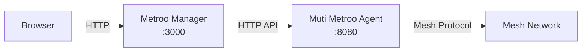

# Metroo Manager

Metroo Manager is a lightweight web dashboard for managing and monitoring Muti Metroo mesh networks. It runs as a standalone Go binary with an embedded React SPA that reverse-proxies a Muti Metroo agent's HTTP API.



## Download

Download the binary for your platform:

| Platform | URL |
|----------|-----|
| macOS (Apple Silicon) | `https://download.mutimetroo.com/darwin-arm64/metroo-manager` |
| macOS (Intel) | `https://download.mutimetroo.com/darwin-amd64/metroo-manager` |
| Linux (amd64) | `https://download.mutimetroo.com/linux-amd64/metroo-manager` |
| Linux (arm64) | `https://download.mutimetroo.com/linux-arm64/metroo-manager` |
| Windows (amd64) | `https://download.mutimetroo.com/windows-amd64/metroo-manager.exe` |
| Windows (arm64) | `https://download.mutimetroo.com/windows-arm64/metroo-manager.exe` |

## Quick Start

```bash
# Download (example: Linux amd64)
curl -L -o metroo-manager https://download.mutimetroo.com/linux-amd64/metroo-manager
chmod +x metroo-manager

# Launch (connects to local agent on port 8080)
./metroo-manager

# Open http://localhost:3000 in your browser
```

## CLI Flags

| Flag | Default | Description |
|------|---------|-------------|
| `-addr` | `:3000` | Address for the web UI to listen on |
| `-agent` | `http://127.0.0.1:8080` | Muti Metroo agent HTTP API URL |
| `-agent-token` | | Bearer token for agent API authentication |
| `-version` | | Print version and exit |

The agent token can also be set via the `MUTI_METROO_TOKEN` environment variable. The `-agent-token` flag takes precedence over the environment variable.

### Examples

```bash
# Connect to a remote agent
./metroo-manager -agent http://192.168.1.10:8080

# Use a custom port for the web UI
./metroo-manager -addr :9090

# Connect to a token-protected agent
./metroo-manager -agent http://192.168.1.10:8080 -agent-token mysecrettoken

# Connect to an HTTPS agent
./metroo-manager -agent https://192.168.1.10:8080

# Bind to all interfaces
./metroo-manager -addr 0.0.0.0:3000 -agent http://10.0.0.5:8080
```

## Agent Configuration Requirements

The Muti Metroo agent must have its HTTP API enabled with dashboard and remote API endpoints active:

```yaml
http:
  enabled: true
  address: ":8080"
  dashboard: true    # Required for /api/* endpoints
  remote_api: true   # Required for /agents/* endpoints
```

If the agent uses bearer token authentication, pass the token via `-agent-token` or the `MUTI_METROO_TOKEN` environment variable:

```yaml
http:
  enabled: true
  address: ":8080"
  token_hash: "$2a$10$..."  # Generated with: muti-metroo hash
  dashboard: true
  remote_api: true
```

```bash
# Via flag
./metroo-manager -agent http://localhost:8080 -agent-token yourtoken

# Via environment variable
export MUTI_METROO_TOKEN=yourtoken
./metroo-manager -agent http://localhost:8080
```

## Features

### Topology Map

Interactive visualization of all agents in the mesh and their peer connections. Agents display their names, IDs, and connection status. Click any agent for detailed information.

### Dashboard

Real-time statistics for the connected agent:

- Connected peers and connection status
- Active streams and buffer usage
- Route table (CIDR and domain routes)
- System information (OS, architecture, uptime)
- Forward route endpoints and listeners

### Route Management

View all CIDR and domain routes advertised across the mesh. The route table shows origin agent, hop count, and metric for each route.

### Remote Shell

Browser-based terminal access to any reachable agent. Supports streaming mode (simple commands) and interactive mode (htop, vim). The target agent must have shell access enabled.

### File Transfer

Upload and download files to/from any reachable agent through the browser. Supports individual files and directory transfers. The target agent must have file transfer enabled.

### Mesh Test

Connectivity tests between all agents in the mesh. Sends probe messages between every pair of agents and reports success/failure with latency measurements.

### Sleep/Wake Control

Trigger mesh-wide sleep or wake commands from the dashboard. Sleep puts agents into a low-power polling mode; wake restores normal operation.
